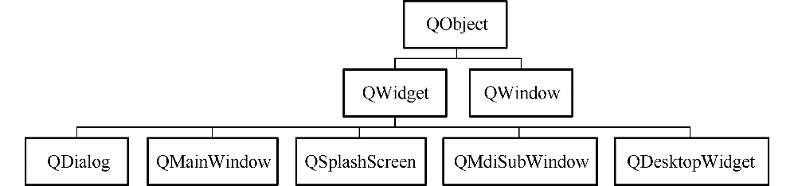

### 6.3.1　主要的窗体类及其用途

常用的窗体基类是QWidget、QDialog和QMainWindow，在创建GUI应用程序时选择窗体基类就是从这3个类中选择。QWidget直接继承于QObject，是QDialog和QMainWindow的父类，其他继承于QWidget的窗体类还有QSplashScreen、QMdiSubWindow和QDesktopWidget。另外还有一个类QWindow，它同时从QObject和QSurface继承。这些类的继承关系如图6-9所示。

<b class="my_markdown">图6-9　几个窗体类的继承关系</b>

这些窗体类的主要特点和用途如下。

+ QWidget：在没有指定父容器时可作为独立的窗口，指定父容器后可以作为容器的内部组件。
+ QDialog：用于设计对话框，以独立窗口显示。
+ QMainWindow：用于设计带有菜单栏、工具栏、状态栏的主窗口，一般以独立窗口显示。
+ QSplashScreen：用作应用程序启动时的splash窗口，没有边框。
+ QMdiSubWindow：用于为QMdiArea提供一个子窗体，用于MDI（多文档）应用程序的设计。
+ QDesktopWidget：具有多个显卡和多个显示器的系统具有多个桌面，这个类提供用户桌面信息，如屏幕个数、每个屏幕的大小等。
+ QWindow：通过底层的窗口系统表示一个窗口的类，一般作为一个父容器的嵌入式窗体，不作为独立窗体。

