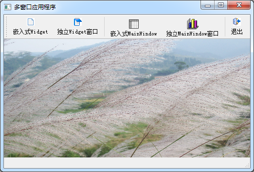
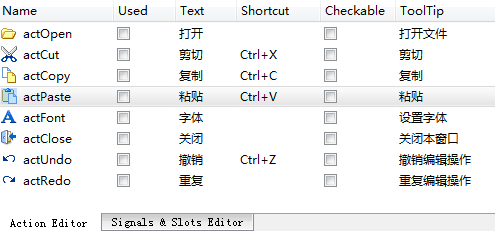
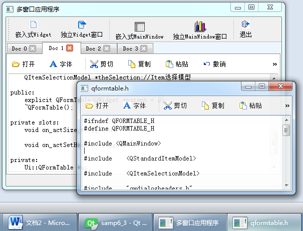
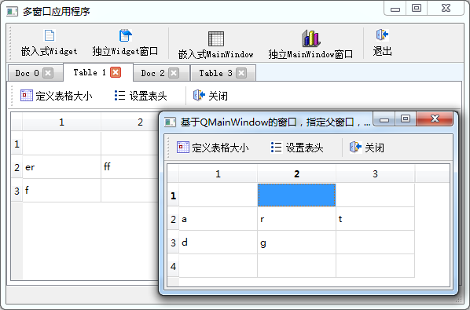

### 6.3.3　多窗口应用程序的设计

#### 1．主窗口设计

本节以实例samp6_3演示多窗口应用程序的设计，实例主窗口如图6-10所示。


<center class="my_markdown"><b class="my_markdown">图6-10　实例samp6_3的主窗口</b></center>

程序的主窗口类是QWMainWindow，从QMainWindow继承。主窗口有一个工具栏，4个创建窗体的按钮以不同方式创建和使用窗体。主窗体工作区绘制一个背景图片，有一个tabWidget组件，作为创建窗体的父窗体。没有子窗体时，tabWidget不显示。

下面是QWMainWindow的构造函数和绘制背景图片的代码。

```css
QWMainWindow::QWMainWindow(QWidget *parent) :   QMainWindow(parent),
   ui(new Ui::QWMainWindow)
{
   ui->setupUi(this);
   ui->tabWidget->setVisible(false);
   ui->tabWidget->clear();//清除所有页面
   ui->tabWidget->setTabsClosable(); //Page有关闭按钮，可被关闭
   this->setCentralWidget(ui->tabWidget);
   this->setWindowState(Qt::WindowMaximized); //窗口最大化显示
}
void QWMainWindow::paintEvent(QPaintEvent *event)
{ //绘制窗口背景图片
   Q_UNUSED(event);
   QPainter painter(this);
   painter.drawPixmap(0,ui->mainToolBar->height(),this->width(),
      this->height()-ui->mainToolBar->height()-ui->statusBar->height(),
      QPixmap(":/images/images/back.jpg")); 
}
```

在构造函数中，将tabWidget组件设置为不可见，并且页面可关闭，这样每个页面标题部分都会出现一个关闭按钮，单击可以关闭页面。

背景图片绘制使用窗体的paintEvent()事件，获取主窗口的画笔之后，将资源文件里的一个图片绘制在主窗口的工作区。绘图的内容在第8章详细介绍。

实例除了主窗口之外，还有两个窗口和两个对话框。

+ QFormDoc：是继承于QWidget可视化设计的窗体，主窗口工具栏上的“嵌入式Widget”和“独立Widget窗口”按钮将以两种方式使用QFormDoc类。
+ QFormTable：是继承于QMainWindow可视化设计的窗体，其界面功能与实例samp6_2的主窗口类似，主窗口工具栏上的“嵌入式MainWindow”和“独立MainWindow窗口”按钮将以两种方式使用QFormTable类。
+ QWDialogSize和QWDialogHeaders就是实例samp6_2中设计的对话框类，由QFormTable调用进行表格组件设置。

#### 2．QFormDoc类的设计

在Qt Creator单击 “File”→“New File or Project”菜单项，在出现的对话框里选择创建Qt Designer Form Class，并且在向导中选择基类为QWidget，将创建的新类命名为QFormDoc。

在QFormDoc的窗口上只放置一个QPlainTextEdit组件。由于QFormDoc是从QWidget继承而来的，在UI设计器里不能直接为QFormDoc设计工具栏，但是可以创建Action，然后在窗体创建时用代码创建工具栏。图6-11是设计的Action除了actOpen和actFont之外，其他编辑操作的Action都和QPlainTextEdit相关槽函数关联，actClose与窗口的close()槽函数关联。


<center class="my_markdown"><b class="my_markdown">图6-11　QFormDoc窗口设计的Action</b></center>

actOpen用于打开文件，actFont用于设置文档字体，这些功能在前面的例子里都遇到过，不是本实例的重点，不再介绍其实现代码。

在QFormDoc的构造函数里用代码创建工具栏和布局，也可以在析构函数里增加一个消息显示的对话框，以便观察窗体是何时被删除的。代码如下：

```css
QFormDoc::QFormDoc(QWidget *parent) :QWidget(parent),ui(new Ui::QFormDoc)
{
   ui->setupUi(this);
   QToolBar*   locToolBar = new QToolBar("文档",this); //创建工具栏
   locToolBar->addAction(ui->actOpen);
   locToolBar->addAction(ui->actFont);
   locToolBar->addSeparator();
   locToolBar->addAction(ui->actCut);
   locToolBar->addAction(ui->actCopy);
   locToolBar->addAction(ui->actPaste);
   locToolBar->addAction(ui->actUndo);
   locToolBar->addAction(ui->actRedo);
   locToolBar->addSeparator();
   locToolBar->addAction(ui->actClose);
   locToolBar->setToolButtonStyle(Qt::ToolButtonTextBesideIcon); 
   QVBoxLayout *Layout = new QVBoxLayout();
   Layout->addWidget(locToolBar); //设置工具栏和编辑器上下布局
   Layout->addWidget(ui->plainTextEdit);
   Layout->setContentsMargins(2,2,2,2); //减小边框的宽度
   Layout->setSpacing(2);
   this->setLayout(Layout); //设置布局
}
QFormDoc::~QFormDoc()
{
   QMessageBox::information(this, "消息", "QFormDoc对象被删除和释放");
   delete ui;
}
```

#### 3．QFormDoc类的使用

主窗口工具栏上的“嵌入式Widget”按钮的响应代码如下：

```css
void QWMainWindow::on_actWidgetInsite_triggered()
{ //创建QFormDoc窗体，并在tabWidget中显示
   QFormDoc *formDoc = new QFormDoc(this); 
   formDoc->setAttribute(Qt::WA_DeleteOnClose); //关闭时自动删除
   int cur=ui->tabWidget->addTab(formDoc,
         QString::asprintf("Doc %d",ui->tabWidget->count()));
   ui->tabWidget->setCurrentIndex(cur);
   ui->tabWidget->setVisible(true);
}
```

这段代码动态创建一个QFormDoc类对象formDoc，并设置其为关闭时删除。然后使用QTabWidget的addTab()函数，为主窗口上的tabWidget新建一个页面，作为formDoc的父窗体组件，formDoc就在新建的页面里显示，我们称这种窗体显示方式为“嵌入式”。

主窗口工具栏上的“独立Widget窗口”按钮响应代码如下：

```css
void QWMainWindow::on_actWidget_triggered()
{
   QFormDoc *formDoc = new QFormDoc();
   formDoc->setAttribute(Qt::WA_DeleteOnClose); //关闭时自动删除
   formDoc->setWindowTitle("基于QWidget的窗体，无父窗口，关闭时删除");
   formDoc->setWindowFlag(Qt::Window,true);
//   formDoc->setWindowFlag(Qt::CustomizeWindowHint,true);
//   formDoc->setWindowFlag(Qt::WindowMinMaxButtonsHint,false);
//   formDoc->setWindowFlag(Qt::WindowCloseButtonHint,true);
//   formDoc->setWindowFlag(Qt::WindowStaysOnTopHint,true);
   formDoc->setWindowOpacity(0.9);
//   formDoc->setWindowModality(Qt::WindowModal);
   formDoc->show(); //在单独的窗口中显示
}
```

这里在创建formDoc对象时，并没有指定父窗口，创建窗口的代码是：

```css
QFormDoc *formDoc = new QFormDoc();
```

使用setWindowFlag()函数，设置其为Qt::Window类型，并用show()函数显示窗口。这样创建的是一个单独显示的窗口，并且在windows的任务栏上会有显示。若有文档窗口打开，则关闭主窗口，而文档窗口依然存在，实际上这时候主窗口是隐藏了。若关闭所有文档窗口，主窗口自动删除并释放，才完全关闭应用程序。

如果创建formDoc时指定主窗口为父窗口，即：

```css
QFormDoc *formDoc = new QFormDoc(this);
```

则formDoc不会在windows的任务栏上显示，关闭主窗口时，所有文档窗口自动删除。

图6-12是嵌入式和独立的QFormDoc窗体的显示效果，在创建独立的显示窗口时，还可以尝试使用setWindowFlag()函数设置不同的属性，观察这些属性的控制效果。


<center class="my_markdown"><b class="my_markdown">图6-12　嵌入式和独立的QFormDoc窗体显示效果</b></center>

#### 4．QFormTable类的设计

表格窗口类QFormTable是基于QMainWindow的可视窗口类，其功能与实例samp6_2主窗口类似，使用QStandardItemModel模型和QTableView组件构成Model/View结构的表格数据编辑器，并且可以调用QWDialogSize和QWDialogHeaders对话框进行表格大小设置和表头设置。该窗口的具体设计不详细介绍了，只是为了观察窗口删除的时机，在析构函数里增加一个信息显示对话框。

```css
QFormTable::~QFormTable()
{   QMessageBox::information(this, "消息", "FormTable窗口被删除和释放");
   delete ui;
}
```

#### 5．QFormTable类的使用

主窗口工具栏上的“嵌入式MainWindow”按钮的响应代码如下：

```css
void QWMainWindow::on_actWindowInsite_triggered()
{
   QFormTable *formTable = new QFormTable(this);
   formTable->setAttribute(Qt::WA_DeleteOnClose); //关闭时自动删除
   int cur=ui->tabWidget->addTab(formTable,
           QString::asprintf("Table %d",ui->tabWidget->count()));
   ui->tabWidget->setCurrentIndex(cur);
   ui->tabWidget->setVisible(true);
}
```

代码功能是创建一个QFormTable对象formTable，并在主窗口的tabWidget组件里新增一个页面，将formTable显示在新增页面里。所以，即使是从QMainWindow继承的窗口类，也是可以在其他界面组件里嵌入式显示的。

主窗口工具栏上的“独立MainWindow窗口”按钮响应代码如下：

```css
void QWMainWindow::on_actWindow_triggered()
{
   QFormTable*  formTable = new QFormTable(this);
   formTable->setAttribute(Qt::WA_DeleteOnClose); 
   formTable->setWindowTitle("基于QMainWindow的窗口，指定父窗口，关闭时删除");
   formTable->show();
}
```

这样创建的formTable以独立窗口显示，关闭时自动删除。它指定了主窗口为父窗口，主窗口关闭时，所有QFormTable类窗口自动删除。

无论是嵌入式的，还是独立的QFormTable窗口，都可以调用QWDialogSize和QWDialogHeaders对话框进行表格大小和表头文字设置，对话框的调用方法在6.2节已有介绍。创建QFormTable嵌入式窗体和独立窗口的运行效果如图6-13所示。

#### 6．QTabWidget类的控制

现在，单击tabWidget中嵌入的QFormDoc或QFormTable窗体工具栏上的“关闭”按钮，都可以关闭窗体并且删除分页。但是单击分页上的关闭图标，并不能关闭窗口。而且，关闭所有分页后，tabWidget并没有隐藏，无法显示背景图片。

为此，需要对tabWidget的两个信号编写槽函数，tabCloseRequested()和currentChanged()信号的槽函数代码如下：

```css
void QWMainWindow::on_tabWidget_tabCloseRequested(int index)
{//关闭Tab
   if (indextabWidget->widget(index);
   aForm->close();
}
void QWMainWindow::on_tabWidget_currentChanged(int index)
{
   bool  en=ui->tabWidget->count()>0; //再无分页
   ui->tabWidget->setVisible(en);
}
```


<center class="my_markdown"><b class="my_markdown">图6-13　嵌入式和独立的QFormTable窗体显示效果</b></center>

tabCloseRequested()信号在单击分页的关闭图标时发射，传递来的参数index表示页面的编号。QTabWidget::widget()返回TabWidget组件中某个页面的窗体组件。获取页面的QWidget组件后，调用close()函数关闭窗体。

删除一个分页或切换页面时，会发射currentChanged()信号，在此信号的槽函数里判断分页个数是否为零，以控制tabWidget是否可见。

