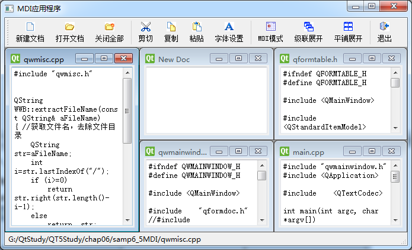

### 6.4.1　MDI简介

传统的应用程序设计中有多文档界面（Multi-document Interface，MDI）应用程序，Qt为设计MDI应用程序提供了支持。

本节的实例samp6_4是一个MDI应用程序，程序运行效果如图6-14所示。MDI应用程序就是在主窗口里创建多个同类型的MDI子窗口，这些MDI子窗口在主窗口里显示，并共享主窗口上的工具栏和菜单等操作功能，主窗口上的操作都针对当前活动的MDI子窗口进行。

设计MDI应用程序需要在主窗口工作区放置一个QMdiArea作为子窗体的容器。实例samp6_4主窗口的工作区使用一个QMdiArea组件，实例的子窗口类是QFormDoc，是一个使用QPlainTextEdit进行简单文本显示和编辑的窗体。

<b class="my_markdown">图6-14　MDI应用程序实例samp6_4的运行时界面</b>

创建的QFormDoc窗体对象作为一个子窗口加入到mdiArea组件中。QMdiArea组件类似于实例samp6_3中主窗口上的tabWidget组件，只是QMdiArea提供更加完备的功能。更改MDI的显示模式，可以得到与实例samp6_3相似的以多页组件管理的MDI界面效果。

