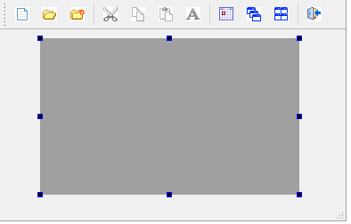
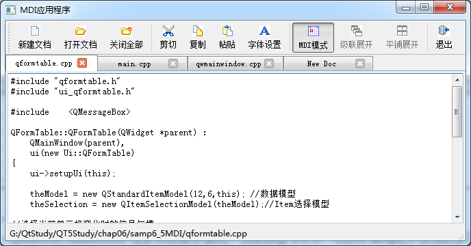

### 6.4.3　MDI主窗口设计与子窗口的使用

#### 1．主窗口界面设计

要在主窗口实现MDI功能，只需在主窗口的工作区放置一个QMdiArea组件。图6-15是设计好的主窗口界面。


<center class="my_markdown"><b class="my_markdown">图6-15　设计时的主窗口</b></center>

在UI设计器里创建Action，并应用Action设计主工具栏。在主窗口的工作区放置一个QMdiArea组件，然后在主窗口的构造函数里设置mdiArea填充满工作区。

```css
QWMainWindow::QWMainWindow(QWidget *parent) :   QMainWindow(parent),
   ui(new Ui::QWMainWindow)
{
   ui->setupUi(this);
   this->setCentralWidget(ui->mdiArea); 
   this->setWindowState(Qt::WindowMaximized);
   ui->mainToolBar->setToolButtonStyle(Qt::ToolButtonTextUnderIcon);
}
```

#### 2．MDI子窗口的创建与加入

下面是主窗口上“新建文档”按钮的响应代码：

```css
void QWMainWindow::on_actDoc_New_triggered()
{ //新建文档
   QFormDoc *formDoc = new QFormDoc(this); 
   ui->mdiArea->addSubWindow(formDoc); //文档窗口添加到MDI
   formDoc->show();  
}
```

代码功能是新建一个QFormDoc类的窗口formDoc，构造函数中传入了主窗口指针，所以主窗口是formDoc的父窗口，然后使用QMdiArea的addSubWindow()函数将formDoc加入到mdiArea。

下面是主窗口上“打开文档”按钮的响应代码：

```css
void QWMainWindow::on_actDoc_Open_triggered()
{//打开文件
   bool needNew=false;// 是否需要新建子窗口
   QFormDoc   *formDoc;
   if (ui->mdiArea->subWindowList().count()>0) //获取活动窗口
   {
      formDoc=(QFormDoc*)ui->mdiArea->activeSubWindow()->widget();
      needNew=formDoc->isFileOpened();//文件已经打开，需要新建窗口
   }
   else
      needNew=true;
   QString curPath=QDir::currentPath();
   QString aFileName=QFileDialog::getOpenFileName(this,"打开一个文件", 
            curPath, "C程序文件(*.h *cpp);;所有文件(*.*)");
   if (aFileName.isEmpty())
      return; 
   if (needNew) //需要新建子窗口
   {
      formDoc = new QFormDoc(this); 
      ui->mdiArea->addSubWindow(formDoc);
   }
   formDoc->loadFromFile(aFileName); //打开文件
   formDoc->show();
   ui->actCut->setEnabled(true);
   ui->actCopy->setEnabled(true);
   ui->actPaste->setEnabled(true);
   ui->actFont->setEnabled(true);
}
```

通过QMdiArea::subWindowList()可以获得子窗口对象列表，从而可以判断子窗口的个数。如果没有一个MDI子窗口，就创建一个新的窗口并打开文件。

如果有MDI子窗口，则总有一个活动窗口，通过QMdiArea::activeSubWindow()可以获得此活动的子窗口，通过子窗口的isFileOpened()函数判断是否打开了文件，如果没有打开过文件，就在这个活动窗口里打开文件，否则新建窗口打开文件。

> **注意**
> 一定要先获取MDI子窗口，再使用QFileDialog选择需要打开的文件。如果顺序更换了，则无法获得正确的MDI活动子窗口。

#### 3．QMdiArea常用功能函数

QMdiArea提供了一些成员函数，可以进行一些操作，工具栏上的“关闭全部”“MDI模式”“级联展开”“平铺展开”等按钮都是调用QMdiArea类的成员函数实现的。下面是这几个按钮功能的实现代码：

```css
void QWMainWindow::on_actCascade_triggered()
{ //窗口级联展开
   ui->mdiArea->cascadeSubWindows();
}
void QWMainWindow::on_actTile_triggered()
{//平铺展开
   ui->mdiArea->tileSubWindows();
}
void QWMainWindow::on_actCloseALL_triggered()
{//关闭全部子窗口
   ui->mdiArea->closeAllSubWindows();
}
void QWMainWindow::on_actViewMode_triggered(bool checked)
{//MDI 显示模式
   if (checked) //Tab多页显示模式
   {
      ui->mdiArea->setViewMode(QMdiArea::TabbedView); //Tab多页显示模式
      ui->mdiArea->setTabsClosable(true); //页面可关闭
      ui->actCascade->setEnabled(false);
      ui->actTile->setEnabled(false);
   }
   else //子窗口模式
   {
      ui->mdiArea->setViewMode(QMdiArea::SubWindowView); //子窗口模式
      ui->actCascade->setEnabled(true); 
      ui->actTile->setEnabled(true); 
   }
}
```

其中，设置MDI视图模式用setViewMode()函数，有两种模式可以选择。

+ QMdiArea::SubWindowView是传统的子窗口模式，显示效果如图6-14所示。
+ QMdiArea::TabbedView是多页的显示模式，显示效果如图6-16所示。


<center class="my_markdown"><b class="my_markdown">图6-16　多页模式下的MDI界面</b></center>

#### 4．MDI的信号

QMdiArea有一个信号subWindowActivated(QMdiSubWindow *arg1)，在当前活动窗口切换时发射，利用此信号可以在活动窗口切换时进行一些处理，例如，在状态栏里显示活动MDI子窗口的文件名，在没有MDI子窗口时，将工具栏上的编辑功能按钮设置为禁用。下面是该信号的槽函数代码：

```css
void QWMainWindow::on_mdiArea_subWindowActivated(QMdiSubWindow *arg1)
{//当前活动子窗口切换时
   if (ui->mdiArea->subWindowList().count()==0)
   { //若子窗口个数为零
      ui->actCut->setEnabled(false);
      ui->actCopy->setEnabled(false);
      ui->actPaste->setEnabled(false);
      ui->actFont->setEnabled(false);
      ui->statusBar->clearMessage();
   }
   else
   {
      QFormDoc *formDoc=static_cast<QFormDoc*>( 
                   ui->mdiArea->activeSubWindow()->widget());
    ui->statusBar->showMessage(formDoc->currentFileName());
   }
}
```

主窗口工具栏上的“剪切”“复制”“粘贴”“字体设置”等按钮都是调用当前子窗口的相应函数，关键是获取当前MDI子窗体对象，例如，“剪切”和“字体设置”按钮的代码如下：

```css
void QWMainWindow::on_actCut_triggered()
{ //cut操作
   QFormDoc* formDoc=(QFormDoc*)ui->mdiArea->activeSubWindow()->widget();
   formDoc->textCut();
}
void QWMainWindow::on_actFont_triggered()
{//设置字体
   QFormDoc* formDoc=(QFormDoc*)ui->mdiArea->activeSubWindow()->widget();
   formDoc->setEditFont();
}
```

