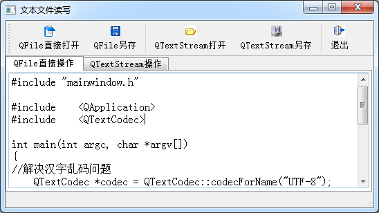

### 7.1.1　实例功能概述

文本文件是指以纯文本格式存储的文件，例如用Qt Creator编写的C++程序的头文件（.h文件）和源程序文件（.cpp文件）。HTML和XML文件也是纯文本文件，只是其读取之后需要对内容进行解析之后再显示。

Qt提供了两种读写纯文本文件的基本方法，一种是用QFile类的IODevice读写功能直接进行读写，另一种是利用QFile和QTextStream结合起来，用流（Stream）的方法进行文件读写。

实例samp7_1演示了这两种方法读写文本文件，其运行时窗口如图7-1所示。实例不仅演示了如何打开文本文件，还有文件保存功能。

<b class="my_markdown">图7-1　实例samp7_1的运行时窗口</b>

