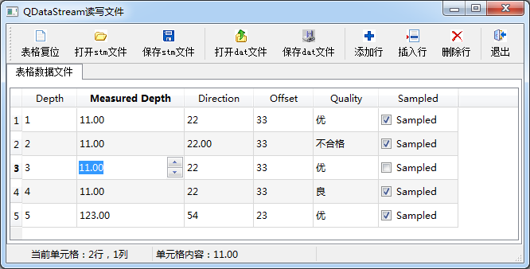

### 7.2.1　实例功能概述

除了文本文件之外，其他需要按照一定的格式定义读写的文件都称为二进制文件。每种格式的二进制文件都有自己的格式定义，写入数据时按照一定的顺序写入，读出时也按照相应的顺序读出。例如地球物理中常用的SEG-Y格式文件，必须按照其标准格式要求写入数据才符合这种文件的格式规范，读取数据时也需要按照格式定义来读出。

Qt使用QFile和QDataStream进行二进制数据文件的读写。QFile负责文件的IO设备接口，即与文件的物理交互，QDataStream以数据流的方式读取文件内容或写入文件内容。

本节以实例samp7_2演示二进制文件的读写，图7-2是程序运行的界面。


<center class="my_markdown"><b class="my_markdown">图7-2　实例samp7_2的二进制文件读写功能</b></center>

实例以表格形式编辑一个数据表，采用Model/View结构，编辑后的数据保存为二进制文件，这与第5.4节的实例用纯文本文件存储数据不同。

根据QDataStream保存文件时使用的数据编码的方式不同，可以保存为两种文件。

（1）用Qt预定义编码保存各种类型数据的文件，定义文件后缀为“.stm”。Qt预定义编码是指在写入某个类型数据，如整形数、字符串等到文件流时，使用Qt预定义的编码。可以将这种Qt预定义数据格式编码类比于HTML的标记符，Qt写入某种类型数据时用了Qt预定义的标记符，读出数据时，根据标记符读出数据。使用Qt预定义编码保存的流文件，某些字节是QDataStream自己写入的，我们并不完全知道文件内每个字节的意义，但是用QDataStream可以读出相应的数据。

（2）标准编码数据文件，定义文件后缀为“.dat”。在将数据写到文件时，完全使用数据的二进制原始内容，每个字节都有具体的定义，在读出数据时，只需根据每个字节的定义读出数据即可。

实例samp7_2具有如下功能：

+ 可以在表格内编辑数据，同样的表格数据内容可以保存为两种格式的文件，Qt预定义编码文件（stm文件）和标准编码文件（dat文件）；
+ 界面上的表格数据可以修改，可以添加行、插入行、删除行；
+ 可以读取stm文件或dat文件，虽然文件格式不一样，但对相同的界面数据表存储的文件的实质内容是一样的。

实例samp7_2的主窗口使用了Model/View结构、标准项数据模型QStandardItemModel和选择模型QItemSelectionModel，界面上使用了QTableView组件，还有代理组件。这些涉及Model/View的设计可参考第5.4节和5.5节，这些设计在前述章节里已经介绍过，不是本节的重点，不再详述。

为便于理解后面的程序，这里给出主窗口MainWindow类中自定义的一些变量和函数，具体如下（忽略了自动生成的一些定义）：

```css
class MainWindow : public QMainWindow
{
private:
   QLabel  *LabCellPos;                        //当前单元格行列号
   QLabel  *LabCellText;                       //当前单元格内容
   QWIntSpinDelegate   intSpinDelegate;        //整型数，代理组件
   QWFloatSpinDelegate  floatSpinDelegate;     //浮点数，代理组件
   QWComboBoxDelegate   comboBoxDelegate;      //列表选择，代理组件
   QStandardItemModel  *theModel;              //数据模型
   QItemSelectionModel  *theSelection;         //选择模型
   void   resetTable(int aRowCount);           //表格复位，设定行数
   bool   saveDataAsStream(QString& aFileName);//保存为stm文件
   bool   openDataAsStream(QString& aFileName);//打开stm文件
   bool   saveBinaryFile(QString& aFileName);  //保存为dat文件
   bool   openBinaryFile(QString& aFileName);  //打开dat文件
};
```

