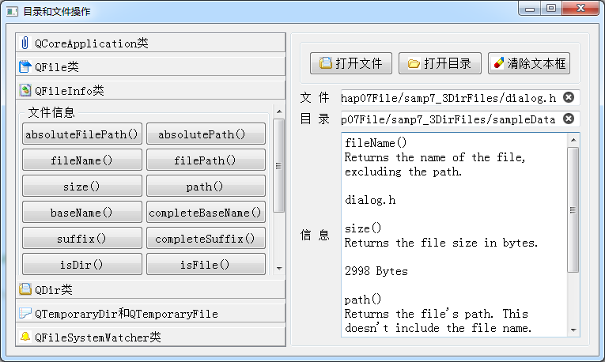

### 7.3.2　实例概述

#### 1．实例功能

实例samp7_3演示前述各种目录与文件操作类的主要功能，图7-3是实例运行时的窗口。窗口左侧是一个QToolBox组件，分为6组，每一组是一个或两个类的功能演示，在每个组里放置一些QPushButton按钮，每个按钮主要调用类的某个函数，按钮的标题就是使用的函数的名称。

窗口右侧是显示区，可以选择一个目录、一个文件，然后左侧的功能基本上都是对选择的目录或文件进行操作，右下方是一个QPlainTextEdit组件，用于显示信息。

#### 2．信号发射者信息的获取

每个按钮一般用函数名称作为标题，例如“QFileInfo类”分组里的按钮“baseName()”是要演示QFileInfo的baseName()函数。另外，将Qt帮助文件里的这个函数的基本描述文字复制作为按钮的ToolTip文字，例如“baseName()”按钮的ToolTip属性是“Returns the base name of the file without the path”。


<center class="my_markdown"><b class="my_markdown">图7-3　实例samp7_3运行时窗口</b></center>

在按钮被单击时，先显示按钮的标题和ToolTip信息，以便明显地知道按钮演示的功能。例如，“baseName()”按钮的clicked()槽函数代码如下：

```css
void Dialog::on_pushButton_30_clicked()
{//QFileInfo.basename()
   QPushButton *btn = static_cast<QPushButton*>(sender());
   ui->plainTextEdit->appendPlainText(btn->text());
   ui->plainTextEdit->appendPlainText(btn->toolTip()+"\n");
   QFileInfo  fileInfo(ui->editFile->text());
   QString  str=fileInfo.baseName();
   ui->plainTextEdit->appendPlainText(str+"\n");
}
```

代码的前3行是用于获取按钮对象，并显示按钮的text和toolTip文字。

这里用到了QObject::sender()函数，该函数用于在槽函数里获取发射信号的对象。因为这个函数是按钮的clicked()信号的槽函数，所以，sender()获取的信号发射对象就是这个按钮。然后将此对象转换为QPushButton类型变量btn，就可以访问btn的text()和toolTip()函数了。

这种方法的优点是没有出现对象的ObjectName，这3行代码可以在任何一个按钮的clicked()信号槽函数里出现。如果是直接用按钮的ObjectName，则每个按钮里的代码里需要修改名称。本实例有几十个按钮，工作量很大，也容易遗漏了修改名称。

对上面的代码还可以进一步优化，因为每个按钮的槽函数里都要重复这3行代码，将其编写为一个函数，然后在按钮的响应代码里调用。优化后的代码如下：

```css
void Dialog::on_pushButton_30_clicked()
{//QFileInfo.basename()
   showBtnInfo(sender());
   QFileInfo  fileInfo(ui->editFile->text());
   QString  str=fileInfo.baseName();
   ui->plainTextEdit->appendPlainText(str+"\n");
}
void Dialog::showBtnInfo(QObject *btn)
{ //显示btn的信息
   QPushButton *theBtn =static_cast<QPushButton*>(btn);
   ui->plainTextEdit->appendPlainText(theBtn->text());
   ui->plainTextEdit->appendPlainText(theBtn->toolTip()+"\n");
}
```

在主窗口类中定义一个私有函数showBtnInfo()，接收QObject *btn对象作为输入参数，将QObject对象转换为QPushButton对象，然后显示按钮的text和toolTip。

在按钮的响应代码里只需用一行语句调用showBtnInfo()函数，并将sender()作为参数传递。

本实例有几十个按钮，每个按钮的响应代码的第一行都是showBtnInfo(sender())，这样可以大大简化代码。

