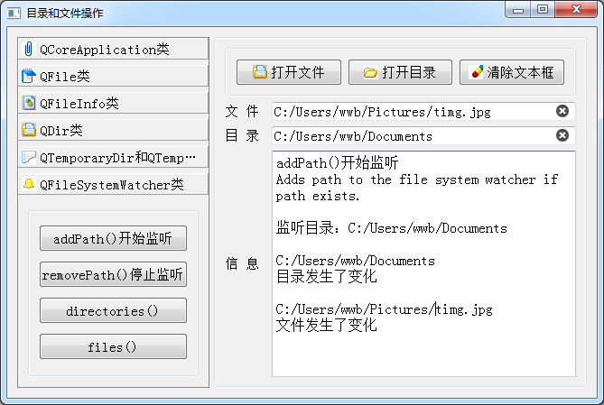

### 7.3.8　QFileSystemWatcher类

QFileSystemWatcher是对目录和文件进行监听的类。把某些目录或文件添加到QFileSystem Watcher对象的监听列表后，当目录下发生文件新建、删除等操作时会发射directoryChanged()信号，当监听的文件发生修改、重命名等操作时，会发射fileChanged()信号。所以，这个类在进行目录或文件监听时起作用。

QFileSystemWatcher的主要接口函数见表7-11（省略了函数参数中的const关键字）。

<center class="my_markdown"><b class="my_markdown">表7-11　QFileSystemWatcher的成员函数</b></center>

| 函数原型 | 功能 |
| :-----  | :-----  | :-----  | :-----  |
| bool　addPath(QString &path) | 添加一个监听的目录或文件 |
| QStringList　addPaths(QStringList &paths) | 添加需要监听的目录或文件列表 |
| QStringList　directories() | 返回监听的目录列表 |
| QStringList　files() | 返回监听的文件列表 |
| bool　removePath(QString &path) | 移除监听的目录或文件 |
| QStringList　removePaths(QStringList &paths) | 移除监听的目录或文件列表 |

QFileSystemWatcher有两个信号，分别是目录变化和文件变化时发射的信号。

```css
void QFileSystemWatcher::directoryChanged(const QString &path)
void QFileSystemWatcher::fileChanged(const QString &path)
```

图7-4是实例中测试QFileSystemWatcher的界面。首先打开一个目录和一个文件，单击“addPath()开始监听”按钮将文件和目录都添加到监听列表，并且将信号与槽函数关联起来。然后在目录下复制某个文件，会发射directoryChanged()信号，重命名所监听的文件后会发射fileChanged()信号，如图7-4所示的运行结果。


<center class="my_markdown"><b class="my_markdown">图7-4　测试QFileSystemWatcher的运行界面</b></center>

为了测试QFileSystemWatcher的功能，在主窗口类中定义了QFileSystemWatcher类型的变量和两个信号的槽函数，定义如下：

```css
private:
   QFileSystemWatcher  fileWatcher;
public slots:
   void on_directoryChanged(const QString path);
   void on_fileChanged(const QString path);
```

两个槽函数仅是显示传递的参数，并显示提示文字，其代码如下：

```css
void Dialog::on_directoryChanged(const QString path)
{ //directoryChanged()信号的槽函数
   ui->plainTextEdit->appendPlainText(path);
   ui->plainTextEdit->appendPlainText("目录发生了变化\n");
}
void Dialog::on_fileChanged(const QString path)
{//fileChanged()信号的槽函数
   ui->plainTextEdit->appendPlainText(path);
   ui->plainTextEdit->appendPlainText("文件发生了变化\n");
}
```

图7-4中QFileSystemWatcher分组里“addPath()开始监听”和“removePath()停止监听”两个按钮的代码如下：

```css
void Dialog::on_pushButton_46_clicked()
{//开始监听,addPath()
  showBtnInfo(sender());
  ui->plainTextEdit->appendPlainText("监听目录："+ui->editDir->text()+"\n");
   fileWatcher.addPath(ui->editDir->text());//添加监听目录
   fileWatcher.addPath(ui->editFile->text());//添加监听文件
   QObject::connect(&fileWatcher,&QFileSystemWatcher::directoryChanged,
          this,&Dialog::on_directoryChanged); //directoryChanged
   QObject::connect(&fileWatcher,&QFileSystemWatcher::fileChanged,
          this,&Dialog::on_fileChanged); //fileChanged
}
void Dialog::on_pushButton_47_clicked()
{//停止监听,removePath()
  showBtnInfo(sender());
  ui->plainTextEdit->appendPlainText("停止监听："+ui->editDir->text()+"\n");
   fileWatcher.removePath(ui->editDir->text());
   fileWatcher.removePath(ui->editFile->text());
   QObject::disconnect(&fileWatcher,&QFileSystemWatcher::directoryChanged,
          this,&Dialog::on_directoryChanged); //directoryChanged
   QObject::disconnect(&fileWatcher,&QFileSystemWatcher::fileChanged,
          this,&Dialog::on_fileChanged); //fileChanged
}
```

采用addPath()函数添加目录和文件后，将信号和槽函数关联起来，开始监听。

停止监听时，用removePath()函数移除监听的目录和文件，并用disconnect()解除信号与槽的关联。


