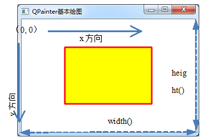

### 8.1.1　QPainter绘图系统

#### 1．QPainter与QPaintDevice

Qt的绘图系统使用户可以在屏幕或打印设备上用相同的API绘图，绘图系统基于QPainter、QPaintDevice和QPaintEngine类。QPainter是用来进行绘图操作的类，QPaintDevice是一个可以使用QPainter进行绘图的抽象的二维界面，QPaintEngine给QPainter提供在不同设备上绘图的接口。QPaintEngine类由QPainter和QPaintDevice内部使用，应用程序一般无需和QPaintEngine打交道，除非要创建自己的设备类型。

一般的绘图设备包括QWidget、QPixmap、QImage等，这些绘图设备为QPainter提供一个“画布”。

#### 2．paintEvent事件和绘图区

QWidget类及其子类是最常用的绘图设备，从QWidget类继承的类都有paintEvent()事件，要在设备上绘图，只需重定义此事件并编写响应代码。创建一个QPainter对象获取绘图设备的接口，然后就可以在绘图设备的“画布”上绘图了。

在paintEvent()事件里绘图的基本程序结构是：

```css
void Widget::paintEvent(QPaintEvent *event)
{
   QPainter   painter(this);  //创建与绘图设备关联的QPainter对象
...//painter在设备的窗口上画图
}
```

首先创建一个属于本绘图设备的QPainter对象painter，然后使用这个painter在绘图设备的窗口上画图。

QWidget的绘图区就是其窗口内部区域。如图8-1所示是在一个QWidget窗口上绘制了一个填充矩形（这个实心矩形及其边框是程序绘制的图形，其他直线和文字是为说明而加的），整个窗口内部的矩形区就是QPainter可以绘图的区域。

QWidget的内部绘图区的坐标系统如图8-1所示，坐标系统的单位是像素。左上角坐标为(0，0)，向右是X轴正方向，向下是Y轴正方向，绘图区的宽度由QWidget::width()函数获取，高度由QWidget::height()函数获取，所以，绘图区右下角的的点的坐标是(width(), height())。这个坐标系统是QWidget绘图区的局部物理坐标，称为视口（viewport）坐标。相应的还有逻辑坐标，称为窗口（window）坐标，后面再详细介绍。


<center class="my_markdown"><b class="my_markdown">图8-1　在QWidget继承的窗口上绘图</b></center>

使用QPainter在QWidget上绘图就是在这样的一个矩形区域里绘图。

#### 3．QPainter绘图的主要属性

用QPainter在绘图设备上绘图，主要是绘制一些基本的图形元素，包括点、直线、圆形、矩形、曲线、文字等，控制这些绘图元素特性的主要是QPainter的3个属性，分别如下。

+ pen属性：是一个QPen对象，用于控制线条的颜色、宽度、线型等，如图8-1所示矩形边框的线条的特性就是由pen属性决定的。
+ brush属性：是一个QBrush对象，用于设置一个区域的填充特性，可以设置填充颜色、填充方式、渐变特性等，还可以采用图片做材质填充。图8-1中的矩形用黄色填充就是由brush属性设置决定的。
+ font属性：是一个QFont对象，用于绘制文字时，设置文字的字体样式、大小等属性。

使用这3个属性基本就控制了绘图的基本特点，当然还有一些其他的功能结合使用，比如叠加模式、旋转和缩放等功能。

#### 4．创建实例

为演示QPainter绘图的基本功能，创建一个Qt Widget Application项目samp8_1，并选择窗口基类为QWidget，自动创建窗体。创建后的项目有一个Widget类，为了简化代码功能，Widget窗口里不再放置任何其他组件，只用来绘图。

下面是Widget类的完整定义。只是重新定义了paintEvent()事件，在此事件里编写绘图的代码。Q_DECL_OVERRIDE宏表示这个函数是对父类虚函数的重载。

```css
class Widget : public QWidget
{
   Q_OBJECT
protected:
   void   paintEvent(QPaintEvent *event) Q_DECL_OVERRIDE;
public:
   explicit Widget(QWidget *parent = 0);
   ~Widget();
private:
   Ui::Widget *ui;
};
```

下面是Widget类构造函数和paintEvent()函数的代码，在界面上绘制如图8-1所示的一个填充矩形，演示了QPainter绘图的基本过程。

```css
Widget::Widget(QWidget *parent) :  QWidget(parent),  ui(new Ui::Widget)
{
   ui->setupUi(this);
   setPalette(QPalette(Qt::white)); //设置窗口为白色背景
   setAutoFillBackground(true);
}
void Widget::paintEvent(QPaintEvent *event)
{
   QPainter   painter (this);//创建QPainter对象
   painter.setRenderHint(QPainter::Antialiasing);
   painter.setRenderHint(QPainter::TextAntialiasing);
   int W=this->width(); //绘图区宽度
   int H=this->height(); //绘图区高度
   QRect   rect(W/4,H/4,W/2,H/2); //中间区域矩形框
//设置画笔
   QPen   pen;
   pen.setWidth(3); //线宽
   pen.setColor(Qt::red); //划线颜色
   pen.setStyle(Qt::SolidLine);//线的样式，实线、虚线等
   pen.setCapStyle(Qt::FlatCap);//线端点样式
   pen.setJoinStyle(Qt::BevelJoin);//线的连接点样式
   painter.setPen(pen);
//设置画刷
   QBrush  brush;
   brush.setColor(Qt::yellow); //画刷颜色
   brush.setStyle(Qt::SolidPattern); //画刷填充样式
   painter.setBrush(brush);
//绘图
   painter.drawRect(rect);
}
```

在paintEvent()函数中，首先创建与Widget关联的QPainter对象painter，这样就可以用这个painter在Widget上绘图了。

下面的代码获取Widget窗口的宽度和高度，并定义了位于中间区域的矩形rect，这个矩形的大小随Widget的大小变化而变化，因为它的大小定义中利用了Widget的宽度和高度，而不是固定大小。

```css
int W=this->width(); //绘图区宽度
int H=this->height(); //绘图区高度
QRect   rect(W/4,H/4,W/2,H/2); //中间区域矩形框
```

然后定义了一个QPen类的对象pen，设置其线宽、颜色、线型等，然后设置为painter的pen。

再定义了一个QBrush类的对象brush，设置其颜色为黄色，填充方式为实体填充，然后设置为painter的brush。

这样设置好painter的pen和brush属性后，调用QPainter类的drawRect()函数，就可以绘制前面定义的矩形了，矩形框的线条特性由pen决定，填充特性由brush决定。运行程序就可以得到如图8-1所示的居于界面中间的填充矩形框。

为了不使程序结构太过于复杂，在paintEvent()函数里直接设置pen和brush的各种属性，而不是设计复杂的界面程序来修改这些设置。要实现什么绘图功能，只需在paintEvent()函数里直接修改代码即可。

