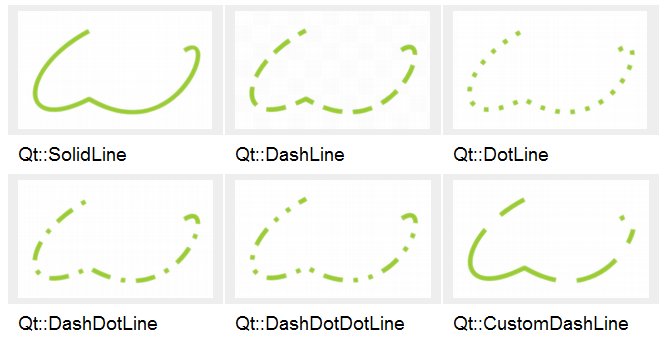
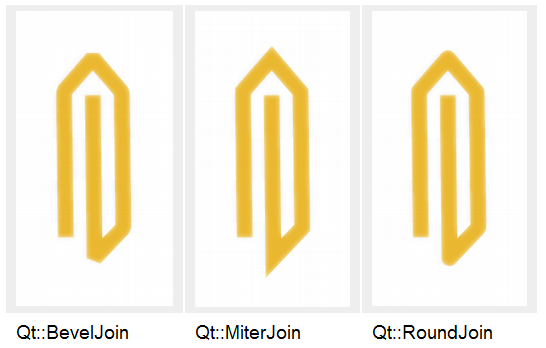

### 8.1.2　QPen的主要功能

QPen用于绘图时对线条进行设置，主要包括线宽、颜色、线型等，表8-1是QPen类的主要接口函数。通常一个设置函数都有一个对应的读取函数，例如setColor()用于设置画笔颜色，对应的读取画笔颜色的函数为color()，表8-1仅列出设置函数（省略了函数参数中的const关键字）。

<b class="my_markdown">表8-1　QPen的主要函数</b>

| 函数原型 | 功能 |
| :-----  | :-----  | :-----  | :-----  |
| void　setColor(QColor &color) | 设置画笔颜色，即线条颜色 |
| void　setWidth(int width) | 设置线条宽度 |
| void　setStyle (Qt::PenStyle style) | 设置线条样式，参数为Qt::PenStyle枚举类型 |
| void　setCapStyle (Qt::PenCapStyle style) | 设置线条端点样式，参数为Qt::PenCapStyle枚举类型 |
| void　setJoinStyle (Qt::PenJoinStyle style) | 设置连接样式，参数为Qt::PenJoinStyle枚举类型 |

线条颜色和宽度的设置无需多说，QPen影响线条特性的另外3个主要属性是线条样式（style）、端点样式（capStyle）和连接样式（joinStyle）。

#### 1．线条样式

setStyle(Qt::PenStyle style)函数用于设置线条样式，参数是一个枚举类型Qt::PenStyle的常量，几种典型的线条样式的绘图效果如图8-2所示。Qt::PenStyle类型还有一个常量Qt::NoPen表示不绘制线条。

<b class="my_markdown">图8-2　各种样式的线条（来自Qt帮助文件）</b>

除了几种基本的线条样式外，用户还可以自定义线条样式，自定义线条样式时需要用到setDashOffset()和setDashPattern()函数。

#### 2．线条端点样式

setCapStyle (Qt::PenCapStyle style)函数用于设置线条端点样式，参数是一个枚举类型Qt::PenCapStyle的常量，该枚举类型的3种取值及其绘图效果如图8-3所示。

<b class="my_markdown">图8-3　各种线条端点样式（来自Qt帮助文件）</b>

#### 3．线条连接样式

setJoinStyle (Qt::PenJoinStyle style)函数用于设置线条连接样式，参数是一个枚举类型Qt::PenJoinStyle 的常量，该枚举类型的取值及其绘图效果如图8-4所示。

<b class="my_markdown">图8-4　各种线条连接样式（来自Qt帮助文件）</b>

