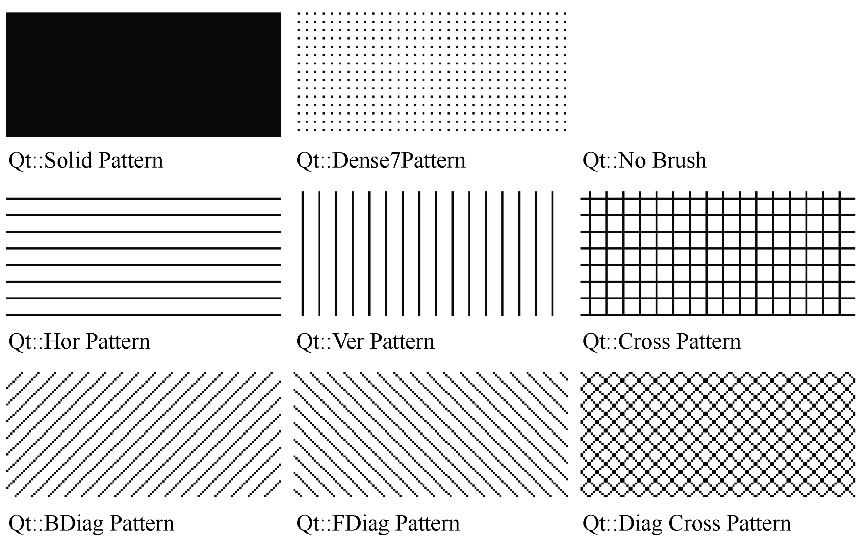
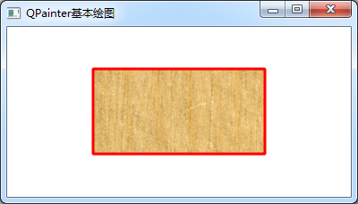

### 8.1.3　QBrush的主要功能

QBrush定义了QPainter绘图时的填充特性，包括填充颜色、填充样式、材质填充时的材质图片等，其主要函数见表8-2（省略了函数参数中的const关键字）。

<center class="my_markdown"><b class="my_markdown">表8-2　QBrush的主要函数</b></center>

| 函数原型 | 功能 |
| :-----  | :-----  | :-----  | :-----  |
| void　setColorr(QColor &color) | 设置画刷颜色，实体填充时即为填充颜色 |
| void　setStyle(Qt::BrushStyle style) | 设置画刷样式，参数为Qt::BrushStyle枚举类型 |
| void　setTexture(QPixmap &pixmap) | 设置一个QPixmap类型的图片作为画刷的图片，画刷样式自动设置为Qt::TexturePattern |
| void　setTextureImage(QImage &image) | 设置一个QImage类型的图片作为画刷的图片，画刷样式自动设置为Qt::TexturePattern |

setStyle(Qt::BrushStyle style)函数设置画刷的样式，参数是Qt::BrushStyle style枚举类型，该枚举类型典型的几种取值见表8-3，详细的取值请参考Qt的帮助文件。几种典型取值的填充效果如图8-5所示。

<center class="my_markdown"><b class="my_markdown">表8-3　枚举类型Qt:: BrushStyle几个主要常量及其意义</b></center>

| 枚举常量 | 描述 |
| :-----  | :-----  | :-----  | :-----  |
| Qt:: NoBrush | 不填充 |
| Qt:: SolidPattern | 单一颜色填充 |
| Qt:: HorPattern | 水平线填充 |
| Qt:: VerPattern | 垂直线填充 |
| Qt:: LinearGradientPattern | 线性渐变，需要使用QLinearGradient类对象作为Brush |
| Qt:: RadialGradientPattern | 辐射渐变，需要使用QRadialGradient类对象作为Brush |
| Qt:: ConicalGradientPattern | 圆锥型渐变，需要使用QConicalGradient类对象作为Brush |
| Qt::TexturePattern | 材质填充，需要指定texture或textureImage图片 |

渐变填充需要使用专门的类作为Brush赋值给QPainter，这部分在后面详细介绍。其他各种线型填充只需设置类型参数即可，使用材质需要设置材质图片。


<center class="my_markdown"><b class="my_markdown">图8-5　Qt::BrushStyle几种填充样式（来自Qt帮助文件）</b></center>

下面是使用资源文件里的一个图片进行材质填充的示例程序，用材质图片填充一个矩形，程序运行结果如图8-6所示。

```css
void Widget::paintEvent(QPaintEvent *event)
{
   QPainter   painter(this); 
   int W=this->width(); //绘图区宽度
   int H=this->height(); //绘图区高度
   QRect   rect(W/4,H/4,W/2,H/2); //中间区域矩形框
//设置画笔
   QPen   pen;
   pen.setWidth(3); //线宽
   pen.setColor(Qt::red); //划线颜色
   pen.setStyle(Qt::SolidLine);//线的类型，实线、虚线等
   painter.setPen(pen);
//设置画刷
   QPixmap texturePixmap(":images/images/texture.jpg");
   QBrush  brush;
   brush.setStyle(Qt::TexturePattern); //画刷填充样式
   brush.setTexture(texturePixmap); //设置材质图片
   painter.setBrush(brush);
//绘图
   painter.drawRect(rect);
}
```


<center class="my_markdown"><b class="my_markdown">图8-6　材质填充效果</b></center>

