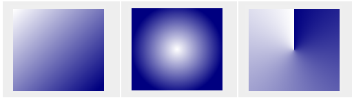
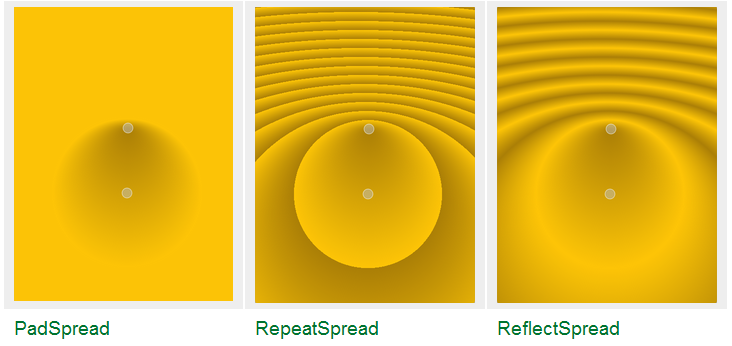
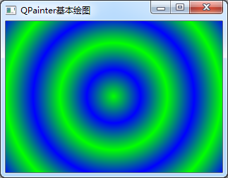

### 8.1.4　渐变填充

使用渐变填充需要用渐变类的对象作为Painter的brush，有3个实现渐变填充的类。

+ QLinearGradient：线性渐变。指定一个起点及其颜色，终点及其颜色，还可以指定中间的某个点的颜色，起点至终点之间的颜色会线性插值计算，得到线性渐变的填充颜色。
+ QRadialGradient：有简单辐射渐变和扩展辐射渐变两种方式。简单辐射渐变是在一个圆内的一个焦点和一个端点之间生成渐变颜色，扩展辐射渐变是在一个焦点圆和一个中心圆之间生成渐变色。
+ QConicalGradient：圆锥形渐变，围绕一个中心点逆时针生成渐变颜色。

这3种渐变的示例效果如图8-7所示。


<center class="my_markdown"><b class="my_markdown">图8-7　3种渐变填充的效果（来自Qt帮助文件）：（左）QLinearGradient；（中）QRadialGradient；（右）QConicalGradient</b></center>

这3个渐变类都继承自QGradient类，除了生成渐变颜色的方式不同之外，在设定的渐变颜色坐标范围之外，还需要用QGradient类的setSpread(QGradient::Spread method)函数设置延展方式。枚举类型QGradient::Spread有3种取值，分别表示3种延展效果，图8-8是使用辐射渐变时3种延展方式的效果。setSpread()对圆锥形渐变不起作用。

+ PadSpread模式是用结束点的颜色填充外部区域，这是缺省的方式。
+ RepeatSpread模式是重复使用渐变方式填充外部区域。
+ ReflectSpread是反射式重复使用渐变方式填充外部区域。


<center class="my_markdown"><b class="my_markdown">图8-8　3种渐变延展效果（来自Qt帮助文件）</b></center>

下面的代码演示使用渐变效果绘图，程序中使用了辐射渐变。

```css
void Widget::paintEvent(QPaintEvent *event)
{
   QPainter   painter(this); 
   int W=this->width();
   int H=this->height();
//径向渐变
   QRadialGradient  radialGrad(W/2,H/2,qMax(W/8,H/8),W/2,H/2);
   radialGrad.setColorAt(0,Qt::green);
   radialGrad.setColorAt(1,Qt::blue);
   radialGrad.setSpread(QGradient::ReflectSpread);
   painter.setBrush(radialGrad);
//绘图
   painter.drawRect(this->rect()); //填充更大区域，会有延展效果
}
```

上面的代码中定义QRadialGradient对象时使用的构造函数原型是：

```css
QRadialGradient(qreal cx, qreal cy, qreal radius, qreal fx, qreal fy)
```

其中，(cx, cy)是辐射填充的中心点，程序中设置为(W/2, H/2)，也就是Widget窗口的中心；radius是辐射填充区的半径，程序中设置为qMax(W/8, H/8)；(fx, fy)是焦点坐标，程序中设置为(W/2, H/2)，与中心点相同。

设置辐射渐变的起点颜色和终点颜色的语句是：

```css
radialGrad.setColorAt(0,Qt::green);
radialGrad.setColorAt(1,Qt::blue);
```

这里的“点”使用了逻辑坐标，0表示起点，即辐射中心点；1表示终点，即填充区圆的圆周。

再用setSpread()函数设置延展方式为QGradient::ReflectSpread。

最后的绘图语句是：

```css
painter.drawRect(this->rect());
```

这里绘制一个矩形，但是使用的矩形是this->rect()，即Widget窗口的整个矩形区域，它大于定义的辐射填充区域，所以会有延展效果。程序运行效果如图8-9所示。


<center class="my_markdown"><b class="my_markdown">图8-9　辐射填充效果</b></center>

若使用线性渐变填充，示例代码如下（只列出QLinearGradient定义的部分）。定义QLinearGradient对象时指定了线性渐变的起点和终点，设置颜色时可以在起点和终点之间设置多个点的颜色值。

```css
//   QLinearGradient  linearGrad(rect.left(),rect.top(),
//                 rect.right(),rect.bottom()); //对角线
   QLinearGradient  linearGrad(rect.left(), rect.top(), rect.right(), rect.top());//从左到右
   linearGrad.setColorAt(0,Qt::blue);//起点颜色
   linearGrad.setColorAt(0.5,Qt::green);//中间点颜色
   linearGrad.setColorAt(1,Qt::red);//终点颜色
   linearGrad.setSpread(QGradient::ReflectSpread);  //展布模式
   painter.setBrush(linearGrad);
```

创建QLinearGradient对象时传递了两个坐标点，分别表示填充区的起点和终点，起点和终点的定义方式不同，可以实现水平渐变、垂直渐变、或对角渐变等不同效果。

使用圆锥形渐变的示例代码如下。创建QConicalGradient对象时指定了中心点坐标和起始角度，然后设置多个点的颜色。但是注意，圆锥形填充没有延展效果。

```css
QConicalGradient  coniGrad(W/2,H/2,45);
coniGrad.setColorAt(0,Qt::yellow);
coniGrad.setColorAt(0.5,Qt::blue);
coniGrad.setColorAt(1,Qt::green);
painter.setBrush(coniGrad);
```

