### 8.1.5　QPainter绘制基本图形元件

#### 1．基本图形元件

QPainter提供了很多绘制基本图形的功能，包括点、直线、椭圆、矩形、曲线等，由这些基本的图形可以构成复杂的图形。QPainter中提供的绘制基本图元的函数见表8-4。每个函数基本上都有多种参数形式，这里只列出函数名，给出了其中一种参数形式的示例代码，并且假设已经通过以下的代码获得了绘图窗口的painter、窗口宽度W和高度H。

```css
QPainter painter(this);
int W=this->width(); //绘图区宽度
int H=this->height(); //绘图区高度
```

同一个函数名的其他参数形式的函数原型可查阅Qt的帮助文件。

<center class="my_markdown"><b class="my_markdown">表8-4　QPainter绘制基本图形元件的函数</b></center>

| 函数名 | 功能和示例代码 | 示例图形 |
| :-----  | :-----  | :-----  | :-----  | :-----  |
| drawArc | 画弧线，例如 `    QRect  rect(W/4,H/4,W/2,H/2); | int startAngle = 90 * 16;    //起始90° | int spanAngle = 90 * 16;    //旋转90° | painter.drawArc(rect, startAngle, spanAngle);  ` | 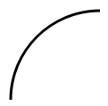 |
| drawChord | 画一段弦，例如 `    QRect  rect(W/4,H/4,W/2,H/2); | int startAngle = 90 * 16;    //起始90° | int spanAngle = 90 * 16;     //旋转90° | painter. drawChord (rect, startAngle, spanAngle); ` | 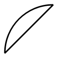 |
| drawConvexPolygon | 根据给定的点画凸多边形 `    QPoint points[4]={ | QPoint(5*W/12,H/4), | QPoint(3*W/4,5*H/12), | QPoint(5*W/12,3*H/4), | QPoint(W/4,5*H/12),    }; | painter.drawConvexPolygon(points, 4);  ` | 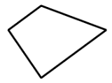 |
| drawEllipse | 画椭圆 `    QRect  rect(W/4,H/4,W/2,H/2); | painter.drawEllipse(rect); ` | 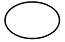 |
| drawImage | 在指定的矩形区域内绘制图片 `    QRect  rect(W/4,H/4,W/2,H/2); | QImage  image(":images/images/qt.jpg"); | painter.drawImage(rect, image);` |  |
| drawLine | 画直线 `    QLine  Line(W/4,H/4,W/2,H/2); | painter.drawLine(Line); ` | 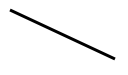 |
| drawLines | 画一批直线 `    QRect   rect(W/4,H/4,W/2,H/2); | QVector<QLine> Lines; | Lines.append(QLine(rect.topLeft(),rect.bottomRight())); | Lines.append(QLine(rect.topRight(),rect.bottomLeft())); | Lines.append(QLine(rect.topLeft(),rect.bottomLeft())); | Lines.append(QLine(rect.topRight(),rect.bottomRight())); | painter.drawLines(Lines);` | 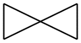 |
| drawPath | 绘制由QPainterPath对象定义的路线 `    QRect  rect(W/4,H/4,W/2,H/2); | QPainterPath  path; | path.addEllipse(rect); | path.addRect(rect); | painter.drawPath(path); ` | 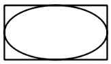 |
| drawPie | 绘制扇形 `    QRect   rect(W/4,H/4,W/2,H/2); | int startAngle = 40 * 16;//起始40° | int spanAngle = 120 * 16;//旋转120° | painter.drawPie(rect, startAngle, spanAngle); ` | 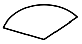 |
| drawPixmap | 绘制Pixmap图片 `    QRect   rect(W/4,H/4,W/2,H/2); | QPixmap   pixmap(":images/images/qt.jpg"); | painter.drawPixmap(rect, pixmap); ` |
| drawPoint | 画一个点 `    painter.drawPoint(QPoint(W/2,H/2)); ` |
| drawPoints | 画一批点 `     QPoint points[]={ | QPoint(5*W/12,H/4), | QPoint(3*W/4,5*H/12), | QPoint(2*W/4,5*H/12)   }; | painter.drawPoints(points, 3); ` |
| drawPolygon | 画多边形，最后一个点会和第一个点闭合 `    QPoint points[]={ | QPoint(5*W/12,H/4), | QPoint(3*W/4,5*H/12), | QPoint(5*W/12,3*H/4), | QPoint(2*W/4,5*H/12)    }; | painter.drawPolygon(points, 4); ` | 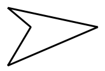 |
| drawPolyline | 画多点连接的线，最后一个点不会和第一个点连接 `    QPoint points[]={ | QPoint(5*W/12,H/4), | QPoint(3*W/4,5*H/12), | QPoint(5*W/12,3*H/4), | QPoint(2*W/4,5*H/12),    }; | painter.drawPolyline(points, 4); ` | 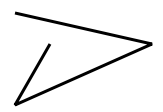 |
| drawRect | 画矩形 `    QRect   rect(W/4,H/4,W/2,H/2); | painter.drawRect(rect);  ` | 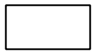 |
| drawRoundedRect | 画圆角矩形 `    QRect   rect(W/4,H/4,W/2,H/2); | painter.drawRoundedRect(rect,20,20);  ` | 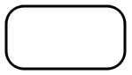 |
| drawText | 绘制文本，只能绘制单行文字，字体的大小等属性由QPainter::font()决定。 `    QRect   rect(W/4,H/4,W/2,H/2); | QFont   font; | font.setPointSize(30); | font.setBold(true); | painter.setFont(font); | painter.drawText (rect,"Hello,Qt"); ` |
| eraseRect | 擦除某个矩形区域，等效于用背景色填充该区域 `    QRect   rect(W/4,H/4,W/2,H/2); | painter.eraseRect(rect); ` |
| fillPath | 填充某个QPainterPath定义的绘图路径，但是轮廓线不显示 `    QRect  rect(W/4,H/4,W/2,H/2); | QPainterPath  path; | path.addEllipse(rect); | path.addRect(rect); | painter.fillPath(path,Qt::red); ` | 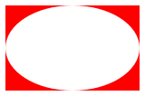 |
| fillRect | 填充一个矩形，无边框线 `    QRect  rect(W/4,H/4,W/2,H/2); | painter.fillRect (rect,Qt::green); ` | 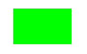 |

这些基本图形元件的绘制用户可以通过修改samp8_1的paintEvent()里的代码进行测试，这里就不再详细举例和说明了。

#### 2．QPainterPath的使用

在表8-4列举的QPainter绘制基本图形元件的函数中，一般的图形元件的绘制都比较简单和直观，只有drawPath()函数是绘制一个复合的图形对象，它使用一个QPainterPath类型的参数作为绘图对象。drawPath()函数的原型是：

```css
void QPainter::drawPath(const QPainterPath &path)
```

QPainterPath是一系列绘图操作的顺序集合，便于重复使用。一个PainterPath由许多基本的绘图操作组成，如绘图点移动、划线、画圆、画矩形等，一个闭合的PainterPath是终点和起点连接起来的绘图路径。使用QPainterPath的优点是绘制某些复杂形状时只需创建一个PainterPath，然后调用QPainter::drawPath()就可以重复使用。例如绘制一个复杂的星星图案需要多次调用lineto()函数，定义一个QPainterPath类型的变量path记录这些绘制过程，再调用drawPath(path)就可以完成星型图案的绘制。

QPainterPath提供了很多函数可以添加各种基本图形元件的绘制，其功能与QPainter提供的绘制基本图件的功能类似，也有一些用于PainterPath的专用函数，如closeSubpath()、connectPath()等，对于QPainterPath的函数功能不做详细说明，可以参考Qt帮助文件查看QPainterPath类的详细描述。在下一节的实例samp8_2中将结合QPainter的坐标变换功能演示QPainterPath 绘制多个星星的实现方法。

