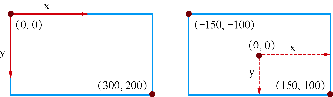
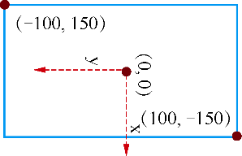

### 8.2.1　坐标变换函数

QPainter在窗口上绘图的默认坐标系统如图8-1所示，这是绘图设备的物理坐标。为了绘图的方便，QPainter提供了一些坐标变换的功能，通过平移、旋转等坐标变换，得到一个逻辑坐标系统，使用逻辑坐标系统在某些时候绘图更方便。坐标变换函数见表8-5。

<center class="my_markdown"><b class="my_markdown">表8-5　QPainter有关坐标变换操作的函数</b></center>

| 分组 | 函数原型 | 功能 |
| :-----  | :-----  | :-----  | :-----  | :-----  |
| 坐标变换 | void translate(qreal dx, qreal dy) | 坐标系统平移一定的偏移量，坐标原点平移到新的点 |
| void rotate(qreal angle) | 坐标系统顺时针旋转一个角度 |
| void scale(qreal sx, qreal sy) | 坐标系统缩放 |
| void shear(qreal sh, qreal sv) | 坐标系统做扭转变换 |
| 状态保存与恢复 | void save() | 保存painter当前的状态，就是将当前状态压入堆栈 |
| void restore() | 恢复上一次状态，就是从堆栈中弹出上次的状态 |
| void resetTransform() | 复位所有的坐标变换 |

常用的坐标变换是平移、旋转和缩放，使用世界坐标变换矩阵也可以实现这些变换功能，但是需要单独定义一个QTransform类的变量，对于QPainter来说，简单的坐标变换使用QPainter自有的坐标变换函数就足够了。

#### 1．坐标平移

坐标平移函数是translate()，其中一种参数形式的函数原型是：

```css
void translate(qreal dx, qreal dy)
```

表示将坐标系统水平方向平移dx个单位，垂直方向平移dy个单位，在缺省的坐标系统中，单位就是像素。如果是从原始状态平移（dx, dy），那么平移后的坐标原点就移到了（dx, dy）｡

假设一个绘图窗口宽度为300像素，高度为200像素，则其原始坐标系统如图8-10左所示；若执行平移函数translate(150, 100)，则坐标系统水平向右平移150像素，向下平移100像素，平移后的坐标系统如图 8-10 右所示，坐标原点在窗口的中心，而左上角的坐标变为（−150, −100），右下角的坐标变为（150, 100）。如此将坐标原点变换到窗口中心在绘制某些图形时是非常方便的。

#### 2．坐标旋转

坐标旋转的函数是rotate()，其函数原型为：

```css
void rotate(qreal angle)
```

它是将坐标系统绕坐标原点顺时针旋转angle角度，单位是度。当angle为正数时是顺时针旋转，为负数时是逆时针旋转。

在图8-10右的基础上，若执行rotate(90)，则得到图8-11所示的坐标系统。


<center class="my_markdown"><b class="my_markdown">图8-10　（左）原始坐标系统；（右）平移（150,100）后的坐标系统</b></center>


<center class="my_markdown"><b class="my_markdown">图8-11　对图8-10右图旋转90°之后的坐标系</b></center>

> **注意**
> 旋转之后并不改变窗口矩形的实际大小，只是改变了坐标轴的方向。

在图8-11的新坐标系下，窗口左上角的坐标变成了(-100, 150)，而右下角的坐标变成了(100, -150)。

#### 3．缩放

缩放函数是scale()，其函数原型为：

```css
void scale(qreal sx, qreal sy)
```

其中，sx, sy分别为横向和纵向缩放比例，比例大于1是放大，小于1是缩小。

#### 4．状态保存与恢复

进行坐标变换时，QPainter内部实际上有一个坐标变换矩阵，用save()保存当前坐标状态，用restore()恢复上次保存的坐标状态，这两个函数必须配对使用，操作的是一个堆栈对象。

resetTransform()函数则是复位所有坐标变换操作，恢复原始的坐标系统。

