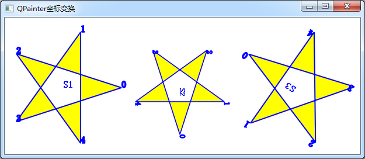

### 8.2.2　坐标变换绘图实例

#### 1．绘制3个五角星的程序

创建一个基于QWidget的窗口的应用程序samp8_2，窗体上不放置任何组件。在Widget类的构造函数和paintEvent()事件中编写代码，代码内容如下。

```css
Widget::Widget(QWidget *parent) :   QWidget(parent),   ui(new Ui::Widget)
{
   ui->setupUi(this);
   setPalette(QPalette(Qt::white)); //设置窗口背景色
   setAutoFillBackground(true);
   resize(600,300); //固定初始化窗口大小
}
void Widget::paintEvent(QPaintEvent *event)
{
   QPainter   painter(this); 
   painter.setRenderHint(QPainter::Antialiasing);
   painter.setRenderHint(QPainter::TextAntialiasing);
//生成五角星的5个顶点的坐标，假设原点在五角星中心
   qreal   R=100; //半径
   const   qreal Pi=3.14159;
   qreal   deg=Pi*72/180;
   QPoint points[5]={
      QPoint(R,0),
      QPoint(R*std::cos(deg),-R*std::sin(deg)),
      QPoint(R*std::cos(2*deg),-R*std::sin(2*deg)),
      QPoint(R*std::cos(3*deg),-R*std::sin(3*deg)),
      QPoint(R*std::cos(4*deg),-R*std::sin(4*deg)),
   };
//设置字体
   QFont   font;
   font.setPointSize(12);
   font.setBold(true);
   painter.setFont(font);
//设置画笔
   QPen   penLine;
   penLine.setWidth(2); //线宽
   penLine.setColor(Qt::blue); //划线颜色
   penLine.setStyle(Qt::SolidLine);//线的类型 
   penLine.setCapStyle(Qt::FlatCap);//线端点样式
   penLine.setJoinStyle(Qt::BevelJoin);//线的连接点样式
   painter.setPen(penLine);
//设置画刷
   QBrush  brush;
   brush.setColor(Qt::yellow); //画刷颜色
   brush.setStyle(Qt::SolidPattern); //画刷填充样式
   painter.setBrush(brush);
//设计绘制五角星的PainterPath，以便重复使用
   QPainterPath starPath;
   starPath.moveTo(points[0]);
   starPath.lineTo(points[2]);
   starPath.lineTo(points[4]);
   starPath.lineTo(points[1]);
   starPath.lineTo(points[3]);
   starPath.closeSubpath(); //闭合路径，最后一个点与第一个点相连
   starPath.addText(points[0],font,"0"); //显示端点编号
   starPath.addText(points[1],font,"1");
   starPath.addText(points[2],font,"2");
   starPath.addText(points[3],font,"3");
   starPath.addText(points[4],font,"4");
//绘图
   painter.save(); //保存坐标状态
   painter.translate(100,120);//平移
   painter.drawPath(starPath); //画星星
   painter.drawText(0,0,"S1");
   painter.restore(); //恢复坐标状态
   painter.translate(300,120); //平移
   painter.scale(0.8,0.8); //缩放
   painter.rotate(90); //顺时针旋转90度
   painter.drawPath(starPath);//画星星
   painter.drawText(0,0,"S2");
   painter.resetTransform(); //复位所有坐标变换
   painter.translate(500,120); //平移
   painter.rotate(-145); //逆时针旋转145度
   painter.drawPath(starPath);//画星星
   painter.drawText(0,0,"S3");
}
```

运行该实例程序，得到如图8-12所示的结果，在窗口上绘制了3个五角星。


<center class="my_markdown"><b class="my_markdown">图8-12　使用QPainterPath和坐标变换的绘图效果</b></center>

第1个是原始的五角星；第2个是缩小为0.8倍，顺时针旋转90度的五角星；第3个是逆时针旋转145度的五角星。这个程序中使用到了QPainterPath和QPainter的坐标变换功能。

#### 2．绘制五角星的PainterPath的定义

首先假设一个五角星的中心点是原点，第0个点在X轴上，五角星外接圆半径为100，计算出5个点的坐标，保存在points数组中。

然后定义了一个QPainterPath类的变量starPath，用于记录画五角星的过程，就是几个点的连线过程，并且标注点的编号。使用QPainterPath的优点就是定义一个QPainterPath类型的变量记录一个复杂图形的绘制过程后，可以重复使用。虽然points数组中的点的坐标是假设五角星的中心点是原点，在绘制不同的五角星时只需将坐标平移到新的原点位置，就可以绘制不同的五角星。

绘制第1个五角星的程序是：

```css
painter.save(); //保存坐标状态
painter.translate(100,120);
painter.drawPath(starPath); //画星星
painter.drawText(0,0,"S1");
painter.restore(); //恢复坐标状态
```

这里，save()函数保存当前坐标状态（也就是坐标的原始状态），然后将坐标原点平移到（100,120），调用绘制路径的函数drawPath(starPath)绘制五角星，在五角星的中心标注“S1”表示第1个五角星，最后调用restore()函数恢复上次的坐标状态。这样就以（100,120）为中心点绘制了第1个五角星。

绘制第2个五角星的程序是：

```css
painter.translate(300,120); //平移
painter.scale(0.8,0.8); //缩放
painter.rotate(90); //顺时针旋转90度
painter.drawPath(starPath);//画星星
painter.drawText(0,0,"S2");
```

这里首先调用坐标平移函数translate(300, 120)。由于上次restore()之后回到坐标初始状态，所以这次平移后，坐标原点到了物理坐标(300, 120)。而如果没有上一个restore()，会在上一次的坐标基础上平移。

绘图之前调用了缩放函数scale(0.8, 0.8)，使得缩小到原来的0.8，再顺时针旋转90°，然后调用绘制路径函数drawPath(starPath)绘制五角星，就得到了第2个五角星。

绘制第3个五角星时首先使坐标复位，即：

```css
painter.resetTransform(); //复位所有坐标变换
```

这样会复位所有坐标变换，又回到了原始坐标。

