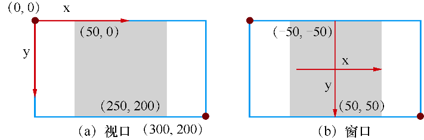
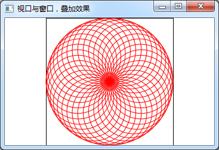
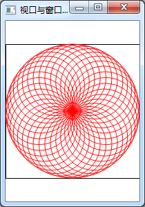

### 8.2.3　视口和窗口

#### 1．视口和窗口的定义与原理

绘图设备的物理坐标是基本的坐标系，通过QPainter的平移、旋转等变换可以得到更容易操作的逻辑坐标。

为了实现更方便的坐标，QPainter还提供了视口（Viewport）和窗口（Window）坐标系，通过QPainter内部的坐标变换矩阵自动转换为绘图设备的物理坐标。

视口表示绘图设备的任意一个矩形区域的物理坐标，可以只选取物理坐标的一个矩形区域用于绘图。默认情况下，视口等于绘图设备的整个矩形区。

窗口与视口是同一个矩形，只不过是用逻辑坐标定义的坐标系。窗口可以直接定义矩形区的逻辑坐标范围。图8-13是对视口和窗口的图示说明。


<center class="my_markdown"><b class="my_markdown">图8-13　视口和窗口示意图</b></center>

图8-13左图中的矩形框代表绘图设备的物理大小和坐标范围，假设宽度为300像素，高度为200像素。现在要取其中间的一个正方形区域作为视口，灰色的正方形就是视口，绘图设备的物理坐标中，视口的左上角坐标为(50, 0)，右下角坐标为(250, 200)。定义此视口，可以使用QPainter的setViewport()函数，其函数原型为：

```css
void QPainter::setViewport(int x, int y, int width, int height)
```

要定义图8-13左图中的视口，使用下面的语句：

```css
painter.setViewport(50,0,200,200);
```

表示从绘图设备物理坐标系统的起点(50, 0)开始，取宽度为200、高度为200的一个矩形区域作为视口。

对于图8-13左图的视口所表示的正方形区域，定义一个窗口（图8-13右图），窗口坐标的中心在正方形中心，并设置正方形的逻辑边长为100。可使用QPainter的setWindow()函数，其函数原型为：

```css
void QPainter::setWindow(int x, int y, int width, int height)
```

所以，此处定义窗口的语句是：

```css
painter. setWindow (-50,-50,100,100);
```

它表示对应于视口的矩形区域，其窗口左上角的逻辑坐标是(-50, -50)，窗口宽度为100，高度为100。这里设置的窗口还是一个正方形，使得从视口到窗口变换时，长和宽的变化比例是相同的。实际可以任意指定窗口的逻辑坐标范围，长和宽的变化比例不相同也是可以的。

#### 2．视口和窗口的使用实例

使用窗口坐标的优点是，只需按照窗口坐标定义来绘图，而不用管实际的物理坐标范围的大小。例如在一个固定边长为100的正方形窗口内绘图，当实际绘图设备大小变化时，绘制的图形会自动变化大小。这样，就可以将绘图功能与绘图设备隔离开来，使得绘图功能适用于不同大小、不同类型的设备。

实例samp8_3演示了使用视口和窗口的方法，项目创建与samp8_1类似，只在Widegt的paintEvent()事件里添加绘图代码。

```css
void Widget::paintEvent(QPaintEvent *event)
{
   QPainter   painter(this);
   int W=width();
   int H=height();
   int side=qMin(W,H);//取长和宽的较小值
   QRect rect((W-side)/2, (H-side)/2,side,side); //viewport矩形区
   painter.drawRect(rect); //Viewport的矩形区域
   painter.setViewport(rect);//设置Viewport
   painter.setWindow(-100,-100,200,200); // 设置窗口大小，逻辑坐标
   painter.setRenderHint(QPainter::Antialiasing);
//设置画笔
   QPen   pen;
   pen.setWidth(1); //线宽
   pen.setColor(Qt::red); //划线颜色
   pen.setStyle(Qt::SolidLine);//线的类型 
   painter.setPen(pen);
   for(int i=0; i
```

运行实例程序samp8_3，可以得到如图8-14所示的图形效果。当窗口的宽度大于高度时，以高度作为正方形的边长；当高度大于宽度时，以宽度作为正方形边长，且图形是自动缩放的。



<center class="my_markdown"><b class="my_markdown">图8-14　实例samp8_3使用窗口坐标的绘图效果</b></center>

程序首先定义了一个正方形视口，正方形以绘图设备的长、宽中较小者为边长。

然后定义窗口，定义的窗口是原点在中心，边长为200的正方形。

图8-14的图形效果实际上是画了36个圆得到的，循环部分的代码如下：

```css
for(int i=0; i<36;i++)
{
   painter.drawEllipse(QPoint(50,0),50,50);
   painter.rotate(10);
}
```

每个圆的圆心在X轴上的(50, 0)，半径为50。画完一个圆之后坐标系旋转10°，再画相同的圆，这就巧妙应用了坐标轴的旋转。

