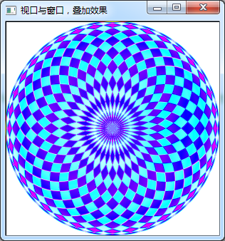
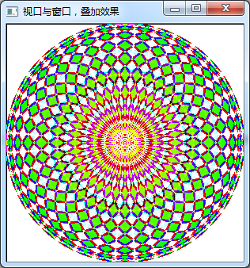

### 8.2.4　绘图叠加的效果

对上面的程序稍作修改，增加渐变填充和叠加效果的设置。

```css
void Widget::paintEvent(QPaintEvent *event)
{
   QPainter   painter(this);
   int W=width();
   int H=height();
   int side=qMin(W,H);//取长和宽的较小值
   QRect rect((W-side)/2, (H-side)/2,side,side); //viewport矩形区
   painter.drawRect(rect); //Viewport大小
   painter.setViewport(rect);//设置Viewport
   painter.setWindow(-100,-100,200,200); // 设置窗口大小，逻辑坐标
   painter.setRenderHint(QPainter::Antialiasing);
//设置画笔
   QPen   pen;
   pen.setWidth(1); //线宽
   pen.setColor(Qt::red); //划线颜色
   pen.setStyle(Qt::SolidLine);//线的类型
   painter.setPen(pen);
//线性渐变
   QLinearGradient  linearGrad(0,0,100,0);//从左到右,
   linearGrad.setColorAt(0,Qt::yellow);//起点颜色
   linearGrad.setColorAt(1,Qt::green);//终点颜色
   linearGrad.setSpread(QGradient::PadSpread);  //展布模式
   painter.setBrush(linearGrad);
//设置复合模式
  painter.setCompositionMode(QPainter::RasterOp_NotSourceXorDestination);
//   painter.setCompositionMode(QPainter::CompositionMode_Difference);
//   painter.setCompositionMode(QPainter::CompositionMode_Exclusion);
   for(int i=0; i
```

在上面的程序中，对单个圆使用了线性渐变填充，单个圆从左到右，由黄色渐变为绿色。

使用QPainter::setCompositionMode()函数设置组合模式，即后面绘制的图与前面绘制的图的叠加模式。函数参数是一个QPainter::CompositionMode枚举类型值，可以查看Qt帮助，这个枚举类型有近40种取值，表示了后绘制图形与前面图形的不同叠加运算方式。

图8-15是其中两种叠加模式下的绘图效果，可以发现采用不同的叠加模式，可以得到不同的绘图效果，甚至是意想不到的绚丽效果。用户可以自己修改程序，设置不同渐变颜色、渐变填充模式、不同叠加模式，也许能绘制出更炫的图形呢。



<center class="my_markdown"><b class="my_markdown">图8-15　渐变填充和叠加效果，（左）CompositionMode_Difference模式叠加，
 （右）RasterOp_NotSourceXorDestination模式叠加</b></center>

