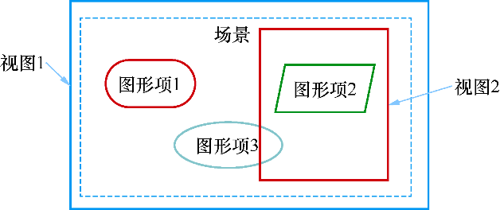

### 8.3.1　场景、视图与图形项

采用QPainter绘图时需要在绘图设备的paintEvent()事件里编写绘图的程序，实现整个绘图过程。这种方法如同使用Windows的画图软件在绘图，绘制的图形是位图，这种方法适合于绘制复杂性不高的固定图形，不能实现图件的选择、编辑、拖放、修改等功能。

Qt为绘制复杂的可交互图形提供了Graphics View 绘图架构，是一种基于图形项（Graphics Item）的模型/视图模式，与第5章的数据编辑与显示的Model/View模式类似。使用Graphics View架构可以绘制复杂的有几万个基本图形元件的图形，并且每个图形元件是可选择、可拖放和修改的，类似于矢量绘图软件的绘图功能。

Graphics View架构主要由3个部分组成，即场景、视图和图形项，其构成的Graphics View绘图系统结构如图8-16所示。

<b class="my_markdown">图8-16　视图、场景、图形项的关系</b>

#### 1．场景

QGraphicsScene类提供绘图场景（Scene）。场景是不可见的，是一个抽象的管理图形项的容器，可以向场景添加图形项，获取场景中的某个图形项等。场景主要具有如下一些功能：

+ 提供管理大量图形项的快速接口；
+ 将事件传播给每个图形项；
+ 管理每个图形项的状态，例如选择状态、焦点状态等；
+ 管理未经变换的渲染功能，主要用于打印。

除了图形项之外，场景还有背景层和前景层，通常由QBrush指定，也可以通过重新实现drawBackground()和drawForeground()函数来实现自定义的背景和前景，实现一些特殊效果。

#### 2．视图

QGraphicsView 提供绘图的视图（View）组件，用于显示场景中的内容。可以为一个场景设置几个视图，用于对同一个数据集提供不同的视口。

在图8-16中，虚线框的部分是一个场景，视图1比场景大，显示场景的全部内容。缺省情况下，当视图大于场景时，场景在视图的中间部分显示，也可以设置视图的Alignment属性控制场景在视图中的显示位置；当视图小于场景时（见图8-16中的视图2），视图只能显示场景的一部分内容，但是会自动提供卷滚条在整个场景内移动。

视图接收键盘和鼠标输入并转换为场景事件，并进行坐标转换后传送给可视场景。

#### 3．图形项

图形项（Graphics Item）就是一些基本的图形元件，图形项的基类是QGraphicsItem。Qt提供了一些基本的图形项，如绘制椭圆的QGraphicsEllipseItem、绘制矩形的QGraphicsRectItem、绘制文字的QGraphicsTextItem等。

QGraphicsItem支持如下的一些操作：

+ 支持鼠标事件响应，包括鼠标按下、移动、释放、双击，还包括鼠标停留、滚轮、快捷菜单等事件；
+ 支持键盘输入，按键事件；
+ 支持拖放操作；
+ 支持组合，可以是父子项关系组合，也可以是通过QGraphicsItemGroup类进行组合。

所以，图形项可以被选择、拖放、组合，若编写信号槽函数代码，还可以实现各种编辑功能。一个图形项还可以包含子图形项，图形项还支持碰撞检测，即是否与其他图形项碰撞。

在图8-16所示的视图、场景和图形项之间的关系示意图中，场景是图形项的容器，可以在场景上绘制很多图形项，每个图形项就是一个对象，这些图形项可以被选择、拖动等。视图是显示场景的一部分区域的视口，一个场景可以有多个视图，一个视图显示场景的部分区域或全部区域，或从不同角度观察场景。

