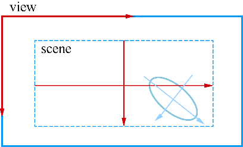

### 8.3.2　Graphics View的坐标系统

Graphics View系统有3个有效的坐标系，图形项坐标、场景坐标、视图坐标。3个坐标系的示意图如图8-17所示。绘图的时候，场景的坐标等价于QPainter的逻辑坐标，一般以场景的中心为原点；视图坐标与设备坐标相同，是物理坐标，缺省以左上角为原点；图形项坐标是局部逻辑坐标，一般以图件的中心为原点。


<center class="my_markdown"><b class="my_markdown">图8-17　场景、视图、图形项3个坐标系之间的关系</b></center>

#### 1．图形项坐标

图形项使用自己的局部坐标（Item Coordinates），通常以其中心为(0, 0)，也是各种坐标变换的中心。图形项的鼠标事件的坐标是用局部坐标表示的，创建自定义图形项，绘制图形项时只需考虑其局部坐标，QGraphicsScene和QGraphicsView会自动进行坐标转换。

一个图形项的位置是其中心点在父坐标系统中的坐标，对于没有父图形项的图形项，其父对象就是场景，图形项的位置就是在场景中的坐标。

如果一个图形项还是其他图形项的父项，父项进行坐标变换时，子项也做同样的坐标变换。

QGraphicsItem的大多数函数都是在其局部坐标系上操作的，例如一个图形项的边界矩形QGraphicsItem::boundingRect()是用局部坐标给出的，但是QGraphicsItem::pos()是仅有的几个例外，它返回的是图形项在父项坐标系中的坐标，如果是顶层图形项，就是在场景中的坐标。

#### 2．视图坐标

视图坐标（View Coordinates）就是窗口界面（widget）的物理坐标，单位是像素。视图坐标只与widget或视口有关，而与观察的场景无关。QGraphicsView视口的左上角坐标总是（0,0）。

所有的鼠标事件、拖放事件的坐标首先是由视图坐标定义的，然后用户需要将这些坐标映射为场景坐标，以便和图形项交互。

#### 3．场景坐标

场景是所有图形项的基础坐标，场景坐标（Scene Coordinates）描述了每个顶层图形项的位置。创建场景时可以定义场景矩形区的坐标范围，例如

```css
scene=new QGraphicsScene(-400,-300,800,600);
```

这样定义的scene是左上角坐标为（-400, -300），宽度为800，高度为600的矩形区域，单位是像素。

每个图形项在场景里都有一个位置坐标，由函数QGraphicsItem::scenePos()给出；还有一个图形项边界矩形，由QGraphicsItem::sceneBoundingRect()函数给出。边界矩形可以使QGraphicsScene知道场景的哪个区域发生了变化。场景发生变化时会发射QGraphicsScene::changed()信号，参数是一个场景的矩形列表，表示发生变化的矩形区。

#### 4．坐标映射

在场景中操作图形项时，进行场景到图形项、图形项到图形项，或视图到场景之间的坐标变换是比较有用的，即坐标映射（Coordinate Mapping）。例如，在QGraphicsView的视口上单击鼠标时，通过函数QGraphicsView::mapToScene()可以将视图坐标映射为场景坐标，然后用QGraphicsScene::itemAt()函数可以获取场景中鼠标光标处的图形项。

