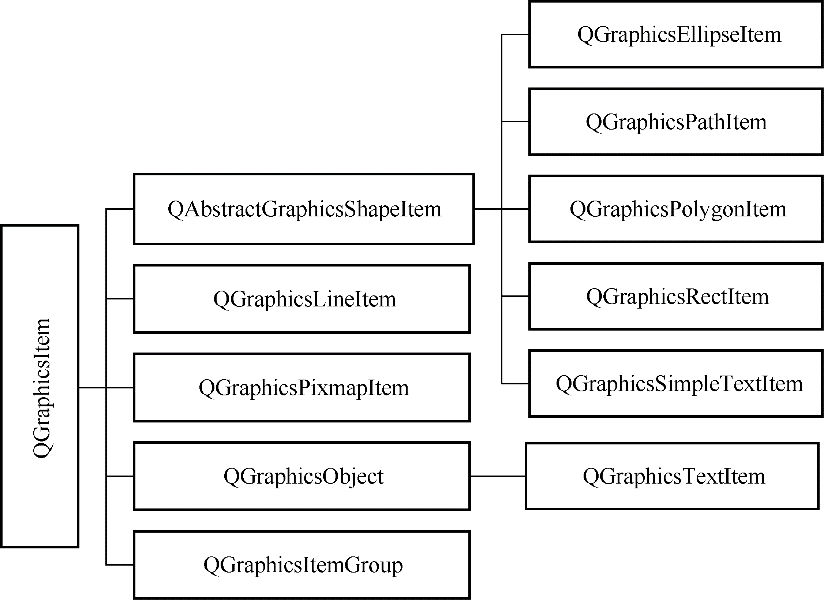

### 8.3.3　Graphics View相关的类

Graphics View结构的主要类包括视图类QGraphicsView、场景类QGraphicsScene，和各种图形项类，图形项类的基类都是QGraphicsItem。

#### 1．QGraphicsView类的主要接口函数

QGraphicsView是用于观察一个场景的物理窗口，当场景小于视图时，整个场景在视图中可见；当场景大于视图时，视图自动提供卷滚条。

QGraphicsView的视口坐标等于显示设备的物理坐标，但是也可以对QGraphicsView的坐标进行平移、旋转、缩放等变换。

表8-6是QGraphicsView的主要接口函数。一般的设置函数还有一个对应的读取函数，如setScene()对应的读取函数是scene()，这里只列出设置函数。并且仅列出函数的返回数据类型，省略了输入参数，函数的详细定义见Qt帮助文件。

<center class="my_markdown"><b class="my_markdown">表8-6　QGraphicsView主要函数功能说明</b></center>

| 分组 | 函数 | 功能描述 |
| :-----  | :-----  | :-----  | :-----  | :-----  |
| 场景 | void　setScene() | 设置关联显示的场景 |
| void　setSceneRect() | 设置场景在视图中可视的部分的矩形区域 |
| 外观 | void　setAlignment() | 设置场景在视图中的对齐方式，缺省是上下都居中 |
| void　setBackgroundBrush() | 设置场景的背景画刷 |
| void　setForegroundBrush() | 设置场景的前景画刷 |
| void　setRenderHints() | 设置视图的绘图选项 |
| 交互 | void　setInteractive() | 是否允许场景可交互，如果禁止交互，则任何键盘或鼠标操作都被忽略 |
| QRect　rubberBandRect() | 返回选择矩形框 |
| void setRubberBandSelectionMode() | 选择模式，参数为枚举类型Qt::ItemSelectionMode |
| QGraphicsItem*　itemAt() | 获取视图坐标系中某个位置处的图形项 |
| QList<QGraphicsItem*>　items() | 获取场景中的所有、或者某个选择区域内图形项的列表 |
| 坐标 | 映射 | QPoint　mapFromScene() | 将场景中的一个坐标转换为视图的坐标 |
| QPointF　mapToScene() | 将视图中的一个坐标转换为场景的坐标 |

#### 2．QGraphicsScene类的主要接口函数

QGraphicsScene是用于管理图形项的场景，是图形项的容器，有添加、删除图形项的函数，管理图形项的各种函数。表8-7是QGraphicsScene的主要接口函数（仅列出函数的返回数据类型，省略了输入参数）。

<center class="my_markdown"><b class="my_markdown">表8-7　QGraphicsScene主要函数功能说明</b></center>

| 分组 | 函数 | 功能描述 |
| :-----  | :-----  | :-----  | :-----  | :-----  |
| 场景 | void　setSceneRect() | 设置场景的矩形区 |
| 分组 | QGraphicsItemGroup* createItemGroup() | 创建图形项组 |
| void　destroyItemGroup() | 解除一个图形项组 |
| 输入焦点 | QGraphicsItem *　focusItem() | 返回当前获得焦点的图形项 |
| void　clearFocus() | 去除选择焦点 |
| bool　hasFocus() | 视图是否有焦点 |
| 图形项操作 | void　addItem() | 添加一个已经创建的图形项 |
| void　removeItem() | 删除图形项 |
| void　clear() | 清除所有图形项 |
| QGraphicsItem*　mouseGrabberItem() | 返回鼠标抓取的图形项 |
| QList<QGraphicsItem *>　selectedItems() | 返回选择的图形项列表 |
| void　clearSelection() | 清除所有选择 |
| QGraphicsItem *　itemAt() | 获取某个位置处的顶层图形项 |
| QList<QGraphicsItem *>　items() | 返回某个矩形区域、多边形等选择区域内的图形项列表 |
| 添加图形项 | QGraphicsEllipseItem *　addEllipse() | 添加一个椭圆 |
| QGraphicsLineItem *　addLine() | 添加一条直线 |
| QGraphicsPathItem *　addPath() | 添加一个绘图路径（QPainterPath） |
| QGraphicsPixmapItem *　addPixmap() | 添加一个图片 |
| QGraphicsPolygonItem *　addPolygon() | 添加一个多边形 |
| QGraphicsRectItem *　addRect() | 添加一个矩形 |
| QGraphicsSimpleTextItem *　addSimpleText() | 添加简单文字 |
| QGraphicsTextItem *　addText() | 添加字符串 |
| QGraphicsProxyWidget *　addWidget() | 添加界面组件 |

#### 3．图形项

QGraphicsItem是所有图形项的基类，用户也可以从QGraphicsItem继承定义自己的图形项。Qt定义了一些常见的图形项，这些常见的图形项的类的继承关系如图8-18所示。


<center class="my_markdown"><b class="my_markdown">图8-18　常见图形项类的继承关系</b></center>

QGraphicsItem类提供了图形项操作的函数，常见的函数见表8-8（仅列出函数的返回数据类型，省略了输入参数）。

<center class="my_markdown"><b class="my_markdown">表8-8　QGraphicsItem主要函数功能说明</b></center>

| 分组 | 函数 | 功能描述 |
| :-----  | :-----  | :-----  | :-----  | :-----  |
| 属性设置 | void　setFlags() | 设置图形项的操作属性，例如，可选择、可移动等 |
| void　setOpacity() | 设置透明度 |
| void　setGraphicsEffect() | 设置图形效果 |
| void　setSelected() | 图形项是否被选中 |
| void　setData() | 用户自定义数据 |
| 坐标 | void　setX() | 图形项的X坐标 |
| void　setY() | 图形项的Y坐标 |
| void　setZValue() | 图形项的Z值，Z值控制图形项的叠放次序 |
| void　setPos() | 图形项在父项中的位置 |
| QPointF　scenePos() | 返回图形项在场景中的坐标，相当于调用mapToScene(0, 0) |
| 坐标变换 | void　resetTransform() | 复位坐标系，取消所有坐标变换 |
| void　setRotation() | 旋转一定角度，参数为正数时表示顺时针旋转 |
| void　setScale() | 按比例缩放，缺省值为1 |
| 坐标映射 | QPointF　mapFromItem() | 将另一个图形项的一个点映射到本图形项的坐标系 |
| QPointF　mapFromParent() | 将父项的一个点映射到本图形项的坐标系 |
| QPointF　mapFromScene() | 将场景中的一个点映射到本图形项的坐标系 |
| QPointF　mapToItem() | 将本图形项内的一个点映射到另一个图形项的坐标系 |
| QPointF　mapToParent() | 将本图形项内的一个点映射到父项坐标系 |
| QPointF　mapToScene() | 将本图形项内的一个点映射到场景坐标系 |

setFlags()函数可以设置一个图形项的操作标志，包括可选择、可移动、可获取焦点等，如：

```css
item->setFlags(QGraphicsItem::ItemIsMovable
            | QGraphicsItem::ItemIsSelectable
            | QGraphicsItem::ItemIsFocusable);
```

setPos()函数设置图形项在父项中的坐标，如果没有父项，就是在场景中的坐标。

setZValue()控制图形项的叠放次序，当有多个图形项有重叠时，zValue越大的，越显示在前面。

图形项可以通过setRotation()进行旋转，通过setScale()进行缩放。

图形项还可以与其他图形项、父项和场景之间进行坐标转换，这些将在实例程序中讲解。

