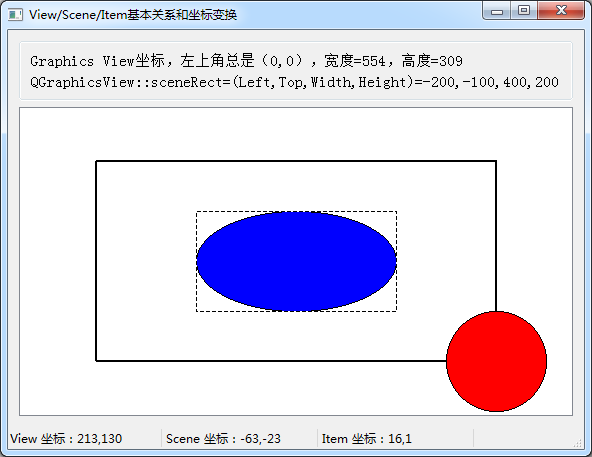
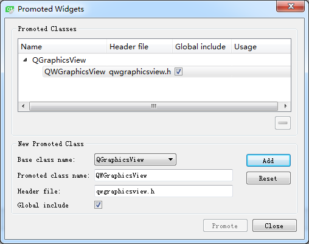

### 8.3.4　Graphics View程序基本结构和功能实现

#### 1．实例程序功能

创建一个实例samp8_4，是一个以QMainWindow为基类的窗口程序，其运行时界面如图8-19所示。

实例程序samp8_4的主要功能包括以下几点。

+ 工作区是一个从QGraphicsView继承的自定义类QWGraphicsView，作为绘图的视图组件。
+ 创建一个QGraphicsScene场景，场景的大小就是图中的实线矩形框的大小。
+ 改变窗口大小，当视图大于场景时，矩形框总是居于图形视图的中央；当视图小于场景时，在视图窗口自动出现卷滚条。
+ 蓝色椭圆正好处于场景的中间，红色圆形位于场景的右下角。当图形项位置不在场景的矩形框中时，图形项也是可以显示的。


<center class="my_markdown"><b class="my_markdown">图8-19　实例samp8_4运行时界面</b></center>

+ 当鼠标在窗口上移动时，会在状态栏显示当前光标位置的视图坐标和场景坐标，在某个图形项上单击鼠标时，还会显示在图形项中的局部坐标。

这个实例演示了Graphics View绘图几个类的基本使用方法，演示视图、场景和绘图项3个坐标系的关系，以及它们之间的坐标转换。

#### 2．自定义图形视图组件

QGraphicsView是Qt的图形视图组件，在UI设计器的Display Widgets分组里可以拖放一个QGraphicsView组件到窗口上。但是本实例中需要实现鼠标在QGraphicsView上移动时就显示当前光标的坐标，这涉及mouseMoveEvent()事件的处理。QGraphicsView没有与mouseMoveEvent()相关的信号，因而无法定义槽函数与此事件相关联。

为此，从QGraphicsView继承定义一个类QWGraphicsView，实现mouseMoveEvent()事件和mousePressEvent()事件，并把鼠标事件转换为信号，这样就可以在主程序里设计槽函数响应这些鼠标事件。下面是QWGraphicsView类的定义：

```css
class QWGraphicsView : public QGraphicsView
{
   Q_OBJECT
protected:
   void mouseMoveEvent(QMouseEvent *event);
   void mousePressEvent(QMouseEvent *event);
public:
   QWGraphicsView(QWidget *parent = 0);
signals:
   void mouseMovePoint(QPoint point);
   void mouseClicked(QPoint point);
};
```
mouseMoveEvent()是鼠标移动事件，其实现代码如下：
```
void QWGraphicsView::mouseMoveEvent(QMouseEvent *event)
{//鼠标移动事件
   QPoint  point=event->pos(); //QGraphicsView的坐标
   emit mouseMovePoint(point); //发射信号
   QGraphicsView::mouseMoveEvent(event);
}
```

在此事件响应代码里，通过事件的pos()函数获取鼠标光标在视图中的坐标point，然后作为参数发射mouseMovePoint(point)信号。这样，若在其他地方编写槽函数与此信号关联，就可以对鼠标移动事件作出响应。

mousePressEvent()是鼠标按键按下的事件，其实现代码如下：

```css
void QWGraphicsView::mousePressEvent(QMouseEvent *event)
{ //鼠标左键按下事件
   if (event->button()==Qt::LeftButton)
   {
      QPoint  point=event->pos(); //QGraphicsView的坐标
      emit mouseClicked(point);//发射信号
   }
   QGraphicsView::mousePressEvent(event);
}
```

在此事件响应代码里，首先判断是否是鼠标左键按下，然后通过事件的pos()函数获取鼠标光标在视图中的坐标point，然后作为参数发射mouseClicked(point)信号。

#### 3．主窗口类定义与QGraphicsView组件升级

主窗口是一个从QMainWindow继承的类，重定义了resizeEvent()事件，对窗口改变大小的事件作出响应。槽函数on_mouseMovePoint()响应鼠标在图形视图上移动的事件信号，显示视图坐标和场景坐标；槽函数on_mouseClicked()响应鼠标单击信号，显示图形项的局部坐标；iniGraphicsSystem()用于创建Graphics View结构的各个对象。

MainWindow类的完整定义如下：

```css
class MainWindow : public QMainWindow
{
   Q_OBJECT
private:
   QGraphicsScene  *scene;
   QLabel  *labViewCord;
   QLabel  *labSceneCord;
   QLabel  *labItemCord;
   void iniGraphicsSystem(); //创建Graphics View的各项
protected:
   void resizeEvent(QResizeEvent *event); 
public:
   explicit MainWindow(QWidget *parent = 0);
   ~MainWindow();
private slots:
   void   on_mouseMovePoint(QPoint point);
   void   on_mouseClicked(QPoint point);
private:
   Ui::MainWindow *ui;
};
```

主窗口是采用UI设计器进行可视化设计的。在设计界面时，先从组件面板里放一个QGraphicsView组件到窗口上。但是我们要用的是从QGraphicsView继承的自定义图形视图组件QWGraphicsView，需要将QGraphicsView升级为QWGraphicsView。

在设计的窗口上选中放置的QGraphicsView组件，单击右键，在快捷菜单中选择“Promote to...”，出现如图8-20的对话框。在其中选择基类名称QGraphicsView，升级类名称输入QWGraphicsView，然后单击“Promote”按钮，就可以将窗口上的QGraphicsView组件升级为QWGraphicsView组件。这是使用自定义界面组件的一种方法，在第12章会详细介绍。


<center class="my_markdown"><b class="my_markdown">图8-20　QGraphicsView组件升级为自定义QWGraphicsView类</b></center>

#### 4．窗口初始化

下面是主窗口的构造函数的代码：

```css
MainWindow::MainWindow(QWidget *parent) : QMainWindow(parent), ui(new Ui::MainWindow)
{
   ui->setupUi(this);
   labViewCord=new QLabel("View 坐标：");
   labViewCord->setMinimumWidth(150);
   ui->statusBar->addWidget(labViewCord);
   labSceneCord=new QLabel("Scene 坐标：");
   labSceneCord->setMinimumWidth(150);
   ui->statusBar->addWidget(labSceneCord);
   labItemCord=new QLabel("Item 坐标：");
   labItemCord->setMinimumWidth(150);
   ui->statusBar->addWidget(labItemCord);
   ui->View->setCursor(Qt::CrossCursor);
   ui->View->setMouseTracking(true);
   ui->View->setDragMode(QGraphicsView::RubberBandDrag);
   QObject::connect(ui->View,SIGNAL(mouseMovePoint(QPoint)),
                 this, SLOT(on_mouseMovePoint(QPoint)));
   QObject::connect(ui->View,SIGNAL(mouseClicked(QPoint)),
                 this, SLOT(on_mouseClicked(QPoint)));
   iniGraphicsSystem();
}
```

槽函数on_mouseMovePoint()响应鼠标在图形视图上移动的mouseMovePoint()信号，实现代码如下：

```css
void MainWindow::on_mouseMovePoint(QPoint point)
{//鼠标移动事件，point是 GraphicsView的坐标,物理坐标
   labViewCord->setText(QString::asprintf("View 坐标：%d,%d", point.x(),point.y()));
   QPointF pointScene=ui->View->mapToScene(point); //转换到Scene坐标
   labSceneCord->setText(QString::asprintf("Scene 坐标：%.0f,%.0f", pointScene.x(),pointScene.y()));
}
```

信号传递的参数point就是鼠标在图形视图中的坐标，使用视图组件的mapToScene()函数可以将此坐标转换为场景中的坐标，这两个坐标在状态栏上显示。

槽函数on_mouseClicked()响应鼠标在图形视图上单击的mouseClicked()信号，代码如下：

```css
void MainWindow::on_mouseClicked(QPoint point)
{//鼠标单击事件
   QPointF pointScene=ui->View->mapToScene(point); //转换到Scene坐标
   QGraphicsItem  *item=NULL;
   item=scene->itemAt(pointScene,ui->View->transform()); //获取光标下的图形项
   if (item != NULL) //有图形项
   {
      QPointF pointItem=item->mapFromScene(pointScene); //图形项局部坐标
      labItemCord->setText(QString::asprintf("Item 坐标：%.0f,%.0f", pointItem.x(),pointItem.y()));
   }
}
```

信号传递的参数point就是鼠标光标在图形视图中的坐标，先使用视图组件的mapToScene()函数将此坐标转换为场景中的坐标pointScene，然后通过场景对象的itemAt()函数获得光标下的图形项。如果鼠标光标下有图形项，就用图形项的mapFromScene()函数将pointScene转换为图形项的局部坐标pointItem，并在状态栏上显示。

另外还定义了窗口的resizeEvent()事件的响应函数，以便在窗口变化大小时，显示视图区域的大小，以及场景的大小信息。其代码如下：

```css
void MainWindow::resizeEvent(QResizeEvent *event)
{ //窗口变化大小时的事件
   ui->labViewSize->setText(QString::asprintf("Graphics View坐标，左上角总是（0,0），宽度=%d，高度=%d",ui->View->width(),ui->View->height()));
   QRectF  rectF=ui->View->sceneRect(); //Scene的矩形区
   ui->LabSceneRect->setText(QString::asprintf("QGraphicsView::sceneRect= (Left,Top,Width,Height)=%.0f,%.0f,%.0f,%.0f",rectF.left(),rectF.top(), rectF.width(),rectF.height()));
}
```

#### 5．Graphics View系统初始化

构造函数中调用的iniGraphicsSystem()用于创建Graphics View结构中的其他元素，包括场景和多个图形项。其代码如下：

```css
void MainWindow::iniGraphicsSystem()
{ //构造Graphics View的各项
   QRectF   rect(-200,-100,400,200); //左上角坐标，宽度，高度
   scene=new QGraphicsScene(rect); //scene逻辑坐标系定义
   ui->View->setScene(scene);
//画一个矩形框，大小等于scene
   QGraphicsRectItem   *item=new QGraphicsRectItem(rect); 
   item->setFlags(QGraphicsItem::ItemIsSelectable  //设置flags
               | QGraphicsItem::ItemIsFocusable);
   QPen   pen;
   pen.setWidth(2);
   item->setPen(pen);
   scene->addItem(item);
//画一个位于scene中心的椭圆，测试局部坐标
  QGraphicsEllipseItem  *item2=new QGraphicsEllipseItem(-100,-50,200,100);
   item2->setPos(0,0);
   item2->setBrush(QBrush(Qt::blue));
   item2->setFlags(QGraphicsItem::ItemIsMovable
                | QGraphicsItem::ItemIsSelectable
                | QGraphicsItem::ItemIsFocusable);
   scene->addItem(item2);
//画一个圆，中心位于scene的边缘
  QGraphicsEllipseItem  *item3=new QGraphicsEllipseItem(-50,-50,100,100); 
   item3->setPos(rect.right(),rect.bottom());
   item3->setBrush(QBrush(Qt::red));
   item3->setFlags(QGraphicsItem::ItemIsMovable
                | QGraphicsItem::ItemIsSelectable
                | QGraphicsItem::ItemIsFocusable);
   scene->addItem(item3);
   scene->clearSelection();
}
```

可视化设计窗体时，将QWGraphicsView类对象的名称命名为View，并且自动填充主窗口的工作区。创建场景并与View关联的代码如下：

```css
QRectF   rect(-200,-100,400,200); //左上角坐标，宽度，高度
scene=new QGraphicsScene(rect); //scene逻辑坐标系定义
ui->View->setScene(scene);
```

这里用一个矩形定义了创建的场景的坐标系统，表示场景的左上角坐标是(-200, -100)，场景宽度为400，高度为200，这样，场景的中心点是(0, 0)，这是场景的坐标系。

创建了一个矩形框图形项item，矩形框的大小就等于创建的场景的大小，矩形框不能移动。

创建的第二个图形项item2是一个椭圆，椭圆的左上角坐标是(-100, -50)，宽度200，高度100，所以椭圆的中心是(0, 0)，这是图形项的局部坐标系。再采用setPos(0, 0)设置椭圆在场景中的位置，若不调用setPos()函数设置图形项在场景中的位置，缺省为位置为(0, 0)。椭圆设置为可移动、可选择、可以获得焦点。

创建的第三个图形项item3是一个圆，圆的左上角坐标是(-50, -50)，宽度100，高度100，所以圆的中心是(0, 0)，这是图形项的局部坐标系。再采用setPos()设置圆在场景中的位置。

```css
item3->setPos(rect.right(),rect.bottom());
```

其中心位置是场景的右下角，圆的一部分区域是超出了场景的矩形区域的，但是整个圆还是可以正常显示的。

从这个实例程序可以看到Graphics View结构中场景与视图的关系，如何创建图形项组件，场景、视图、图形项各自的坐标系以及坐标系之间的转换关系。

