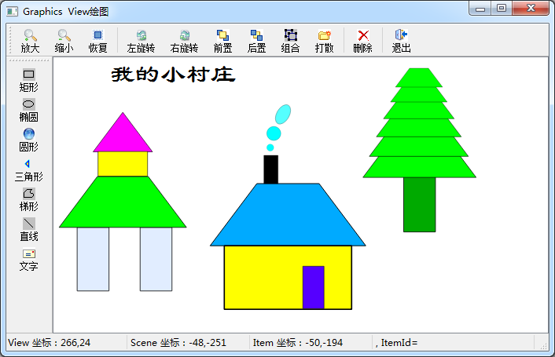
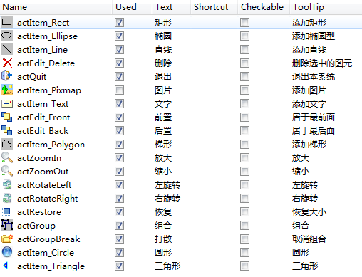

### 8.3.5　Graphics View绘图程序实例

#### 1．实例功能

实例samp8_4只是演示了Graphics View的基本结构和3个坐标系的概念，为了演示Graphics View结构编程的更多功能，创建了实例程序samp8_5。

实例samp8_5是一个基于Graphics View结构的简单绘图程序，通过这个实例可以发现Graphics View图形编程更多功能的使用方法。程序运行界面如图8-21所示。


<center class="my_markdown"><b class="my_markdown">图8-21　基于Graphics View结构的绘图程序samp8_5</b></center>

这个实例程序具有如下的功能。

+ 可以创建矩形、椭圆、圆形、三角形、梯形、直线、文字等基本图形项。
+ 每个图形项都可以被选择和拖动。
+ 图形项或整个视图可以缩放和旋转。
+ 图形项重叠时，可以调整前置或后置。
+ 多个图形项可以组合，也可以解除组合。
+ 可以删除选择的图形项。
+ 鼠标在视图上移动时，会在状态栏显示视图坐标和场景坐标。
+ 鼠标单击某个图形项时，会显示图形项的局部坐标，也会显示图形项的文字描述和编号。
+ 双击某个图形项时，会根据图形项的类型调用颜色对话框或字体对话框，设置图形项的填充颜色、线条颜色或文字的字体。
+ 选中某个图形项时，可以进行按键操作，Delete键删除图形项，PgUp放大，PgDn缩小，空格键旋转90°，上下左右光标键移动图形项。

#### 2．自定义图形视图类QWGraphicsView

与实例samp8_4类似，从QGraphicsView类继承定义一个图形视图类QWGraphicsView，在自定义类中添加鼠标和按键事件的处理，将鼠标和按键事件转换为信号，以便在主程序中设计槽函数做相应的处理。

下面是QWGraphicsView类的定义，处理了mouseMoveEvent()、mousePressEvent()、mouse DoubleClickEvent()和keyPressEvent()事件，定义了相应的信号，在事件处理里发射信号。

```css
class QWGraphicsView : public QGraphicsView
{
   Q_OBJECT
protected:
   void mouseMoveEvent(QMouseEvent *event);
   void mousePressEvent(QMouseEvent *event);
   void mouseDoubleClickEvent(QMouseEvent *event);
   void keyPressEvent(QKeyEvent *event);
public:
   QWGraphicsView(QWidget *parent = 0);
signals:
   void mouseMovePoint(QPoint point); //鼠标移动
   void mouseClicked(QPoint point); //鼠标单击
   void mouseDoubleClick(QPoint point); //双击事件
   void keyPress(QKeyEvent *event); //按键事件
};
```

下面是QWGraphicsView类的4个事件的实现代码，在每个事件里发射相应的信号。在QWGraphicsView类里，将鼠标和键盘事件转换为信号，就可以利用信号与槽机制，在主程序里设计槽函数对相应的鼠标和键盘操作进行响应。

```css
void QWGraphicsView::mouseMoveEvent(QMouseEvent *event)
{//鼠标移动事件
   QPoint  point=event->pos(); //QGraphicsView的坐标
   emit mouseMovePoint(point); //发射信号
   QGraphicsView::mouseMoveEvent(event);
}
void QWGraphicsView::mousePressEvent(QMouseEvent *event)
{ //鼠标按键按下事件
   if (event->button()==Qt::LeftButton)
   {
      QPoint  point=event->pos(); //QGraphicsView的坐标
      emit mouseClicked(point);//发射信号
   }
   QGraphicsView::mousePressEvent(event);
}
void QWGraphicsView::mouseDoubleClickEvent(QMouseEvent *event)
{ //鼠标双击事件
   if (event->button()==Qt::LeftButton)
   {
      QPoint  point=event->pos(); //QGraphicsView的坐标
      emit mouseDoubleClick(point);//发射信号
   }
   QGraphicsView::mouseDoubleClickEvent(event);
}
void QWGraphicsView::keyPressEvent(QKeyEvent *event)
{ //按键事件
   emit keyPress(event); //发射信号
   QGraphicsView::keyPressEvent(event);
}
```

#### 3．主窗口设计

主窗口是一个从QMainWindow继承的窗口类MainWindow，采用可视化设计。设计的Action如图8-22所示，利用这些Action创建两个工具栏，一个用于图形项的创建，一个用于图形项的各种操作。主窗口工作区的QWGraphicsView组件是从QGraphicsView组件升级而来的。


<center class="my_markdown"><b class="my_markdown">图8-22　主窗口的Action</b></center>

主窗口类MainWindow的定义的主要部分如下（省略了Action的槽函数的定义）：

```css
class MainWindow : public QMainWindow
{   Q_OBJECT
private:
   static const int ItemId = 1; //图形项自定义数据的key
   static const int ItemDesciption = 2; //图形项自定义数据的key
   int seqNum=0; //用于图形项的编号，每个图形项有一个编号
   int frontZ=0;   //用于bring to front
   int backZ=0;  //用于bring to back
   QGraphicsScene  *scene;
   QLabel  *labViewCord;
   QLabel  *labSceneCord;
   QLabel  *labItemCord;
   QLabel  *labItemInfo;
public:
   explicit MainWindow(QWidget *parent = 0);
   ~MainWindow();
private slots:
   void   on_mouseMovePoint(QPoint point); //鼠标移动
   void   on_mouseClicked(QPoint point); //鼠标单击
   void   on_mouseDoubleClick(QPoint point); //鼠标双击
   void   on_keyPress(QKeyEvent *event); //按键
private:
   Ui::MainWindow *ui;
};
```

ItemId和ItemDesciption是用于定义图形项的自定义数据的键。

变量seqNum用于给每个图形项编号，每个图形项有一个唯一编号。

变量frontZ用于设置图形项的叠放顺序，数值越大，越在前面显示。

变量backZ用于设置图形项的叠放顺序，数值越小，越在后面显示。

定义了4个私有槽函数，用于响应QWGraphicsView的4个信号，实现鼠标移动、单击、双击、按键时的处理。

+ on_mouseMovePoint()槽函数响应绘图视图的mouseMovePoint()信号，在鼠标移动时显示鼠标光标处的视图坐标和场景坐标。
+ on_mouseClicked()槽函数响应绘图视图的mouseClicked()信号，在鼠标单击时，显示图形项的局部坐标和图形项存储的自定义信息，如图形项编号和描述信息。
+ on_mouseDoubleClick ()槽函数响应绘图视图的mouseDoubleClick()信号，在某个图形项上双击时，根据图形项的类型调用颜色对话框或字体对话框，设置填充颜色、线条颜色或字体。
+ on_keyPress()槽函数响应绘图视图的keyPress()信号，在选中某个图形项时，用按键实现缩放、删除、移动等操作。

MainWindow的构造函数代码如下：

```css
MainWindow::MainWindow(QWidget *parent) : QMainWindow(parent), ui(new Ui::MainWindow)
{
   ui->setupUi(this);
   labViewCord=new QLabel("View 坐标："); //创建状态栏标签
   labViewCord->setMinimumWidth(150);
   ui->statusBar->addWidget(labViewCord);
   labSceneCord=new QLabel("Scene 坐标：");
   labSceneCord->setMinimumWidth(150);
   ui->statusBar->addWidget(labSceneCord);
   labItemCord=new QLabel("Item 坐标：");
   labItemCord->setMinimumWidth(150);
   ui->statusBar->addWidget(labItemCord);
   labItemInfo=new QLabel("ItemInfo: ");
   labItemInfo->setMinimumWidth(200);
   ui->statusBar->addWidget(labItemInfo);
   scene=new QGraphicsScene(-300,-200,600,200); //创建QGraphicsScene
   ui->View->setScene(scene); //与view关联
   ui->View->setCursor(Qt::CrossCursor); //设置鼠标光标形状
   ui->View->setMouseTracking(true); 
   ui->View->setDragMode(QGraphicsView::RubberBandDrag);
   this->setCentralWidget(ui->View);
   QObject::connect(ui->View,SIGNAL(mouseMovePoint(QPoint)),
                 this, SLOT(on_mouseMovePoint(QPoint)));
   QObject::connect(ui->View,SIGNAL(mouseClicked(QPoint)),
                 this, SLOT(on_mouseClicked(QPoint)));
   QObject::connect(ui->View,SIGNAL(mouseDoubleClick(QPoint)),
                 this, SLOT(on_mouseDoubleClick(QPoint)));
   QObject::connect(ui->View,SIGNAL(keyPress(QKeyEvent*)),
                 this, SLOT(on_keyPress(QKeyEvent*)));
   qsrand(QTime::currentTime().second()); //随机数初始化
}
```

在构造函数里，首先是创建状态栏上的标签，然后创建场景并与视图关联，再将视图组件的4个信号与4个槽函数关联。

qsrand()用于随机数初始化，这里用当前时间的秒作为随机数种子。

#### 4．图形项的创建

主窗口左侧工具栏上的按钮用于创建各种标准的图形项。创建矩形使用QGraphicsRectItem，创建椭圆和圆使用QGraphicsEllipseItem，创建三角形和梯形使用QGraphicsPolygonItem，创建直线使用QGraphicsLineItem，创建文字使用QGraphicsTextItem。还有一些其他的标准图形项类，程序里未全部涉及。

创建各图形项的代码基本类似，以创建椭圆的代码为例进行说明。

```css
void MainWindow::on_actItem_Ellipse_triggered()
{ //添加一个椭圆
   QGraphicsEllipseItem   *item=new QGraphicsEllipseItem(-50,-30,100,60);
   item->setFlags(QGraphicsItem::ItemIsMovable
               | QGraphicsItem::ItemIsSelectable
               | QGraphicsItem::ItemIsFocusable);
   item->setBrush(QBrush(Qt::blue)); //填充颜色
   item->setZValue(++frontZ); //用于叠放顺序
   item->setPos(-50+(qrand() % 100),-50+(qrand() % 100)); //初始位置
   item->setData(ItemId,++seqNum);  //自定义数据，ItemId键
   item->setData(ItemDesciption,"椭圆"); //自定义数据，ItemDesciption键
   scene->addItem(item);
   scene->clearSelection();
   item->setSelected(true);
}
```

椭圆图形类是QGraphicsEllipseItem。创建一个椭圆图形实例item，用setFlags()函数设置为可移动、可选择和可获取焦点；setBrush()用于设置填充色；setZValue()用于设置ZValue，这个参数控制叠放顺序，当有多个图形项叠加在一起时，ZValue值最大的显示在最前面；setPos()函数设置图形项在场景中的位置，这里使用了随机数函数qrand()。

setData()函数用于设置图形项的自定义参数，setData()函数原型为：

```css
void QGraphicsItem::setData(int key, const QVariant &value)
```

key是一个整数，value是QVariant类型，key和value是一个键值对。所以，使用setData()一次可以设置一个键值对，可以为一个图形项设置多个自定义键值对。程序里设置了两个自定义数据：

```css
item->setData(ItemId,++seqNum);  //自定义数据，ItemId键
item->setData(ItemDesciption,"椭圆"); //自定义数据，ItemDesciption键
```

ItemId是图形项的编号，ItemDesciption是图形项的描述，两个都是在MainWindow类中定义的静态变量。这样，每个图形项有一个唯一的编号，有一个文字描述。在窗口上单击某个图形项时，会提取这两个自定义数据在状态栏上显示。

工具栏上的按钮还可以创建其他一些图形项，代码与此基本类似，这里不再详细介绍。

#### 5．图形项操作

主窗口的另一个工具栏上的按钮实现图形项的缩放、旋转、组合等操作。

+ 缩放

图形项的缩放使用QGraphicsItem的setScale()函数，参数大于1是放大，小于1是缩小。例如，下面是实现放大的程序。

```css
void MainWindow::on_actZoomIn_triggered()
{ //放大
   int cnt=scene->selectedItems().count();
   if (cnt==1)
   {
      QGraphicsItem*  item=scene->selectedItems().at(0);
      item->setScale(0.1+item->scale());
   }
   else
      ui->View->scale(1.1,1.1);
}
```

QGraphicsScene::selectedItems()返回场景中选中的图形项的列表，如果只有一个图形项被选中，就用QGraphicsItem的setScale()对图形项进行放大，在原来的缩放系数scale()基础上加0.1作为放大系数。如果选中的图形项个数大于1个，或没有图形项被选中，就用QGraphicsView的scale()函数对绘图视图进行放大。

+ 旋转

图形项的旋转使用QGraphicsItem::setRotation ()函数，参数为角度值，正值表示顺时针旋转，负值表示逆时针旋转。例如，下面是逆时针旋转的程序。

```css
void MainWindow::on_actRotateLeft_triggered()
{//逆时针旋转
   int cnt=scene->selectedItems().count();
   if (cnt==1)
   {
      QGraphicsItem*   item=scene->selectedItems().at(0);
      item->setRotation(-30+item->rotation());
   }
   else
      ui->View->rotate(-30);
}
```

如果有一个图形项被选中，就对图形项进行旋转，否则对绘图视图进行旋转。

+ 恢复坐标变换

缩放和旋转都是坐标变换，要取消所有变换恢复初始状态，调用QGraphicsItem或Qgraphics View的resetTransform()函数。下面是“恢复”按钮的响应代码。

```css
void MainWindow::on_actRestore_triggered()
{//取消所有变换
   int cnt=scene->selectedItems().count();
   if (cnt==1)
   {
      QGraphicsItem*   item=scene->selectedItems().at(0);
      item->resetTransform();
   }
   else
      ui->View->resetTransform();
}
```

+ 叠放顺序

QGraphicsItem的zValue()表示图形项在Z轴的值，若有多个图形项叠加在一起，zValue()值最大的显示在最前面，zValue()值最小的显示在最后面。用setZValue()函数可以设置这个属性值。下面是工具栏上的“前置”和“后置”按钮的代码。

```css
void MainWindow::on_actEdit_Front_triggered()
{ //bring to front,前置
   int cnt=scene->selectedItems().count();
   if (cnt>0)
   { //只处理选中的第1个图形项
      QGraphicsItem*   item=scene->selectedItems().at(0);
      item->setZValue(++frontZ);
   }
}
void MainWindow::on_actEdit_Back_triggered()
{//bring to back，后置
   int cnt=scene->selectedItems().count();
   if (cnt>0)
   {//只处理选中的第1个图形项
      QGraphicsItem*   item=scene->selectedItems().at(0);
      item->setZValue(--backZ);
   }
}
```

frontZ和backZ是在MainWindow类中定义的私有变量，专门用于存储叠放次序的编号。frontZ只增加，所以每增加一次都是最大值，设置该值的图形项就可以显示在最前面；backZ只减少，所以每减小一次都是最小值，设置该值的图形项就可以显示在最后面。

+ 图形项的组合

可以将多个图形项组合为一个图形项，当作一个整体进行操作，如同PowerPoint软件里图形组合功能一样。使用QGraphicsItemGroup类实现多个图形项的组合，QGraphicsItemGroup是QGraphicsItem的子类，所以实质上也是一个图形项。下面是工具栏上的“组合”按钮的响应代码：

```css
void MainWindow::on_actGroup_triggered()
{ //组合
   int cnt=scene->selectedItems().count();
   if (cnt>1)
   {
      QGraphicsItemGroup*  group =new QGraphicsItemGroup; //创建组合
      scene->addItem(group); //组合添加到场景中
       for (int i=0;i<cnt;i++)
       {
          QGraphicsItem*   item=scene->selectedItems().at(0);
          item->setSelected(false); //清除选择虚线框
          item->clearFocus();
          group->addToGroup(item); //添加到组合
       }
       group->setFlags(QGraphicsItem::ItemIsMovable
                    | QGraphicsItem::ItemIsSelectable
                    | QGraphicsItem::ItemIsFocusable);
       group->setZValue(++frontZ);
       scene->clearSelection();
       group->setSelected(true);
    }
}
```

当有多个图形项被选择时，创建一个QGraphicsItemGroup类型的实例group，并添加到场景中，然后将选中的图形项逐一添加到group中。这样创建的group就是场景中的一个图形项，可以对其进行缩放、旋转等操作。

一个组合对象也可以被打散，使用QGraphicsScene的destroyItemGroup()函数可以打散一个组合对象，这个函数打散组合，删除组合对象，但是不删除原来组合里的图形项。下面是工具栏上的“打散”按钮的响应代码：

```css
void MainWindow::on_actGroupBreak_triggered()
{ //break group,打散组合
   int cnt=scene->selectedItems().count();
   if (cnt==1)
   {
      QGraphicsItemGroup  *group;
      group=(QGraphicsItemGroup*)scene->selectedItems().at(0);
      scene->destroyItemGroup(group);
    }
}
```

这里假设在单击“打散”按钮时，选中的是一个组合对象，并没有做类型判断。

+ 图形项的删除

使用QGraphicsScene的removeItem()函数删除某个图形项，下面是工具栏上的“删除”按钮的响应代码。

```css
void MainWindow::on_actEdit_Delete_triggered()
{ //删除所有选中的图形项
   int cnt=scene->selectedItems().count();
   if (cnt>0)
   for (int i=0;i<cnt;i++)
   {
      QGraphicsItem*   item=scene->selectedItems().at(0);
      scene->removeItem(item); //删除图形项
   }
}
```

#### 6．鼠标与键盘操作

MainWindow定义了4个槽函数与QWGraphicsView定义的4个信号进行关联，实现对鼠标移动、单击、双击和按键的响应。

+ 鼠标移动

鼠标在绘图视图上移动时，在状态栏显示光标处的视图坐标和场景坐标，on_mouseMovePoint()槽函数的代码如下：

```css
void MainWindow::on_mouseMovePoint(QPoint point)
{//鼠标移动事件，point是 GraphicsView的坐标,物理坐标
   labViewCord->setText(QString::asprintf("View 坐标：%d,%d", point.x(),point.y()));
   QPointF pointScene=ui->View->mapToScene(point); //转换到Scene坐标
   labSceneCord->setText(QString::asprintf("Scene 坐标：%.0f,%.0f", pointScene.x(), pointScene.y()));
}
```

参数point是鼠标光标在视图上的坐标，用QGraphicsView::mapToScene()函数可以将此坐标转换为场景中的坐标。

+ 鼠标单击

在视图上单击鼠标时，如果选中一个图形项，就会显示图形项的局部坐标，并提取其自定义信息进行显示，on_mouseClicked()槽函数代码如下：

```css
void MainWindow::on_mouseClicked(QPoint point)
{//鼠标单击事件
   QPointF pointScene=ui->View->mapToScene(point); //转换到Scene坐标
   QGraphicsItem  *item=NULL;
   item=scene->itemAt(pointScene,ui->View->transform()); //光标下的图形项
   if (item != NULL) //有图形项
   {
      QPointF pointItem=item->mapFromScene(pointScene); //图形项局部坐标
      labItemCord->setText(QString::asprintf("Item 坐标：%.0f,%.0f", pointItem.x(), pointItem.y()));
      labItemInfo->setText(item->data(ItemDesciption).toString()
                 +", ItemId="+ item->data(ItemId).toString());
   }
}
```

首先将视图的坐标point转换为场景中的坐标pointScene，再利用QGraphicsScene的itemAt()函数获得光标处的图形项。利用QGraphicsItem的mapFromScene()函数将pointScene转换为图形项的局部坐标pointItem。

在创建图形项时，使用setData()函数设置了自定义数据的键值对，这里用data()函数提取图形项的自定义的数据ItemId和ItemDesciption，并进行显示。

+ 鼠标双击

当鼠标双击某个图形项时，希望根据图形项的类型，调用不同的对话框进行图形项的设置。例如，当图形项是矩形、圆形、梯形等有填充色的对象时，打开一个颜色选择对话框，设置其填充颜色；当图形项是直线时，设置其线条颜色；当图形项是文字时，打开一个字体对话框，设置其字体。下面是on_mouseDoubleClick()槽函数的代码。

```css
void MainWindow::on_mouseDoubleClick(QPoint point)
{//鼠标双击,调用相应的对话框，设置填充颜色、线条颜色或字体
   QPointF pointScene=ui->View->mapToScene(point); //转换到Scene坐标
   QGraphicsItem  *item=NULL;
   item=scene->itemAt(pointScene,ui->View->transform()); //光标下的图形项
   if (item == NULL) //没有图形项
      return;
   switch (item-><em>type</em>())  //图形项的类型
   { 
     case   QGraphicsRectItem::Type: //矩形框
     { //强制类型转换
      QGraphicsRectItem *theItem; 
      theItem =qgraphicsitem_cast<QGraphicsRectItem*>(item);
      setBrushColor(theItem);
      break;
     }
     case   QGraphicsEllipseItem::Type: //椭圆和圆都是此类型
     {
      QGraphicsEllipseItem *theItem;
      theItem =qgraphicsitem_cast<QGraphicsEllipseItem*>(item);
      setBrushColor(theItem);
      break;
     }
     case   QGraphicsPolygonItem::Type: //梯形和三角形
     {
      QGraphicsPolygonItem *theItem;
      theItem =qgraphicsitem_cast<QGraphicsPolygonItem*>(item);
      setBrushColor(theItem);
      break;
    }
     case   QGraphicsLineItem::Type: //直线，设置线条颜色
     {
      QGraphicsLineItem *theItem;
      theItem =qgraphicsitem_cast<QGraphicsLineItem*>(item);
      QPen   pen=theItem->pen();
      QColor  color=theItem->pen().color();
      color=QColorDialog::getColor(color,this,"选择线条颜色");
      if (color.isValid())
      {
         pen.setColor(color);
         theItem->setPen(pen);
      }
      break;
     }
     case  QGraphicsTextItem::Type: //文字，设置字体
     {
      QGraphicsTextItem *theItem; 
      theItem =qgraphicsitem_cast<QGraphicsTextItem*>(item);
      QFont font=theItem->font();
      bool ok=false;
      font=QFontDialog::getFont(&ok,font,this,"设置字体");
      if (ok)
         theItem->setFont(font);
      break;
     }
   }
}
```

双击鼠标时，获取光标下的图形项item，由于不知道具体是什么类型的图形项，item定义为QGraphicsItem，即所有图形项的父类。

QGraphicsItem的函数type()返回图形项的类型，每个具体的图形项类都需要重定义此函数，例如自定义一个图形项时，需要定义枚举常量Type和函数type，枚举常量Type的值必须大于UserType，示例代码如下：

```css
class CustomItem : public QGraphicsItem
  {
  public:
    enum { Type = UserType + 1 };
    int type() const
    {
       // 使得 qgraphicsitem_cast 可以使用这个图形项
       return Type;
    }
    ...
  };
```

根据item->type()值判断图形项的类型，若该值等于QGraphicsLineItem::Type，说明这个item是一个QGraphicsLineItem类型实例，可以设置其线条颜色。

设置线条颜色可以调用QGraphicsLineItem::setPen()函数，但是QGraphicsItem没有setPen()函数。所以，需要使用图形项的强制类型转换函数qgraphicsitem_cast()将item转换为QGraphicsLineItem类型的theItem，即：

```css
QGraphicsLineItem *theItem;
theItem =qgraphicsitem_cast<QGraphicsLineItem*>(item);
```

然后就调用QColorDialog::getColor()函数选择颜色，设置为theItem的线条颜色。

QGraphicsItem类同样没有setFont()和setBrush()函数，当选择的图形项是文字对象QGraphicsTextItem时，需要将其强制转换为QGraphicsTextItem类型的变量，调用字体选择对话框后，用QGraphicsTextItem::setFont()函数设置字体。

对于QGraphicsRectItem、QGraphicsEllipseItem或QGraphicsPolygonItem，可以调用这3个类的setBrush()函数设置填充颜色，这里用一个函数setBrushColor()为3种不同类的对象进行填充色的设置。setBrushColor()并不是使用不同类型参数的同名重载函数，而是一个在mainwindow.cpp文件中定义的一个独立的模板函数。

```css
template<class T> void setBrushColor(T *item)
{//函数模板
   QColor   color=item->brush().color();
   color=QColorDialog::getColor(color,NULL,"选择填充颜色");
   if (color.isValid())
      item->setBrush(QBrush(color));
}
```

编译器会自动根据调用setBrushColor()的参数的类型生成3个不同参数类型的函数，减少了代码的冗余性。

+ 按键操作

在选中一个图形项之后，可以通过键盘按键实现一些快捷操作，例如缩放、旋转、移动等。on_keyPress()槽函数实现对按键的响应，其代码如下：

```css
void MainWindow::on_keyPress(QKeyEvent *event)
{ //按键事件
   if (scene->selectedItems().count()!=1)
      return; //没有选中的图形项，或选中的多于1个
   QGraphicsItem   *item=scene->selectedItems().at(0);
   if (event->key()==Qt::Key_Delete)//删除
      scene->removeItem(item);
   else if (event->key()==Qt::Key_Space) //顺时针旋转90度
      item->setRotation(90+item->rotation());
   else if (event->key()==Qt::Key_PageUp)//放大
      item->setScale(0.1+item->scale());
   else if (event->key()==Qt::Key_PageDown) //缩小
      item->setScale(-0.1+item->scale());
   else if (event->key()==Qt::Key_Left)  //左移
      item->setX(-1+item->x());
   else if (event->key()==Qt::Key_Right) //右移
      item->setX(1+item->x());
   else if (event->key()==Qt::Key_Up) //上移
      item->setY(-1+item->y());
   else if (event->key()==Qt::Key_Down) //下移
      item->setY(1+item->y());
}
```

这段代码限定只有一个图形项被选中时才可以执行键盘操作。


