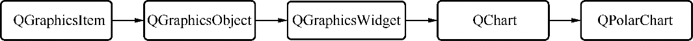

### 9.1.1　Qt Charts模块

Qt Charts模块是一组易于使用的图表组件，它基于Qt的Graphics View架构，其核心组件是QChartView和QChart。

QChartView的父类是QGraphicsView，就是Graphics View架构中的视图组件，所以，QChart View是用于显示图表的视图。

QChart的继承关系如图9-1所示，可以看到，QChart是从QGraphicsItem继承而来的，所以，QChart是一种图形项。


<center class="my_markdown"><b class="my_markdown">图9-1　QChart的继承关系</b></center>

QPolarChart是用于绘制极坐标图的图表类，它从QChart继承而来。

要在项目中使用Qt Charts模块，必须在项目的配置文件（.pro文件）中增加下面的一行语句：

```css
Qt += charts
```

在需要使用QtCharts的类的头文件或源程序文件中，要使用如下的包含语句：

```css
#include   <QtCharts>  
using namespace  QtCharts;
```

也可以使用宏定义：

```css
#include   <QtCharts>  
Qt_CHARTS_USE_NAMESPACE
```

