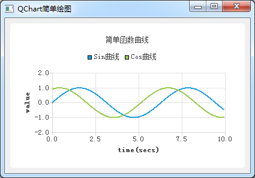

### 9.1.2　一个简单的QChart绘图程序

先用一个简单实例程序说明QChart绘图的基本原理。创建一个基于QMainWindow的应用程序samp9_1，主窗口上不放置任何组件。在主窗口类中只定义一个createChart()函数，在主窗口的构造函数中调用此函数，即：

```css
MainWindow::MainWindow(QWidget *parent) : QMainWindow(parent), ui(new Ui::MainWindow)
{
   ui->setupUi(this);
   createChart();
}
```

createChart()函数用于创建图表，其代码如下：

```css
void MainWindow::createChart()
{ //创建图表
   QChartView *chartView=new QChartView(this); //创建 ChartView
   QChart *chart = new QChart(); //创建 Chart
   chart->setTitle("简单函数曲线");
   chartView->setChart(chart); //Chart添加到ChartView
   this->setCentralWidget(chartView);
//创建折线序列
   QLineSeries *series0 = new QLineSeries();
   QLineSeries *series1 = new QLineSeries();
   series0->setName("Sin曲线");
   series1->setName("Cos曲线");
   chart->addSeries(series0); //序列添加到图表
   chart->addSeries(series1);
//序列添加数值
   qreal   t=0,y1,y2,intv=0.1;
   int cnt=100;
   for(int i=0;i<cnt;i++)
   {
      y1=qSin(t);//+qrand();
      series0->append(t,y1);
      y2=qSin(t+20);
      series1->append(t,y2);
      t+=intv;
   }
//创建坐标轴
   QValueAxis *axisX = new QValueAxis; //X 轴
   axisX->setRange(0, 10); //设置坐标轴范围
axisX->setTitleText("time(secs)"); //标题
   QValueAxis *axisY = new QValueAxis; //Y 轴
   axisY->setRange(-2, 2);
   axisY->setTitleText("value");
   chart->setAxisX(axisX, series0); //为序列设置坐标轴
   chart->setAxisY(axisY, series0); 
   chart->setAxisX(axisX, series1); //为序列设置坐标轴
   chart->setAxisY(axisY, series1); 
}
```

程序运行后界面如图9-2所示。


<center class="my_markdown"><b class="my_markdown">图9-2　实例samp9_1运行时界面</b></center>

在createChart()函数里，首先创建一个QChartView对象chartView，再创建一个QChart对象chart，将chart在chartView里显示，使用下面一行语句：

```css
chartView->setChart(chart);
```

图表上用于显示数据的称为序列（series），这里使用折线序列QLineSeries，创建了两个QLine Series类型的序列，并且将序列添加到chart中。

```css
chart->addSeries(series0);  
chart->addSeries(series1);
```

序列存储用于显示的数据，所以需要为直线序列添加平面数据点的坐标数据。程序将生成正弦和余弦函数的数据作为序列的数据。

序列还需要坐标轴，创建QValueAxis类型的坐标轴作为图表的X轴和Y轴，调用QChart的setAxisX()和setAxisY()函数为两个序列分别设置X轴和Y轴。

