### 9.1.3　图表的主要组成部分

观察createChart()函数的内容和程序运行后的界面（图9-2），可知QChartView是QChart的视图组件，而一个QChart一般包括序列、坐标轴、图例、图表标题等部分。

#### 1．QChartView 的功能

QChartView是QChart的视图组件，类似于Graphics View架构中的QGraphicsView。实际上，在窗口设计界面上使用QChartView时，就是先放置一个QGraphicsView组件，然后升级为QChartView。

QChartView类定义的函数很少，只有以下几个。

+ void setChart(QChart *chart)，设置一个QChart对象作为显示的图表。
+ QChart * chart()，返回QChartView当前设置的QChart类对象。
+ void setRubberBand(RubberBands &rubberBand)，设置选择框的类型，即鼠标在视图组件上拖动选择范围的方式，是一个QChartView::RubberBand枚举类型的组合，QChartView:: RubberBand枚举类型有以下几种取值：
      + QChartView::NoRubberBand——无选择框；
    + QChartView::VerticalRubberBand——垂向选择；
    + QChartView::HorizontalRubberBand——水平选择；
    + QChartView::RectangleRubberBand——矩形框选择。  
+ RubberBands rubberBand()，返回设置的选择框类型。

#### 2．序列

序列是数据的表现形式，如图9-2中的两条曲线就是两个QLineSeries类型的序列。

图表的类型主要就是由序列的类型决定的，常见的图表类型有折线图、柱状图、饼图、散点图等，Qt Charts能实现的常见图表示例及用到的序列类见表9-1。

<b class="my_markdown">表9-1　Qt Charts常见图表及用到的序列类（图片来自Qt帮助文件）</b>

| 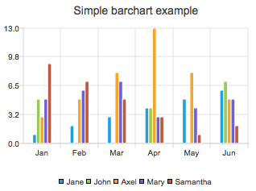 | 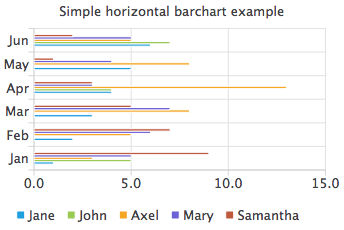 |
| :-----  | :-----  | :-----  | :-----  |
| 柱状图QBarSeries | 水平柱状图QHorizontalBarSeries |
| 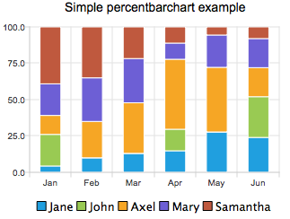 | 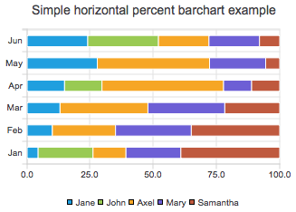 |
| 百分比柱状图QPercentBarSeries | 水平百分比柱状图QHorizontalPercentBarSeries |
| 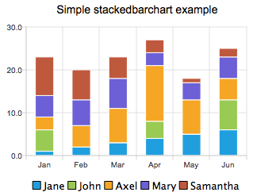 | 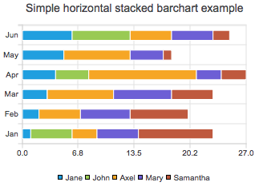 |
| 堆叠柱状图QStackedBarSeries | 水平堆叠柱状图QHorizontalStackedBarSeries |
| 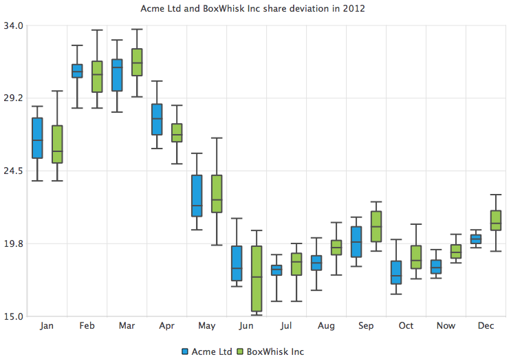 |  |
| 火柴盒图QBoxPlotSeries | 饼图QPieSeries |
|  | 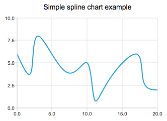 |
| 折线图QLineSeries | 光滑曲线图QSplineSeries |
| 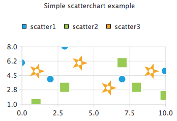 | 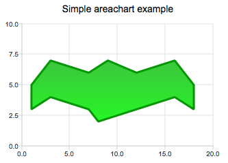 |
| 散点图QScatterSeries | 面积图QAreaSeries |

图9-3是这些序列类的继承关系，可见它们都是从QAbstractSeries类继承而来的。折线、光滑曲线和散点的序列是从QXYSeries继承而来，用于绘制二维平面的数据；QAbstractBarSeries派生出柱状图、百分比柱状图和堆叠图等图表的序列；面积图、火柴盒图、饼图的序列都直接继承于QAbstractSeries。

#### 3．坐标轴

一般的图表都有横轴和纵轴两个坐标轴，如折线图一般表示数据，坐标轴用QValueAxis类的数值坐标轴，如果用对数坐标，就可以使用QLogValueAxis类的坐标轴；柱状图的横坐标通常是文字，可以用QBarCategoryAxis作为横轴，而饼图一般没有坐标轴。

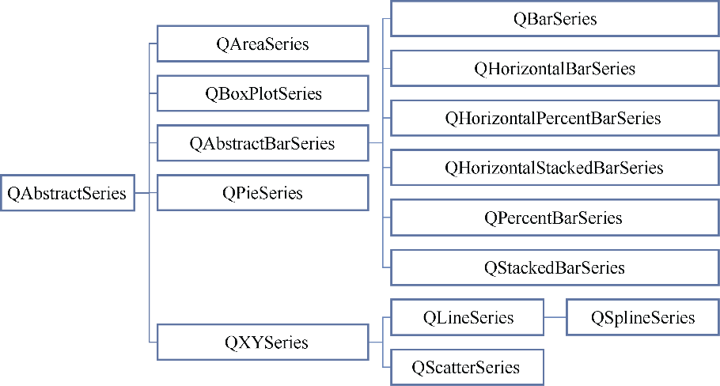

<b class="my_markdown">图9-3数据序列类的继承关系</b>

Qt Charts的坐标轴类、特点及其适用情况见表9-2，类的继承关系如图9-4所示。

<b class="my_markdown">表9-2　Qt提供的坐标轴类</b>

| 坐标轴类 | 特点 | 用途 |
| :-----  | :-----  | :-----  | :-----  | :-----  |
| QValueAxis | 数值坐标轴 | 作为数值型数据的坐标轴 |
| QCategoryAxis | 分组数值坐标轴 | 可以为数值范围设置文字标签 |
| QLogValueAxis | 对数数值坐标轴 | 作为数值型数据的对数坐标轴，可以设置对数的基 |
| QBarCategoryAxis | 类别坐标轴 | 用字符串作为坐标轴的刻度，用于图表的非数值坐标轴 |
| QDateTimeAxis | 日期时间坐标轴 | 作为日期时间数据的坐标轴 |

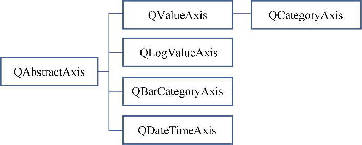

<b class="my_markdown">图9-4　坐标轴类的继承关系</b>

坐标轴类封装了坐标轴的刻度、标签、网格线、标题等属性。

#### 4．图例

图例（Legend）是对图表上显示的序列的示例说明，如图9-2中为两条曲线显示的图例，有线条颜色和文字说明。QLegend是封装了图例控制功能的类，可以为每个序列设置图例中的文字，可以控制图例显示在图表的上、下、左、右不同位置。

对于图例还有一个类QLegendMarker，可以为每个序列的图例生成一个类似于QCheckBox的组件，在图例上单击序列的标记，可以控制序列是否显示。

