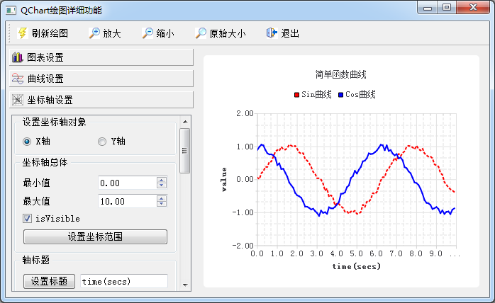

### 9.2.1　实例功能

实例samp9_2以绘制折线图为例，详细介绍图表各个部分的设置和操作，包括图表的标题、图例、边距等属性设置，QLineSeries序列的属性设置，QValueAxis坐标轴的属性设置，以及图表的缩放。实例运行时界面如图9-5所示。

<b class="my_markdown">图9-5　实例samp9_2运行时界面</b>

实例samp9_2是一个主窗口继承自QMainWindow类的应用程序，界面的设计主要分为以下几个部分。

+ 工具栏：创建几个Action，并创建工具栏，实现图表数据刷新和缩放功能。
+ 主工作区图表视图：从组件面板放置一个QGraphicsView组件作为视图组件，并用Promote方法升级为QChartView组件，命名为chartView。
+ 图表属性设置面板：左侧是一个QToolBox组件，分为3个操作面板，用于进行图表设置、曲线设置和坐标轴设置。

