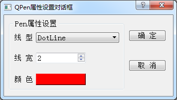

### 9.2.3　画笔设置对话框QWDialogPen

在本实例中，经常需要设置一些对象的pen属性，如折线序列的pen属性，网格线的pen属性等。pen属性就是一个QPen对象，设置内容主要包括线型、线宽和颜色。为使用方便，设计一个自定义对话框QWDialogPen，专门用于QPen对象的属性设置。

QWDialogPen是一个可视化设计的对话框，其类定义如下：

```css
class QWDialogPen : public QDialog
{ //QPen属性设置对话框
   Q_OBJECT
private:
   QPen   m_pen; //成员变量
public:
   explicit QWDialogPen(QWidget *parent = 0);
   ~QWDialogPen();
   void   setPen(QPen pen); //设置QPen，用于对话框的界面显示
   QPen   getPen(); //获取对话框设置的QPen的属性
   static  QPen  getPen(QPen  iniPen, bool &ok);  //静态函数
private slots:
   void on_btnColor_clicked();
private:
   Ui::QWDialogPen *ui;
};
```

自定义对话框的设计在第6章已经介绍过，这个QWDialogPen的特别之处在于定义了一个静态函数getPen()，在类中的定义如下：

```css
static  QPen   getPen(QPen  iniPen, bool &ok);  //静态函数
```

Qt的标准对话框一般都有静态函数，使用静态函数无需管理对话框的创建与删除，使用起来比较方便。

QWDialogPen类的静态函数getPen()以及相关函数的实现代码如下：

```css
QPen QWDialogPen::getPen(QPen iniPen,bool &ok)
{ //静态函数，获取QPen
   QWDialogPen *Dlg=new QWDialogPen; //创建一个对话框
   Dlg->setPen(iniPen); //设置初始化QPen
   QPen   pen;
   int ret=Dlg->exec(); //弹出对话框
   if (ret==QDialog::Accepted)
   {
      pen=Dlg->getPen(); //获取
      ok=true;   }
   else
   {
      pen=iniPen;
      ok=false;   }
   delete  Dlg; //删除对话框对象
   return  pen; //返回设置的QPen对象
}
void QWDialogPen::setPen(QPen pen)
{ //设置QPen，并刷新显示界面
   m_pen=pen;
   ui->spinWidth->setValue(pen.width()); //线宽
   int  i=static_cast<int>(pen.style());  //枚举类型转换为整型
   ui->comboPenStyle->setCurrentIndex(i);
   QColor  color=pen.color();
   ui->btnColor->setAutoFillBackground(true); //设置颜色按钮的背景色
   QString str=QString::asprintf("background-color: rgb(%d, %d, %d);",
                        color.red(),color.green(),color.blue());
   ui->btnColor->setStyleSheet(str);
}
QPen QWDialogPen::getPen()
{//获得设置的属性
   m_pen.setStyle(Qt::PenStyle(ui->comboPenStyle->currentIndex())); //线型
   m_pen.setWidth(ui->spinWidth->value()); //线宽
   QColor  color=ui->btnColor->palette().color(QPalette::Button);
   m_pen.setColor(color); //颜色
   return  m_pen;
}
```

静态函数getPen()里创建了一个QWDialogPen类的实例Dlg，然后调用Dlg->setPen(iniPen)进行初始化设置，运行对话框并获取返回状态，若返回类型为QDialog::Accepted，就调用Dlg->getPen()获取设置属性后的QPen的对象，最后删除对话框对象并返回设置的QPen对象。所以，静态函数getPen()就是集成了普通方法调用对话框时的创建对话框、设置初始值、获取对话框返回状态、获取返回值、删除对话框的过程，简化了调用代码。

在设置颜色按钮的背景色时用到了StyleSheet的功能，这一点在16.2节有详细介绍。

图9-6是QWDialogPen对话框运行界面，可以选择线型、设置线宽和颜色。


<center class="my_markdown"><b class="my_markdown">图9-6　QPen设置对话框运行状态</b></center>

