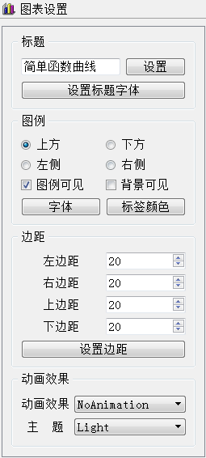
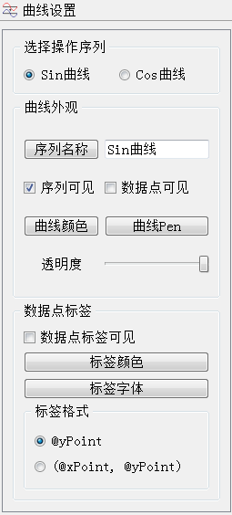

### 9.2.4　QChart的设置

QChart是组合图表各部件、显示各种数据序列的绘图组件。QChart接口函数众多，其主要接口函数分类整理后见表9-3。对于一个属性，通常有一个设置函数和一个对应的读取函数，如setTitle()用于设置图表标题，对应的读取图表标题的函数为title()。表9-3仅列出设置函数或单独地读取函数，仅列出函数的返回数据类型，省略了输入参数，函数详细定义请参考Qt帮助文件。

<center class="my_markdown"><b class="my_markdown">表9-3　QChart类的主要函数</b></center>

| 分组 | 函数名 | 功能描述 |
| :-----  | :-----  | :-----  | :-----  | :-----  |
| 图表 | 外观 | void　setTitle() | 设置图表标题，显示在图表上方，支持HTML格式 |
| void　setTitleFont() | 设置图表标题字体 |
| void　setTitleBrush() | 设置图表标题画刷 |
| void　setTheme() | 设置主题，主题是内置的UI设置，定义了图表的配色 |
| void　setMargins() | 设置绘图区与图表边界的4个边距 |
| QLegend * legend() | 返回图表的图例，是一个QLegend类的对象 |
| void　setAnimationOptions() | 设置序列或坐标轴的动画效果 |
| 数据 | 序列 | void　addSeries() | 添加序列 |
| QList<QAbstractSeries *> series() | 返回图表拥有的序列的列表 |
| void　removeSeries() | 移除一个序列，但并不删除序列对象 |
| void　removeAllSeries() | 移除并删除图表的所有序列 |
| 坐标轴 | void　addAxis() | 为图表的某个方向添加坐标轴 |
| QList<QAbstractAxis *> axes() | 返回某个方向的坐标轴列表 |
| void　setAxisX() | 设置某个序列的水平方向的坐标轴 |
| void　setAxisY() | 设置某个序列的垂直方向的坐标轴 |
| void　removeAxis() | 移除一个坐标轴 |
| void　createDefaultAxes() | 根据已添加的序列的类型，创建缺省的坐标轴，前面已有的坐标轴会被删除 |

图9-7是进行图表设置的界面，通过界面可以设置图表标题的文字内容和字体，可以设置图例的位置、是否显示、字体和颜色，可以设置4个边距的值，可以设置动画效果以及主题。图9-8是进行曲线序列设置的界面，可操作内容如下。


<center class="my_markdown"><b class="my_markdown">图9-7　图表设置界面</b></center>


<center class="my_markdown"><b class="my_markdown">图9-8　曲线序列设置界面</b></center>

setAnimationOptions(AnimationOptions options)函数设置图表的动画效果，输入参数是QChart:: AnimationOption枚举类型，有以下几种取值：

+ QChart::NoAnimation——无动画效果；
+ QChart::GridAxisAnimations——背景网格有动画效果；
+ QChart::SeriesAnimations——序列有动画效果；
+ QChart::AllAnimations——都有动画效果。

主题是预定义的图表配色样式，是QChart::ChartTheme枚举类型，有多种取值，使图表具有不同的配色效果。

图例是一个QLegend类的对象，通过QChart::legend()可以获得图表的图例。图例是根据添加的序列自动生成的，但是可以修改图例的一些属性，如在图表中的显示位置、图例文字的字体等。例如，设置图例显示在图表的底部可用下面的语句：

```css
ui->chartView->chart()->legend()->setAlignment(Qt::AlignBottom);
```

设置图例文字的字体的代码如下：

```css
void MainWindow::on_btnLegendFont_clicked()
{ //图例的字体设置
   QFont   font=ui->chartView->chart()->legend()->font();
   bool   ok=false;
   font=QFontDialog::getFont(&ok,font);
   if (ok)
      ui->chartView->chart()->legend()->setFont(font);
}
```

