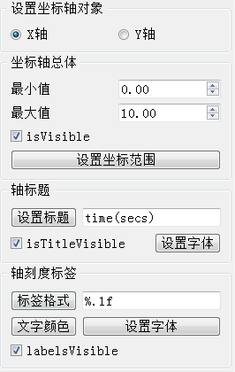
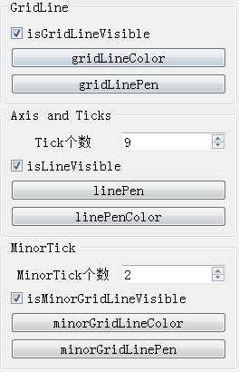

### 9.2.6　QValueAxis坐标轴的设置

本例中使用QValueAxis类的坐标轴，这是数值型坐标轴，与QLineSeries正好配合使用。Qt提供了好几种坐标轴类（见图9-4），都是从QAbstractAxis类继承而来的。QValueAxis类的主要函数见表9-5（包括从QAbstractAxis继承的函数，仅列出函数的返回数据类型，省略了输入参数）。

<center class="my_markdown"><b class="my_markdown">表9-5　QValueAxis类的主要函数</b></center>

| 分组 | 函数 | 功能描述 |
| :-----  | :-----  | :-----  | :-----  | :-----  |
| 坐标轴整体 | void　setVisible() | 设置坐标轴可见性 |
| Qt::Orientation　orientation() | 返回坐标轴方向 |
| void　setMin() | 设置坐标轴最小值 |
| void　setMax() | 设置坐标轴最大值 |
| void　setRange() | 设置坐标轴最小、最大值表示的范围 |
| 轴标题 | void　setTitleVisible() | 设置轴标题的可见性 |
| void　setTitleText() | 设置轴标题的文字 |
| void　setTitleFont() | 设置轴标题的字体 |
| void　setTitleBrush() | 设置轴标题的画刷 |
| 轴标签 | void　setLabelFormat() | 设置标签格式，例如可以设置显示的小数点位数 |
| void　setLabelsAngle() | 设置标签的角度，单位为度 |
| void　setLabelsBrush() | 设置标签的画刷 |
| void　setLabelsColor() | 设置标签文字颜色 |
| void　setLabelsFont() | 设置标签文字字体 |
| void　setLabelsVisible() | 设置轴标签文字是否可见 |
| 轴线和刻度线 | void　setTickCount() | 设置坐标轴主刻度的个数 |
| void　setLineVisible() | 设置轴线和刻度线的可见性 |
| void　setLinePen() | 设置轴线和刻度线的画笔 |
| void　setLinePenColor() | 设置轴线和刻度线的颜色 |
| 主网格线 | void　setGridLineColor() | 设置网格线的颜色 |
| void　setGridLinePen() | 设置网格线的画笔 |
| void　setGridLineVisible() | 设置网格线的可见性 |
| 次刻度和次网格线 | void　setMinorTickCount() | 设置两个主刻度之间的次刻度的个数 |
| void　setMinorGridLineColor() | 设置次网格线的颜色 |
| void　setMinorGridLinePen() | 设置次网格线的画笔 |
| void　setMinorGridLineVisible() | 设置次网格线的可见性 |

参看图9-5图表的X坐标轴，QValueAxis坐标轴有以下几个组成部分。

+ 坐标轴标题：是在坐标轴下方显示的文字，表示坐标轴的名称，图中X轴坐标轴的标题是“time(secs)”。坐标轴标题除了可以设置文字内容，还可以设置字体、画刷和可见性。
+ 轴线和刻度线：轴线是图中从左到右的表示坐标轴的直线，刻度线是垂直于轴线的短线，包括主刻度线和次刻度线，主刻度个数是tickCount()，每两个主刻度之间的次刻度的个数是minorTickCount()。
+ 轴标签：在主刻度处显示的数值标签文字，可以控制其数值格式、文字颜色和字体等。
+ 主网格线：在绘图区与主刻度对应的网格线，可以设置其颜色、线条的pen属性、可见性等。
+ 次网格线：在绘图区与次刻度对应的网格线，可以设置其颜色、线条的pen属性、可见性等。

搞清楚坐标轴的这些组成部分后，对其进行属性读取或设置就只需调用相应的函数即可。图9-9是实例中窗口左侧“坐标轴设置”的界面内容，可以对坐标轴的各种属性进行设置。



<center class="my_markdown"><b class="my_markdown">图9-9　坐标轴设置的界面</b></center>

在图9-9的界面上首先选择需要操作的坐标轴对象，两个RadioButton按钮的响应代码相同，为radioX按钮编写事件槽函数，另一个按钮的槽函数里只需调用这个函数即可，代码如下：

```css
void MainWindow::on_radioX_clicked()
{ //获取当前坐标轴
   if (ui->radioX->isChecked())
      curAxis=(QValueAxis*)ui->chartView->chart()->axisX();
   else
      curAxis=(QValueAxis*)ui->chartView->chart()->axisY();
//获取坐标轴的各种属性，显示到界面上
   ui->spinAxisMin->setValue(curAxis->min());
   ui->spinAxisMax->setValue(curAxis->max());
   ui->editAxisTitle->setText(curAxis->titleText());
   ui->chkBoxAxisTitle->setChecked(curAxis->isTitleVisible());
   ui->editAxisLabelFormat->setText(curAxis->labelFormat());
   ui->chkBoxLabelsVisible->setChecked(curAxis->labelsVisible());
   ui->chkGridLineVisible->setChecked(curAxis->isGridLineVisible());
   ui->chkAxisLineVisible->setChecked(curAxis->isLineVisible());
   ui->spinTickCount->setValue(curAxis->tickCount());
   ui->chkAxisLineVisible->setChecked(curAxis->isLineVisible());
   ui->spinMinorTickCount->setValue(curAxis->minorTickCount());
ui->chkMinorTickVisible->setChecked(curAxis->isMinorGridLineVisible());
}
```

程序中curAxis是在MainWindow类中定义的私有变量，用于表示当前操作的坐标轴对象。获取对象后，首先获得轴对象的各种属性并显示在界面上。

坐标轴各种属性的设置只需调用QValueAxis的相应函数即可，各种接口函数可参考表9-5。例如，“标签格式”按钮的槽函数代码如下：

```css
void MainWindow::on_pushButton_clicked()
{//设置坐标轴刻度标签的文字格式
   curAxis->setLabelFormat(ui->editAxisLabelFormat->text());
}
```

在编辑框editAxisLabelFormat里设置格式字符串，例如“%.2f”，作为QValueAxis::setLabel　Format()的输入参数。格式字符串的定义与printf()函数的格式字符串定义一样。

