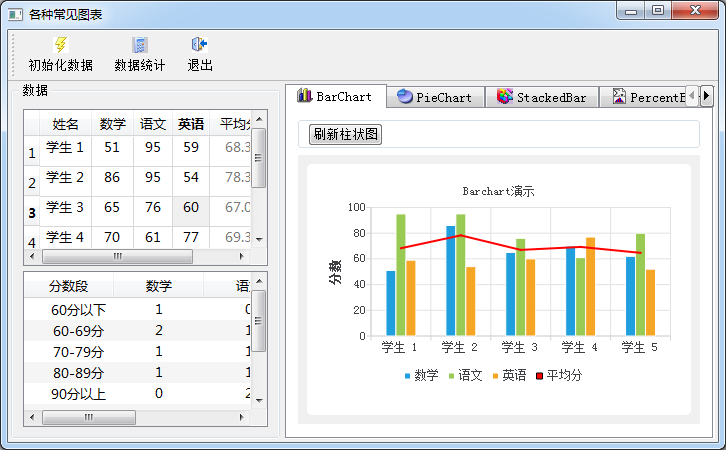

### 9.3.1　实例功能概述

前一节通过折线图的绘制，介绍了Qt Charts绘图的基本原理。图表的类型由数据序列决定，除了折线图，Qt Charts还提供柱状图、饼图、百分比柱状图等常见图表。

本节通过实例samp9_3介绍这些常见图表的绘制方法，图9-10是实例samp9_3的运行界面。左上方是随机生成的若干个学生的数学、语文、英语分数，平均分是自动计算的，左下方是根据分数统计的结果，右方是各种图表的页面。

该实例的主要目的是演示各种常见图表的绘制方法，图表的基本设置在程序里完成，不再如实例samp9_2那样提供丰富的设置功能。

窗口左上方是一个QTableView组件，使用Model/View结构提供数据编辑功能；左下角是一个QTreeWidget组件，用于显示统计数据结果；窗口右方是一个QTabWidget组件，共有5个页面，分别用于显示柱状图、饼图、堆叠图、百分比柱状图和散点图，每个图表的显示用一个Qgraphics　View组件升级为QChartView。

<b class="my_markdown">图9-10　实例samp9_3运行界面</b>

