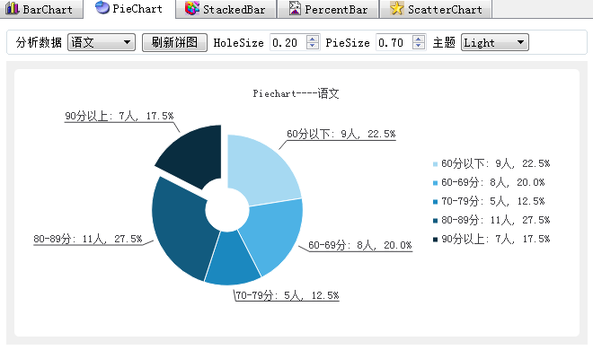

### 9.3.4　饼图

#### 1．饼图的绘制

图9-11是绘制饼图的页面。饼图一般用于对一个数据进行分段统计后分析显示，可以直观地表示某个数据所占的百分比。在图9-11中，绘制饼图需在上方的“分析数据”下拉列表框中选择分析数据对象，列表框中有数学、英语、语文、平均分4个数据对象可供选择，在下拉列表框中选择一个项，或单击“刷新饼图”按钮就可以刷新饼图。

饼图数据来源于分数的统计数据，即每个分数段的人数。为使每个分数段都有一定的统计人数，将mainwindow.h中的常量iniDataRowCount更改为较大值，如40。


<center class="my_markdown"><b class="my_markdown">图9-11　饼图绘制界面</b></center>

界面上方的HoleSize可以设置饼图中心空心圆的大小，PieSize可以设置饼图的大小，“主题”下拉列表框可以为图表选择不同的配色主题。

MainWindow类中绘制饼图相关的函数有两个，iniPiewChart()用于初始化，在MainWindow的构造函数里调用，buildPieChart()用于绘制饼图。

iniPiewChart()函数用于创建QChart对象，并设置为QChartView类对象chartViewPie的显示图表，其代码与iniBarChart()类似，不再赘述。

在图9-11的“分析数据”下拉列表框的currentIndexChanged()信号的响应槽函数和“刷新饼图”按钮的响应代码里都调用buildPieChart()函数绘制饼图。buildPieChart()函数的代码如下：

```css
void MainWindow::buildPieChart()
{ //绘制饼图
   QChart *chart =ui->chartViewPie->chart(); //获取chart对象
   chart->removeAllSeries();
   int colNo=1+ui->cBoxCourse->currentIndex(); //获取分析对象
   QPieSeries *series = new QPieSeries(); //创建饼图序列
   series->setHoleSize(ui->spinHoleSize->value()); //饼图中间空心的大小
   for (int i=0;i<=4;i++) //添加分块数据
   {
      QtreeWidgetItem* item=ui->treeWidget->topLevelItem(i);
      series->append(item->text(0),item->text(colNo).toFloat());
   }
   QPieSlice *slice; //饼图分块
   for(int i=0;i<=4;i++) //设置每个分块的标签文字
   {
     slice =series->slices().at(i);  //获取分块
     slice->setLabel(slice->label()+QString::asprintf(": %.0f人, %.1f%%", 
                  slice->value(),slice->percentage()*100));
     connect(slice, SIGNAL(hovered(bool)),
                this, SLOT(on_PieSliceHighlight(bool)));
   }
   slice->setExploded(true); //最后一个设置为exploded
   series->setLabelsVisible(true); //必须添加完slice之后再设置
   chart->addSeries(series); //添加饼图序列
   chart->setTitle("Piechart----"+ui->cBoxCourse->currentText());
   chart->legend()->setVisible(true); //图例
   chart->legend()->setAlignment(Qt::AlignRight);
}
```

用于绘制饼图的序列类是QPieSeries，一般一个图表只有一个QPieSeries序列。

使用QPieSeries::append()添加一个数据，实际上就是为QPieSeries增加了一个QPieSlice对象，就是饼图的一个分块。

QPieSeries::slices()返回已经添加的饼图分块，是一个QPieSlice类型的列表。获取某个分块slice后，用slice->setLabel()函数设置其标签内容，slice->value()是数据块存储的数值，slice->percentage()是数据块在饼图中所占的百分比，是0到1之间的数。

另外，为每个分块对象slice的hovered(bool)信号关联了一个槽函数on_PieSliceHighlight()。hovered(bool)信号在鼠标移到和移出对象上时发射，此槽函数用以实现某个数据块的动态弹出效果。

下面是on_PieSliceHighlight()槽函数的代码：

```css
void MainWindow::on_PieSliceHighlight(bool show)
{ //鼠标移入、移出时发射hovered()信号，动态设置exploded效果
   QPieSlice*  slice=(QPieSlice *)sender();
   slice->setExploded(show);
}
```

函数的输入参数show表示hovered()信号发射时，鼠标是移入还是移出。show为true表示鼠标移入，否则为移出。代码首先通过sender()获取对象slice，然后调用其setExploded()函数实现效果。若setExploded(true)，则数据块在饼图中是弹出的，如图9-11中的“90分以上”这个数据块就是处于弹出的状态；若setExploded(false)，则数据块就是正常的状态。

> **注意**
> 饼图没有坐标轴，所以无需设置坐标轴。

#### 2．饼图相关的主要类

饼图没有坐标轴，创建饼图主要涉及两个类。

+ QPieSeries：饼图序列，一个图表一般只有一个饼图序列。
+ QPieSlice：一个饼图的分块，一个饼图由多个分块组成。

QPieSeries类是饼图序列，主要功能是对数据块的操作和饼图外观的设置，主要的函数功能见表9-9（仅列出函数的返回数据类型，省略了输入参数）。

<center class="my_markdown"><b class="my_markdown">表9-9　QPieSeries类的主要函数功能</b></center>

| 分组 | 函数 | 功能描述 |
| :-----  | :-----  | :-----  | :-----  | :-----  |
| 分块 | 操作 | bool　append() | 添加一个分块到饼图 |
| bool　insert() | 在某个位置插入一个分块 |
| bool　remove() | 移除并删除一个分块 |
| bool　take() | 移除一个分块，但是并不删除数据块对象 |
| void　clear() | 清除序列所有的分块 |
| QList<QPieSlice *>　slices() | 返回序列的所有分块的列表 |
| int　count() | 返回序列分块的个数 |
| bool　isEmpty() | 如果序列是空的，返回true，否则返回false |
| qreal　sum() | 返回序列各分块的数值的和 |
| 外观 | void　setHoleSize() | 设置饼图中心的空心圆的大小，在0至1之间 |
| void　setPieSize() | 设置饼图占图表矩形区的相对大小，0是最小，1是最大 |
| void　setLabelsVisible() | 设置分块的标签的可见性 |

QPieSlice类是饼图上的一个分块，主要用于存储分块的数据，并决定分块的显示特性。QPieSlice类的主要函数功能见表9-10（仅列出函数的返回数据类型，省略了输入参数）。

<center class="my_markdown"><b class="my_markdown">表9-10　QPieSlice类的主要函数功能</b></center>

| 分组 | 函数 | 功能描述 |
| :-----  | :-----  | :-----  | :-----  | :-----  |
| 数据 | QPieSeries *　series() | 返回分块所属的QPieSeries序列对象 |
| void　setValue() | 设置分块的数值，必须是正数 |
| qreal　percentage() | 返回本数据块的值在饼图中所有数据块的值的和中所占的百分比，数值在0到1之间。当饼图的数据块变化后自动更新 |
| 标签 | void　setLabelVisible() | 设置标签的可见性 |
| void　setLabel() | 设置分块的标签文字 |
| 标签 | void　setLabelBrush() | 设置标签的画刷 |
| void　setLabelColor() | 设置标签的颜色 |
| void　setLabelFont() | 设置标签的字体 |
| void　setLabelPosition() | 设置标签的位置，输入参数是QPieSlice::LabelPosition枚举类型 |
| 外观 | void　setExploded() | 设置分块是否弹出，如果设置为true，分块具有弹出效果 |
| void　setPen() | 设置绘制分块的边框的画笔 |
| void　setBorderColor() | 设置边框的颜色，是画笔颜色的便捷调用方式 |
| void　setBorderWidth() | 设置边框的线宽，是画笔线宽的便捷调用方式 |
| void　setBrush() | 设置绘制分块的画刷 |
| void　setColor() | 设置分块的填充颜色，是画刷颜色的便捷调用方式 |

