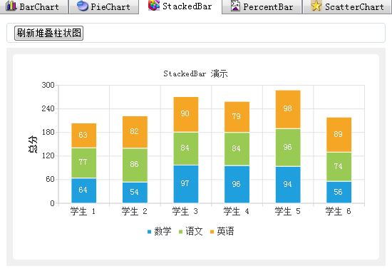

### 9.3.5　堆叠柱状图

堆叠柱状图（StackBar）的绘制效果如图9-12所示，它是柱状图的一种变体。图中有数学、语文、英语这3个数据集，堆叠柱状图将3个数据集叠加成一个柱子来显示，一个柱子中每个小段是一门课的分数，柱子的高度表现了总分的大小。


<center class="my_markdown"><b class="my_markdown">图9-12　堆叠柱状图界面</b></center>

iniStackedBar()用于图表的初始化，其代码与iniBarChart()相似，这里不再赘述。

buildStackedBar()函数用于根据数据模型里的所有学生的3门课的分数绘制叠加柱状图，实现代码如下：

```css
void MainWindow::buildStackedBar()
{//绘制叠加柱状图
   QChart *chart =ui->chartViewStackedBar->chart(); //获取QChart对象
   chart->removeAllSeries();
   chart->removeAxis(chart->axisX()); 
   chart->removeAxis(chart->axisY());
//创建三门课程的数据集
   QBarSet *setMath = new QBarSet(theModel->horizontalHeaderItem(colNoMath)->text());
   QBarSet *setChinese = new QBarSet(theModel->horizontalHeaderItem(colNoChinese)->text());
   QBarSet *setEnglish= new QBarSet(theModel->horizontalHeaderItem(colNoEnglish)->text());
   for(int i=0;i<theModel->rowCount();i++)
   { //添加分数数据到数据集
      setMath->append(theModel->item(i,colNoMath)->text().toInt());
      setChinese->append(theModel->item(i,colNoChinese)->text().toInt());
      setEnglish->append(theModel->item(i,colNoEnglish)->text().toInt());
   }
//创建 QStackedBarSeries对象并添加数据集
   QStackedBarSeries *series = new QStackedBarSeries();
   series->append(setMath);
   series->append(setChinese);
   series->append(setEnglish);
   series->setLabelsVisible(true);//显示每段的标签
   chart->addSeries(series); //添加序列到图表
//创建横轴
   QStringList categories;
   for (int i=0;i<theModel->rowCount();i++)
      categories <<theModel->item(i,colNoName)->text();
   QBarCategoryAxis *axisX = new QBarCategoryAxis(); //类别坐标轴，作为横轴
   axisX->append(categories);
   chart->setAxisX(axisX, series);
   axisX->setRange(categories.at(0), categories.at(categories.count()-1));
//数值坐标轴，作为纵轴
   QValueAxis *axisY = new QValueAxis; //数值坐标轴，作为纵轴
   axisY->setRange(0, 300);
   axisY->setTitleText("总分");
   axisY->setTickCount(6);
   axisY->setLabelFormat("%.0f"); //标签格式
   chart->setAxisY(axisY, series);
   chart->legend()->setVisible(true);
   chart->legend()->setAlignment(Qt::AlignBottom);
}
```

创建堆叠柱状图与创建柱状图类似，都需要先创建QBarSet数据集并添加数据，然后创建QStackedBarSeries序列，将3个数据集添加到这个序列。横轴采用QBarCategoryAxis类型的坐标轴，纵轴采用QValueAxis类型的坐标轴。除了使用QStackedBarSeries类作为序列，其他用到的类与buildBarChart()函数里的都相同。

