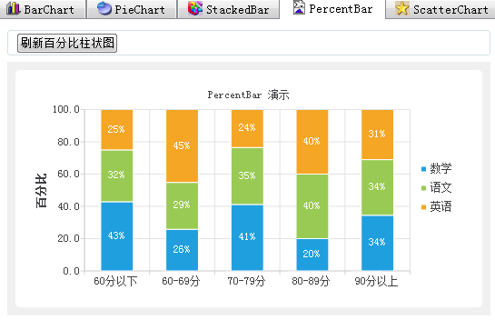

### 9.3.6　百分比柱状图

绘制百分比柱状图的界面如图9-13所示。图中有数学、语文、英语3个数据集，3个数据集的数据来源是按分数统计的结果，3个数据集叠加显示，显示效果类似于叠加柱状图，但是每个柱子的3个数据的和是相同的，等于学生总人数，所以，所有的柱子是等高度的。显示标签时，显示的是每段所占的百分比。

为避免某个分数段统计人数为0，将学生人数设置为40人，就是修改mianwindow.h文件中定义的符号iniDataRowCount为40。

iniPercentBar()用于图表的初始化，与iniBarChart()代码相似，这里不再赘述。

buildPercentBar()函数用于根据统计数据绘制百分比柱状图，其代码如下：

```css
void MainWindow::buildPercentBar()
{//绘制百分比柱状图
   QChart *chart =ui->chartViewPercentBar->chart();
   chart->removeAllSeries();
   chart->removeAxis(chart->axisX());
   chart->removeAxis(chart->axisY());
//创建数据集
   QBarSet *setMath = new QBarSet(theModel->horizontalHeaderItem(colNoMath)->text());
   QBarSet *setChinese = new QBarSet(theModel->horizontalHeaderItem(colNoChinese)->text());
   QBarSet *setEnglish= new QBarSet(theModel->horizontalHeaderItem(colNoEnglish)->text());
   QTreeWidgetItem *item; //节点
   QStringList categories;
   for (int i=0;i<=4;i++)
   {//从分数段统计数据表里获取数据，添加到数据集
      item=ui->treeWidget->topLevelItem(i);
      categories<<item->text(0);//用作横坐标的标签
      setMath->append(item->text(colNoMath).toFloat());
      setChinese->append(item->text(colNoChinese).toFloat());
      setEnglish->append(item->text(colNoEnglish).toFloat());
   }
   QPercentBarSeries *series = new QPercentBarSeries(); //序列
   series->append(setMath);
   series->append(setChinese);
   series->append(setEnglish);
   series->setLabelsVisible(true);//显示百分比
   chart->addSeries(series);
   QBarCategoryAxis *axisX = new QBarCategoryAxis(); //横坐标
   axisX->append(categories);
   chart->setAxisX(axisX, series);
   axisX->setRange(categories.at(0), categories.at(categories.count()-1));
   QValueAxis *axisY = new QValueAxis;//纵坐标
   axisY->setRange(0, 100);
   axisY->setTitleText("百分比");
   axisY->setTickCount(6);
   axisY->setLabelFormat("%.1f"); //标签格式
   chart->setAxisY(axisY, series);
   chart->legend()->setVisible(true);
   chart->legend()->setAlignment(Qt::AlignBottom);
}
```


<center class="my_markdown"><b class="my_markdown">图9-13　百分比柱状图界面</b></center>

绘制百分比柱状图也需要先创建QBarSet数据集，这里创建了3个数据集，从统计数据表里分别获取3门课各个分数段的人数。

绘制百分比柱状图使用QPercentBarSeries类的序列，添加数据集，设置X和Y轴的坐标轴即可。若显示数据标签，显示的是某个分数段内某门课的人数的百分比。

