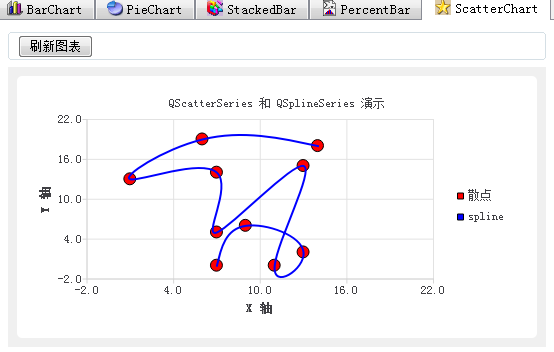

### 9.3.7　散点图和光滑曲线图

在窗口绘图区的“ScatterChart”页面可以绘制散点图和光滑曲线图，绘图效果如图9-14所示。

绘制散点图使用QScatterSeries序列类。它在添加数据点后，将数据点以散点的形式显示，如图9-14中的“散点”序列。可以控制散点的形状、大小和颜色等属性。


<center class="my_markdown"><b class="my_markdown">图9-14　散点与spline图</b></center>

绘制光滑曲线使用QSplineSeries序列类，它在两点之间连线时采用差值算法，从而形成光滑的曲线，而绘制折线图采用的是QLineSeries序列类，两点间只是简单的用直线连接。

实例中绘制散点和光滑曲线图使用随机数据，与界面左侧的学生分数数据无关。

iniScatterChart()用于图表的初始化，与iniBarChart()的代码相似，这里不再赘述。

单击绘图页面上方的“刷新图表”按钮，将调用buildScatterChart()函数绘制散点图和spline曲线，buildScatterChart()函数的代码如下：

```css
void MainWindow::buildScatterChart()
{ //绘制 QScatterSeries和QSplineSeries图
   QChart *chart =ui->chartViewScatter->chart();
   chart->removeAllSeries();
   chart->removeAxis(chart->axisX());
   chart->removeAxis(chart->axisY());
   QSplineSeries *seriesLine = new QSplineSeries(); //光滑曲线序列
   seriesLine->setName("spline");
   QPen pen;
   pen.setColor(Qt::blue);
   pen.setWidth(2);
   seriesLine->setPen(pen);
   QScatterSeries *series0 = new QScatterSeries(); //散点序列
   series0->setName("散点");
   series0->setMarkerShape(QScatterSeries::MarkerShapeCircle);
   series0->setBorderColor(Qt::black);
   series0->setBrush(QBrush(Qt::red));
   series0->setMarkerSize(12);
   qsrand(QTime::currentTime().second());//随机数种子
   for (int i=0;iappend(x,y); //散点序列
      seriesLine->append(x,y); //光滑曲线序列
   }
   chart->addSeries(series0);
   chart->addSeries(seriesLine);
   chart->createDefaultAxes(); //创建缺省的坐标轴
   chart->axisX()->setTitleText("X 轴");
   chart->axisX()->setRange(-2,22);
   chart->axisY()->setTitleText("Y 轴");
   chart->axisY()->setRange(-2,22);
   chart->legend()->setVisible(true);
   chart->legend()->setAlignment(Qt::AlignRight); 
}
```

函数创建了一个QSplineSeries序列对象seriesLine，一个QScatterSeries序列对象series0。

散点序列的数据点形状采用函数setMarkerShape()进行设置，传递的参数是一个QScatterSeries:: MarkerShape枚举类型的值，这个枚举类型只有两种取值：

+ QScatterSeries::MarkerShapeCircle，圆形：
+ QScatterSeries::MarkerShapeRectangle，矩形。

setBorderColor()函数用于设置数据点形状边框的颜色，setBrush()函数可以设置填充颜色，setMarkerSize()函数设置数据点形状的大小。

两个序列创建后，采用随机函数生成数据点，两个序列添加相同的数据点。

创建坐标轴时采用了QChart::createDefaultAxes()函数生成缺省的坐标轴，创建缺省的坐标轴之后，还是可以通过QChart:: axisX()或QChart:: axisY()获取图表的X坐标轴或Y坐标轴进行坐标轴的属性设置，例如设置坐标轴标题和数值范围。

