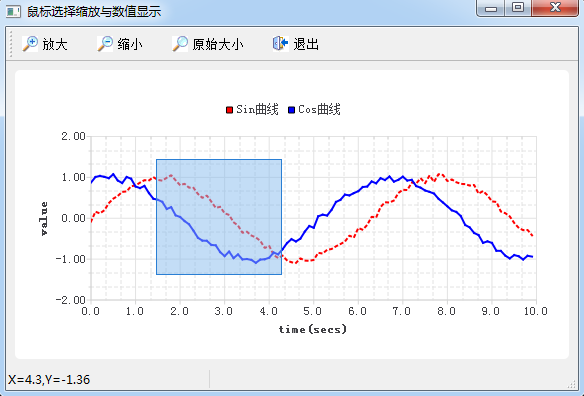

### 9.4.1　实例功能概述

前面介绍了QChart绘图的基本功能，以及几种常见图表的绘制方法，本节介绍QChart绘图的一些高级的用法，也是经常需要实现的一些功能。实例samp9_4用于演示这些功能的实现，图9-15是实例运行界面。

<b class="my_markdown">图9-15　实例samp9_4运行界面</b>

该实例具有如下功能：

+ 鼠标在图表上移动时，在状态栏里显示鼠标当前位置的坐标数值，这个功能在一般的数据曲线显示图表中是经常需要实现的；
+ 图例具有类似于QCheckBox的功能，单击图例的图标可以显示或隐藏对应的序列；
+ 通过工具栏按钮可以进行图表缩放操作；
+ 鼠标在图表上可以选择矩形区域进行放大，单击鼠标右键则恢复图表大小；
+ 使用按键可以实现图表的快捷操作，如“+”键进行放大、“-”键进行缩小、Home键恢复原始大小，使用上、下、左、右光标键可以移动序列的显示位置等。

