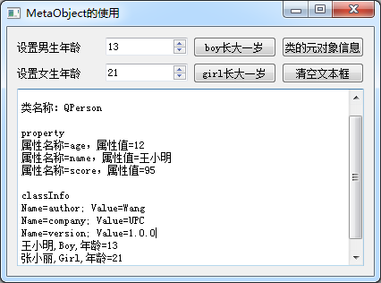

[toc]

### 1. 程序运行界面



<center><b>程序运行界面</b></center>

### 2. QPerson 类

#### 2.1 qperson.h

```cpp
#ifndef QPERSON_H
#define QPERSON_H

#include <QObject>

class QPerson : public QObject
{
    Q_OBJECT

    Q_CLASSINFO("author","Wang")
    Q_CLASSINFO("company","UPC")
    Q_CLASSINFO("version","1.0.0")

    Q_PROPERTY(int age READ age WRITE setAge NOTIFY ageChanged)
    Q_PROPERTY(QString name MEMBER m_name)
    Q_PROPERTY(int score MEMBER m_score)

public:
    explicit QPerson(QString fName, QObject *parent = nullptr);

    int     age();
    void    setAge(int value);

private:
    int m_age = 10;
    QString m_name;
    int     m_score=79;

public:
    void incAge();

signals:
    void ageChanged(int value);

};

#endif // QPERSON_H
```

#### 2.2 qperson.cpp

```cpp
#include "qperson.h"
#include <QVariant>

QPerson::QPerson(QString fName, QObject *parent) : QObject(parent)
{
    m_name = fName;
}

void QPerson::incAge()
{
    m_age++;
    emit ageChanged(m_age);
}

int QPerson::age()
{
    return m_age;
}

void QPerson::setAge(int value)
{
    m_age = value;
}
```

### 3. MainWindow 类

#### 3.1 mainwindow.h

```cpp
#ifndef MAINWINDOW_H
#define MAINWINDOW_H

#include <QMainWindow>
#include "qperson.h"

namespace Ui {
class MainWindow;
}

class MainWindow : public QMainWindow
{
    Q_OBJECT

private:
    QPerson *boy;
    QPerson *girl;

public:
    explicit MainWindow(QWidget *parent = 0);
    ~MainWindow();

private:
    Ui::MainWindow *ui;

public slots:
    // 自定义槽函数
    void on_ageChanged(int value);
    void on_spin_valueChanged(int arg1);
    // 界面按钮的槽函数
    void on_btnBoyInc_clicked();
    void on_btnClssInfo_clicked();
    void on_btnGirlInc_clicked();
    void on_btnClear_clicked();

};

#endif // MAINWINDOW_H
```

#### 3.2 mainwindow.cpp

```cpp
#include <QMetaClassInfo>
#include <QMetaObject>
#include <QMetaProperty>

#include "mainwindow.h"
#include "ui_mainwindow.h"

MainWindow::MainWindow(QWidget *parent) :
    QMainWindow(parent),
    ui(new Ui::MainWindow)
{
    ui->setupUi(this);
    boy = new QPerson("王小明");
    boy->setProperty("score", 95);
    boy->setProperty("age", 10);
    boy->setProperty("sex", "Boy"); // 动态属性

    connect(boy, &QPerson::ageChanged, this, &MainWindow::on_ageChanged);

    girl = new QPerson("张小丽");
    girl->setProperty("score", 81);
    girl->setProperty("age", 20);
    girl->setProperty("sex", "Girl");   // 动态属性

    connect(girl, &QPerson::ageChanged, this, &MainWindow::on_ageChanged);

    ui->spinBoy->setProperty("isBoy", true);
    ui->spinGirl->setProperty("isBoy", false);

    connect(ui->spinGirl, SIGNAL(valueChanged(int)), this, SLOT(on_spin_valueChanged(int)));
    connect(ui->spinBoy, SIGNAL(valueChanged(int)), this, SLOT(on_spin_valueChanged(int)));
}

MainWindow::~MainWindow()
{
    delete ui;
}

void MainWindow::on_ageChanged(int value)
{
    // 响应 QPerson 的 ageChanged() 信号
    Q_UNUSED(value);
    QPerson *aPerson = qobject_cast<QPerson *>(sender());   // 类型投射
    QString hisName = aPerson->property("name").toString(); // 姓名
    QString hisSex = aPerson->property("sex").toString();   // 动态属性
    int hisAge = aPerson->age();    // 通过接口函数获取年龄
    // int hisAge = aPerson->property("age").toInt();   // 通过属性获得年龄
    ui->textEdit->append(hisName + ", " + hisSex + QString::asprintf(", 年龄=%d", hisAge));
}

void MainWindow::on_spin_valueChanged(int arg1)
{
    // 响应界面上 spinBox 的 valueChanged(int) 信号
    Q_UNUSED(arg1);
    QSpinBox *spinBox = qobject_cast<QSpinBox *>(sender());
    if (spinBox->property("isBoy").toBool())
    {
        boy->setAge(spinBox->value());
    } else {
        girl->setAge(spinBox->value());
    }
}

void MainWindow::on_btnBoyInc_clicked()
{
    boy->incAge();
}

void MainWindow::on_btnClssInfo_clicked()
{
    // "类元素对象信息" 按钮
    const QMetaObject *meta = boy->metaObject();
    ui->textEdit->clear();
    ui->textEdit->append("==元对象信息==\n");
    ui->textEdit->append(QString("类名称：%1\n").arg(meta->className()));
    ui->textEdit->append("property");
    for (int i = meta->propertyOffset(); i < meta->propertyCount(); i++)
    {
        QMetaProperty prop = meta->property(i);
        const char *propName = prop.name();
        QString propValue = boy->property(propName).toString();
        ui->textEdit->append(QString("属性名称=%1, 属性值=%2").arg(propName).arg(propValue));
    }
    ui->textEdit->append("");
    ui->textEdit->append("classInfo");
    for (int i = meta->classInfoOffset(); i <meta->classInfoCount(); i++)
    {
        QMetaClassInfo classInfo = meta->classInfo(i);
        ui->textEdit->append(QString("Name=%1; Value=%2").arg(classInfo.name()).arg(classInfo.value()));
    }
}

void MainWindow::on_btnGirlInc_clicked()
{
    girl->incAge();
}

void MainWindow::on_btnClear_clicked()
{
    ui->textEdit->clear();
}
```

