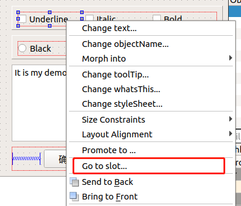
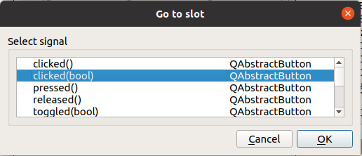

1. 窗体在设计模式下，选中要设置信号与槽的控件，单击右键，在弹出的快捷菜单中选择 "Go to slot..."。

   

2. 在弹出的对话框中选择要处理的信号，然后点 "OK" 按钮。

   

3. Qt 会在源代码文件中添加如下方法

   **dialog.h**

   ```cpp
   private slots:
       void on_chkBoxUnder_clicked(bool checked);
   ```

   **dialog.cpp**

   ```cpp
   void QWDialog::on_chkBoxUnder_clicked(bool checked)
   {
       QFont   font=ui->txtEdit->font();
       font.setUnderline(checked);
       ui->txtEdit->setFont(font);
   }
   ```

   但是，查看 QWDialog 的构造函数，构造函数只有简单的一条语句。

   ```css
   QWDialog::QWDialog(QWidget *parent) : QDialog(parent), ui(new Ui::QWDialog)
   {
       ui->setupUi(this);
   }
   ```

   这里没有发现用 `connect()` 函数进行几个 CheckBox 的信号与槽函数关联的操作。这些功能是如何实现的呢？

   查看编译生成的 ui_qwdialog.h 文件。构造函数里调用的 `setupUi()` 是在 ui_qwdialog.h 文件里实现的。查看 `setupUi()` 函数的内容，也没有发现用 `connect()` 函数进行几个 heckBox 的信号与槽关联的操作，只是在 `setupUI()` 里发现了如下的一条语句：

   ```css
   QMetaObject::connectSlotsByName(QWDialog);
   ```

   秘密就在于这条语句。`connectSlotsByName(QWDialog)` 函数将搜索QWDialog 界面上的所有组件，将信号与槽函数匹配的信号和槽关联起来，它假设槽函数的名称是：

   ```css
   void on_<object name>_<signal name>(<signal parameters>);
   
   ```

   例如，通过 UI 设计器的操作，为 chkBoxUnder 自动生成的槽函数是：

   ```css
   void on_chkBoxUnder_clicked(bool checked);
   ```

   它就正好是 chkBoxUnder 的信号 clicked(bool) 的槽函数。那么，`connectSlotsByName()` 就会将此信号和槽函数关联起来，如同执行了下面的这样一条语句：

   ```css
   connect(chkBoxUnder, SIGNAL(clicked (bool)), 
           this, SLOT (on_chkBoxUnder_clicked (bool));
   ```

   这就是用UI设计器可视化设计某个组件的信号响应槽函数，而不用手工去将其关联起来的原因，都是在界面类的构造函数里调用 setupUi() 自动完成了关联。