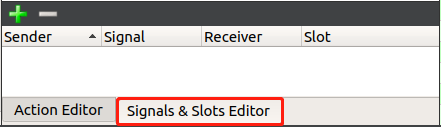
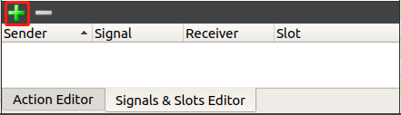
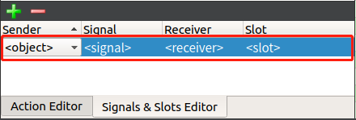
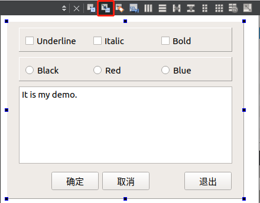
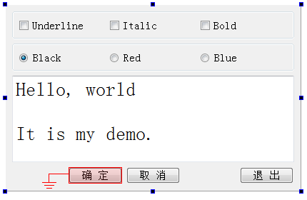
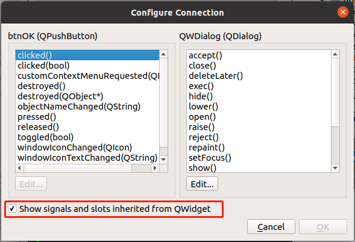
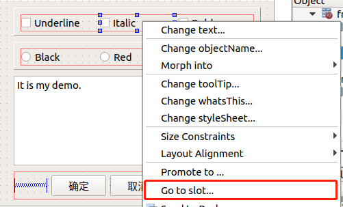
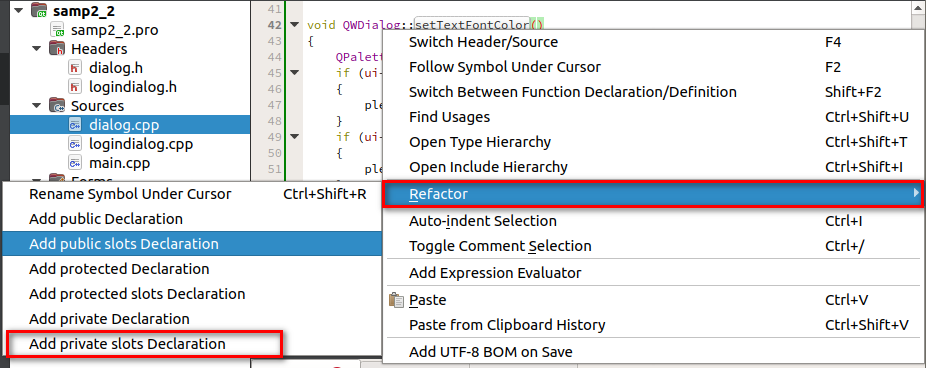

[toc]

### 1. 通过信号与槽编辑窗口设置

1. 在 Qt 界面底边点击 `Signals & Slots Editor` 项切换到信号与槽编辑窗口。

   

2. 点击信号与槽编辑窗口顶部的加号按钮，添加一项信号与槽设置。

   

3. 在信号与槽编辑窗口的列表中，双击列中对应的项，分别设置信号发送者（Sender）、要处理的信号（Signal）、信号接收者（Receiver）、信号处理方法（Slot）。

   

> 注意
>
> 该方法可选择的处理方法（槽），只有系统自带的方法，无法创建自定义的处理方法。

### 2. 通过信号与槽工具进行设置

1. 点击信号与槽工具按钮切换到信号与槽编辑状态。

   

2. 选中要设置信号与槽的控件，按住鼠标不放，将鼠标移动到要处理该信号的控件或窗体上，然后松开鼠标。

   

3. 在弹出对话框中，在左边列表选择要处理的信号，在右边列表中选择处理该信号的方法。可以勾选底部的 `Show signals and slots inherited from QWidget` 项显示更多处理方法。

   

4. 最后单击 "OK" 按钮即可。

> 注意
>
> 该方法可选择的处理方法（槽），只有系统自带的方法，无法创建自定义的处理方法。

### 3. 通过可视化生成信号与槽方法设置

1. 在要设置信号与槽的控件上右击，在弹出的菜单中选择 "Go to slot..." 项。

   

2. 在弹出的对话框中选择要处理的信号，然后点击 "OK" 按钮。

   

3. Qt 会自动在对应的头文件和源代码添加如下代码

   **头文件**

   ```cpp
   private slots:
       void on_chkBoxItalic_clicked(bool checked);
   ```

   **源代码文件**

   ```cpp
   void QWDialog::on_chkBoxItalic_clicked(bool checked)
   {
       
   }
   ```

4. 在源代码文件中处理方法中添加处理逻辑即可。

### 4. 通过 QObject::connect() 方法设置信号与槽

1. 在源代码中添加信号处理方法

   ```cpp
   void QWDialog::setTextFontColor()
   {
       QPalette plet = ui->txtEdit->palette();
       if (ui->rBtnBlue->isChecked())
       {
           plet.setColor(QPalette::Text, Qt::blue);
       }
       if (ui->rBtnRed->isChecked())
       {
           plet.setColor(QPalette::Text, Qt::red);
       }
       if (ui->rBtnBlack->isChecked())
       {
           plet.setColor(QPalette::Text, Qt::black);
       }
       ui->txtEdit->setPalette(plet);
   }
   ```

2. 在源代码文件中的处理函数名处右击鼠标，在弹出的对话框中选择 "Refactor" -> "Add private slots Declaration" 菜单项自动生成函数的声明代码。

   

   或者在头文件中直接添加如下代码：

   ```cpp
   private slots:
       void setTextFontColor();
   ```

3. 在源代码的类构造函数中添加如下代码，将信号与槽关联在一起。

   ```cpp
   QWDialog::QWDialog(QDialog *parent) :
       QDialog(parent),
       ui(new Ui::QWDialog)
   {
       ui->setupUi(this);
       connect(ui->rBtnBlue, SIGNAL(clicked()), this, SLOT(setTextFontColor()));
   }
   ```

### 5. 通过 QMetaObject::connectSlotsByName() 方法设置信号与槽

1. 在类头文件中添加信号处理方法，代码如下所示。

   ```cpp
   private slots:
       void on_chkBoxUnder_clicked(bool checked);
   ```

   > 注意
   >
   > 信号处理方法的名称命名规则如下：
   >
   > ```cpp
   > void on_<object name>_<signal name>(<signal parameters>);
   > ```

2. 在类源代码文件中实现该函数，代码如下所示。

   ```cpp
   void QWDialog::on_chkBoxUnder_clicked(bool checked)
   {
       QFont font = ui->txtEdit->font();
       font.setUnderline(checked);
       ui->txtEdit->setFont(font);
   }
   ```

3. 在类构造函数中添加如下方法

   ```cpp
   QMetaObject::connectSlotsByName(QWDialog);
   ```

   > 注意
   >
   > `QMetaObject::connectSlotsByName()` 方法的参数为类名称。

> 提示
>
> `QMetaObject::connectSlotsByName()` 方法会自动将参数类中控件名称为 `chkBoxUnder` 的 `onClick(bool)` 信号与 `on_chkBoxUnder_clicked()` 函数关联起来，即执行下面的代码：
>
> ```cpp
> QObject::connect(chkBoxUnder, SIGNAL(clicked (bool)), 
>         this, SLOT (on_chkBoxUnder_clicked (bool));
> ```

