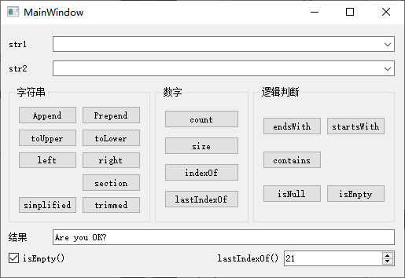

> 提示：示例源代码位置：百度网盘 -> 书籍资源 -> Qt 5.9 C++开发指南 -> 资源 -> QT5.9Samp2019 -> QT5.9Samp2019 -> samp4_2QString

`QString` 存储字符串采用的是 `Unicode` 码，每一个字符是一个 16 位的 `QChar`，而不是 8 位的 `char`，所以 `QString` 处理中文字符没有问题，而且一个汉字算作是一个字符。

+ `append()` 和 `prepend()`

  `append()` 在字符串的后面添加字符串，`prepend()` 在字符串的前面添加字符串，如：

  ```c++
  QString str1 = "卖", str2="拐";
  QString str3 = str1;
  str1.append(str2);	// str1 = "卖拐"
  str3.prepend(str2);	// str3 = "拐卖"
  ```

+ `toUpper()` 和 `toLower()`

  `toUpper()` 将字符串内的字母全部转换为大写形式，`toLower()` 将字母全部转换为小写形式，如：

  ```c++
  QString str1 = "Hello, World", str2;
  str2 = str1.toUpper();	// str2 = "HELLO, WORLD"
  str2 = str1.toLower();	// str2 = "hello, world"
  ```

+ `count()`、`size()` 和 `length()`

  `count()`、`size()` 和 `length()` 都返回字符串的字符个数，这 3 个函数是相同的，但是要注意，字符串中如果有汉字，一个汉字算一个字符。

  ```c++
  QString str1 = "NI好";
  int N = str1.count();	// N = 3
  N = str1.size();	// N = 3
  N = str1.length();	// N = 3
  ```

+ `trimmed()` 和 `simplified()`

  `trimmed()` 去掉字符串首尾的空格，`simplified()` 不仅去掉首尾的空格，中间连续的空格也用一个空格替换。

  ```c++
  QString str1 = "    Are    you    OK?    ", str2;
  str2 = str1.trimmed();	// str1 = "Are    you    OK?"
  str2 = str1.simplified();	// str1 = "Are you OK?"
  ```

+ `indexOf()` 和 `lastIndexOf()`

  `indexOf()` 函数的原型为：

  ```c++
  int indexOf(const QString &str, int from = 0, Qt::CaseSensitivity cs = Qt::CaseSensitive) const
  ```

  其功能是在自身字符串内查找参数字符串 `str` 出现的位置，参数 `from` 是开始查找的位置，`Qt::CaseSensitivity cs` 参数指定是否区分大小写。

  `lastIndexOf()` 函数则是查找某个字符串最后出现的位置。

  ```c++
  QString str1 = "G:\Qt5Book\QT5.9Study\qw.cpp";
  int index = str1.indexOf("5.9");	// index = 13
  index = str1.lastIndexOf("\\");		// index = 21
  ```

  `\` 是转义字符，如果要查找 `\`，需要输入 `\\`。

+ `isNull()` 和 `isEmpty()`

  两个函数都判断字符串是否为空，但是稍有差别。如果一个空字符串，只有 `\0`，`isNull()` 返回 `false`，而 `isEmpty()` 返回 `true`；只有未赋值的字符串，`isNull()` 才返回 `true`。

  ```c++
  QString str1, str2 = "";
  bool result = str1.isNull();	// result = true 未赋值的字符串变量
  result = str2.isNull();	// result = false 只有 "\0" 的字符串，也不是 Null
  result = str1.isEmpty();	// result = true
  result = str2.isEmpty();	// result = true
  ```

+ `contains()`

  判断字符串内是否包含某个字符串，可指定是否区分大小写。

  ```c++
  QString str1 = "G:\Qt5Book\QT5.9Study\qw.cpp";
  bool result = str1.contains(".cpp", Qt::CaseInsensitive);	// result = true, 不区分大小写
  result = str1.contains(".CPP", Qt::CaseSensitive);	// result = false, 区分大小写
  ```

+ `endsWith()` 和 `startsWith()`

  `startsWith()` 判断是否以某个字符串开头，`endsWith()` 判断是否以某个字符串结束。

  ```c++
  QString str1 = "G:\Qt5Book\QT5.9Study\qw.cpp";
  bool result = str1.endsWith(".cpp", Qt::CaseInsensitive);	// result = true, 不区分大小写
  result = str1.endsWith(".CPP", Qt::CaseSensitive);	// result = false, 区分大小写
  result = str1.startsWith("g: ");	// result = true, 缺省为不区分大小写
  ```

+ `left()` 和 `right()`

  `left()` 表示从字符串中取左边多少个字符，`right()` 表示从字符串中取右边多少个字符。注意，一个汉字被当做一个字符。

  ```c++
  QString str2, str1 = "学生姓名，男，1984-3-4，汉族，山东";
  int index = str1.indexOf("，");	// index = 4，第一个 "，" 出现的位置
  str2 = str1.left(index);	// str2 = "学生姓名"
  index = str1.lastIndexOf("，");	// index = 18, 最后一个逗号的位置
  str2 = str1.right(str1.size() - index - 1);	// str2 = "山东"，提取最后一个逗号之后的字符串
  ```

+ `section()`

  `section()` 函数的原型为：

  ```c++
  QString section(const QString &sep, int start, int end = -1, SectionFlags flags = SectionDefault) const
  ```

  其功能是从字符串中提取以 `sep` 作为分隔符，从 `start` 端到 `end` 端的字符串。

  ```c++
  QString str2, str1 = "学生姓名，男，1984-3-4，汉族，山东";
  str2 = str1.section("，", 0, 0);	// str2 = "学生姓名"，第 1 段的编号为 0
  str2 = str1.section("，", 1, 1);	// str2 = "男"
  str2 = str1.section("，", 0, 1);	// str2 = "学生姓名，男"
  str2 = str1.section("，", 4, 4);	// str2 = "山东"
  ```

**示例效果图：**



**示例代码：**

```c++
#include "mainwindow.h"
#include "ui_mainwindow.h"

MainWindow::MainWindow(QWidget *parent) :
    QMainWindow(parent),
    ui(new Ui::MainWindow)
{
    ui->setupUi(this);
}

MainWindow::~MainWindow()
{
    delete ui;
}

void MainWindow::on_btAppend_clicked()
{   // append() 函数
    QString str1, str2;
    str1 = ui->cbStr1->currentText();
    str2 = ui->cbStr2->currentText();
    str1.append(str2);

    ui->leResult->setText(str1);
}

void MainWindow::on_btPrepend_clicked()
{   // prepend() 函数
    QString str1, str2;
    str1 = ui->cbStr1->currentText();
    str2 = ui->cbStr2->currentText();
    str1.prepend(str2);

    ui->leResult->setText(str1);
}

void MainWindow::on_btToUpper_clicked()
{   // toUpper() 函数
    QString str1, str2;
    str1 = ui->cbStr1->currentText();
    str2 = str1.toUpper();

    ui->leResult->setText(str2);
}

void MainWindow::on_btToLower_clicked()
{   // toLower() 函数
    QString str1, str2;
    str1 = ui->cbStr1->currentText();
    str2 = str1.toLower();

    ui->leResult->setText(str2);
}

void MainWindow::on_btLeft_clicked()
{
    // left() 函数
    QString str1, str2;
    str1 = ui->cbStr1->currentText();
    int index = ui->spinBox->value();
    str2 = str1.left(index);
    ui->leResult->setText(str2);
}

void MainWindow::on_btRight_clicked()
{   // right() 函数
    QString str1, str2;
    str1 = ui->cbStr1->currentText();
    int length = str1.size();
    int index = ui->spinBox->value();
    str2 = str1.right(length - index - 1);
    ui->leResult->setText(str2);
}

void MainWindow::on_btSection_clicked()
{   // section() 函数
    int i;
    QString str1, str2, str3;
    str1 = ui->cbStr1->currentText();
    i = ui->spinBox->value();
    str3 = ui->cbStr2->currentText();
    if (QString::compare(str3, "\\", Qt::CaseInsensitive) == 0) {
        str2 = str1.section('\\', i, i + 1);
    } else {
        str2 = str1.section(str3, i, i + 1);
    }

    ui->leResult->setText(str2);
}

void MainWindow::on_btSimplified_clicked()
{   // simplified() 函数
    QString str1;
    str1 = ui->cbStr1->currentText();
    str1 = str1.simplified();
    ui->leResult->setText(str1);
}

void MainWindow::on_btTrimmed_clicked()
{   // trimmed() 函数
    QString str1;
    str1 = ui->cbStr1->currentText();
    str1 = str1.trimmed();

    ui->leResult->setText(str1);
}

void MainWindow::on_btCount_clicked()
{   // count() 函数
    QString str1 = ui->cbStr1->currentText();
    int i = str1.count();
    ui->spinBox->setValue(i);
    ui->LabSpin->setText("count()");
}

void MainWindow::on_btSize_clicked()
{   // size() 函数
    QString str1 = ui->cbStr1->currentText();
    int i = str1.size();
    ui->spinBox->setValue(i);
    ui->LabSpin->setText("size()");
}

void MainWindow::on_btLastIndexOf_clicked()
{   // lastIndexOf() 函数
    QString str1, str2;
    str1 = ui->cbStr1->currentText();
    str2 = ui->cbStr2->currentText();

    int i;
    i = str1.lastIndexOf(str2);
    ui->spinBox->setValue(i);
    ui->LabSpin->setText("lastIndexOf()");
}

void MainWindow::on_btEndsWith_clicked()
{   // endsWith() 函数
    QString str1, str2;
    str1 = ui->cbStr1->currentText();
    str2 = ui->cbStr2->currentText();

    bool chk;
    chk = str1.endsWith(str2);
    ui->checkBox->setChecked(chk);
    ui->checkBox->setText("endsWith()");
    ui->checkBox->sizeHint();

}

void MainWindow::on_btStartsWith_clicked()
{   // startsWith() 函数
    QString str1, str2;
    str1 = ui->cbStr1->currentText();
    str2 = ui->cbStr2->currentText();

    bool chk;
    chk = str1.startsWith(str2);
    ui->checkBox->setChecked(chk);
    ui->checkBox->setText("startsWith()");
    ui->checkBox->sizeHint();
}

void MainWindow::on_btContains_clicked()
{   // contains() 函数
    QString str1, str2;
    str1 = ui->cbStr1->currentText();
    str2 = ui->cbStr2->currentText();

    bool chk;
    chk = str1.contains(str2);
    ui->checkBox->setChecked(chk);
    ui->checkBox->setText("contains()");
    ui->checkBox->sizeHint();
}

void MainWindow::on_btIsNull_clicked()
{   // isNull() 函数
    QString str1;
    str1 = ui->cbStr1->currentText();
    bool chk;
    chk = str1.isNull();
    ui->checkBox->setChecked(chk);
    ui->checkBox->setText("isNull()");
    ui->checkBox->sizeHint();
}

void MainWindow::on_btIsEmpty_clicked()
{   // isEmpty() 函数
    QString str1;
    str1 = ui->cbStr1->currentText();
    bool chk;
    chk = str1.isEmpty();
    ui->checkBox->setChecked(chk);
    ui->checkBox->setText("isEmpty()");
    ui->checkBox->sizeHint();
}

void MainWindow::on_btIndexOf_clicked()
{   // indexOf() 函数
    QString str1, str2;
    str1 = ui->cbStr1->currentText();
    str2 = ui->cbStr2->currentText();

    int i;
    i = str1.indexOf(str2);
    ui->spinBox->setValue(i);
    ui->LabSpin->setText("indexOf()");

}
```

