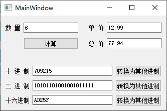
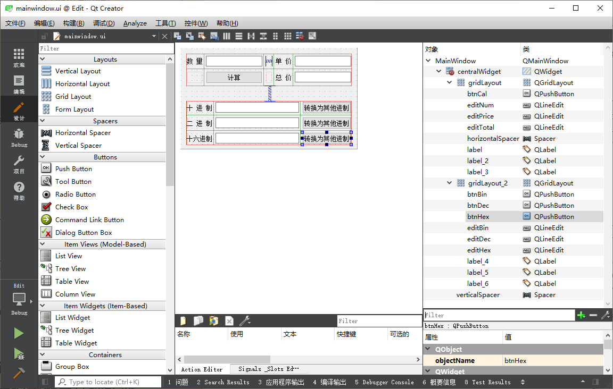

> 提示：示例源代码位置：百度网盘 -> 书籍资源 -> Qt 5.9 C++开发指南 -> 资源 -> QT5.9Samp2019 -> QT5.9Samp2019 -> samp4_1Edit

`QString` 类从字符串转换为整数的函数有：

```c++
int toInt(bool *ok = Q_NULLPTR, int base = 10) const
long toLong(bool *ok = Q_NULLPTR, int base = 10) const
short toShort(bool *ok = Q_NULLPTR, int base = 10) const
uint toUInt(bool *ok = Q_NULLPTR, int base = 10) const
ulong toULong(bool *ok = Q_NULLPTR, int base = 10) const
```

这些函数如果不设置参数，缺省表示从十进制表示的字符串转换为整数；若指定整数基参数，还可以直接将二进制、十六进制字符串转换为整数。

`QString` 将字符串转换为浮点数的函数有：

```c++
double toDouble(bool *ok = Q_NULLPTR) const
float toFloat(bool *ok = Q_NULLPTR) const
```

如果需要将整数或浮点数转换为字符串，下面 4 行代码都可以实现这个功能：

```c++
str = QString::numer(total, 'f', 2);
str = QString::asprintf("%.2f", total);
str = str.setNum(total, 'f', 2);
str = str.sprintf("%.2f", total);
```

可以使用 `QString` 的静态函数 `number()` 和 `asprintf()`，也可以使用其公共函数 `setNum()` 和 `sprintf()`。`QString` 的 `sprintf()` 函数与 C 语言里的 `sprintf()` 函数的格式是一样的，而 `setNum()` 和 `number()` 函数使用另外一种格式定义，而且 `setNum()` 和 `number()` 有多个重载函数定义，可以处理各种类型的整数和浮点数，在处理整数时还可以指定进制。

**示例运行效果图：**



**示例布局：**



**示例代码：**

```c++
#include "mainwindow.h"
#include "ui_mainwindow.h"

MainWindow::MainWindow(QWidget *parent) :
    QMainWindow(parent),
    ui(new Ui::MainWindow)
{
    ui->setupUi(this);
}

MainWindow::~MainWindow()
{
    delete ui;
}

void MainWindow::on_btnCal_clicked()
{
    QString str = ui->editNum->text();  // 读取 "数量"
    int num = str.toInt();
    str = ui->editPrice->text();    // 读取 "单价"
    float price = str.toFloat();
    float total = num * price;
    str = str.sprintf("%.2f", total);
    ui->editTotal->setText(str);
}

void MainWindow::on_btnDec_clicked()
{
    // 读取十进制数，转换为其他进制
    QString str = ui->editDec->text();
    int val = str.toInt();  // 缺省为十进制
    // str = QString::number(val, 16);  // 转换为十六进制的字符串
    str = str.setNum(val, 16);  // 十进制
    str = str.toUpper();
    ui->editHex->setText(str);
    str = str.setNum(val, 2);   // 二进制
    // str = QString::number(val, 2);
    ui->editBin->setText(str);
}

void MainWindow::on_btnBin_clicked()
{
    // 读取二进制数，转换为其他进制的数
    QString str = ui->editBin->text();  // 读取二进制字符串
    bool ok;
    int val = str.toInt(&ok, 2);    // 以二进制数读入
    str = QString::number(val, 10); // 数字显示为十进制字符串
    ui->editDec->setText(str);
    str = str.setNum(val, 16);  // 显示为十六进制
    str = str.toUpper();
    ui->editHex->setText(str);
}

void MainWindow::on_btnHex_clicked()
{
    // 读取十六进制，转换为其他进制的数
    QString str = ui->editHex->text();  // 读取十六进制字符串
    bool ok;
    int val = str.toInt(&ok, 16);   // 以二进制数读入
    str = QString::number(val, 10); // 数字显示为十进制字符串
    ui->editDec->setText(str);
    str = str.setNum(val, 2);   // 显示为二进制
    ui->editBin->setText(str);
}
```