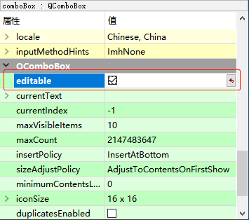

[toc]

### 1. 在设计器中设置 QComboBox 允许编辑

在将 `ComboBox` 控件添加到设计器中后，可以在 `属性窗口` 中找到 `QComboBox` 控件的属性列表。在属性列表中找到 `editable` 属性，使该属性处于勾选状态即可允许 `QComboBox` 控件可以编辑其内容。



### 2. 在代码中设置 QComboBox 允许编辑

在代码中可以调用 `QComboBox` 对象的 `setEditable()` 方法，传递 `true` 给其参数即可。

```c++
ui->comboBox->setEditable(true);
```

