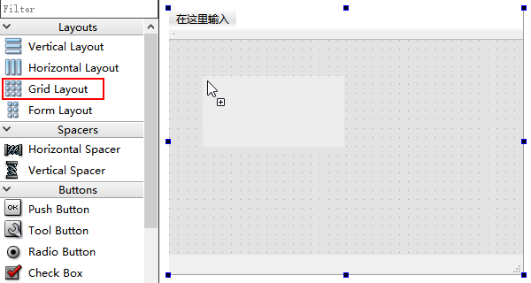
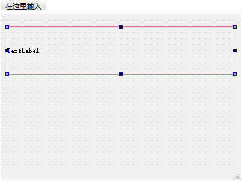
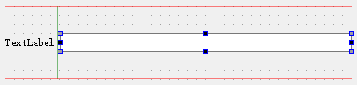

1. 在设计器左侧的控件列表中找到 `QGridLayout` 控件，用鼠标单击该控件，按住鼠标不放，将其拖入应用程序设计界面中。

   

2. 将需要添加到 `QGridLayout` 控件中的控件拖入其中，当拖入一个控件进入 `QGridLayout` 控件中后，该控件将占满 `QGridLayout` 控件的空间。

   

3. 继续向 `QGridLayout` 控件添加子控件时，需要按照需要将该控件拖至其他控件的左侧、右侧、顶部或底部，直到出现蓝色条时，放开鼠标，这时该控件将会放置在该蓝条的位置。

   

4. 按照上面的方法，继续添加子控件即可。