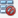
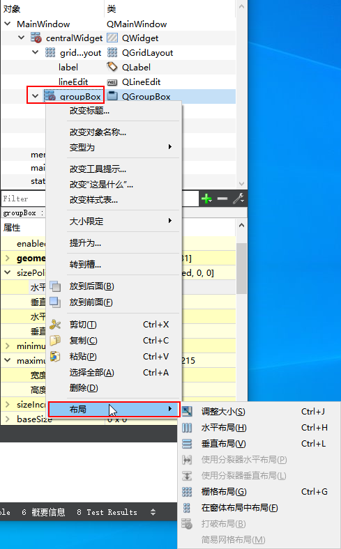

当将 `QGroupBox` 控件添加到设计界面中，并添加一些子控件，这时在对象列表中，可以看到 `QGroupBox` 控件前方图标显示为 ，这说明该控件还不完整。对于 `QGroupBox` 控件来说，这是因为控件未设置布局的原因。可以在对象窗口中 `QGroupBox` 控件处右击，在弹出的菜单中选择 `布局` ，然后在 `布局` 子菜单中选需要的布局方式。

这是 `QGroupBox` 控件左侧的图标将会显示成对应布局的图标，例如栅格布局 ，同时 `QGroupBox` 控件中的子控件也会按照所选的布局方式自动布局子控件。