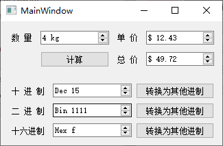

> 提示：示例源代码路径：百度网盘 -> 书籍资源 -> Qt 5.9 C++开发指南 -> 资源.zip -> QT5.9Samp2019.zip -> chap04Widgets -> samp4_3Spin

`QSpinBox` 用于整数的显示和输入，一般显示十进制数，也可以显示二进制、十六进制的数，而且可以在显示框中增加前缀或后缀。

`QDoubleSpinBox` 用于浮点数的显示和输入，可以设置显示小数位数，也可以设置显示的前缀和后缀。

`QSpinBox` 和 `QDoubleSpinBox` 都是 `QAbstractSpinBox` 的子类，具有大多数相同的属性，只是参数类型不同。在 `UI` 设计器里进行界面设计时，就可以设置这些属性。`QSpinBox` 和 `QDoubleSpinBox` 的主要属性如下表：

| 属性名               | 描述                                                         |
| -------------------- | ------------------------------------------------------------ |
| `prefix`             | 数字显示的前缀，例如 `$`                                     |
| `suffix`             | 数字显示的后缀，例如 `kg`                                    |
| `minimum`            | 数值范围的最小值，如 0                                       |
| `maximum`            | 数值范围的最大值，如 255                                     |
| `singlestep`         | 单击右侧上下调整按钮时的单步改变值，如设置为 1，或 0.1       |
| `value`              | 当前显示的值                                                 |
| `displayIntegerBase` | `QSpinBox` 特有属性，显示整数使用的进制，例如 2 就表示二进制 |
| `decimals`           | `QDoubleSpinBox` 特有属性，显示数值的小数位数，例如 2 就显示两位小数。 |

在使用 `QSpinBox` 和 `QDoubleSpinBox` 读取和设置数值时，无需做字符串与数值之间的转换，也无需做进制的转换，其显示效果（前缀、后缀、进制和小数位数）在设置好之后就自动按照效果进行显示，这对于数值的输入输出是非常方便的。

**示例程序**

**示例效果：**



**源代码文件：**

```c++
#include "mainwindow.h"
#include "ui_mainwindow.h"

MainWindow::MainWindow(QWidget *parent) :
    QMainWindow(parent),
    ui(new Ui::MainWindow)
{
    ui->setupUi(this);
}

MainWindow::~MainWindow()
{
    delete ui;
}

void MainWindow::on_btnCal_clicked()
{   // 计算
    int num = ui->spinNum->value();
    float price = ui->spinPrice->value();
    float total = num * price;
    ui->spinTotal->setValue(total);
}

void MainWindow::on_btnBin_clicked()
{   // 读取二进制数，以其他进制显示
    int val = ui->spinBin->value();
    ui->spinDec->setValue(val);
    ui->spinHex->setValue(val);
}

void MainWindow::on_btnDec_clicked()
{   // 读取十进制数，以其他进制显示
    int val = ui->spinDec->value();
    ui->spinBin->setValue(val);
    ui->spinHex->setValue(val);
}

void MainWindow::on_btnHex_clicked()
{   // 读取十六进制数，以其他进制显示
    int val = ui->spinHex->value();
    ui->spinDec->setValue(val);
    ui->spinBin->setValue(val);
}
```

