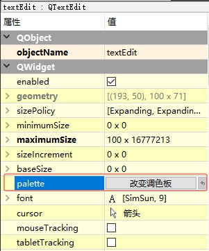

[toc]

### 1. 设计界面

在 `设计` 界面中，可以通过 `QWidget` 对象的 `palette` 属性设置 `QTextEdit` 的背景颜色。点击 `palette` 属性右边编辑框，编辑框将显示 `改变调色板` 按钮。

点击 `改变调色板` 按钮，在弹出的 `编辑调色板` 对话框中的 `曲调调色板` 列表中选择 `Base` 栏。

双击 `Base` 栏对应的 `激活` 列中的项，在弹出的 `选择颜色` 对话框中选择 `QTextEdit` 的背景颜色，然后点击 `OK` 按钮。

最后在 `编辑调色板` 对话框中点击 `OK` 按钮即可。