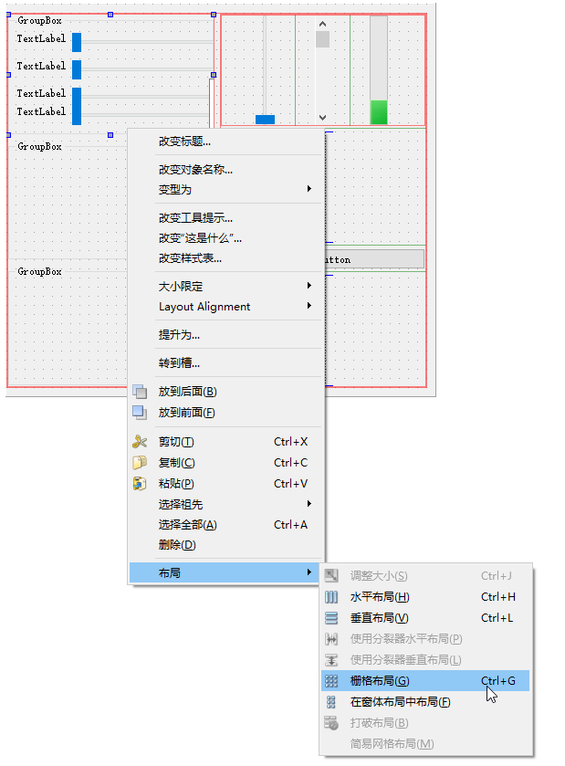
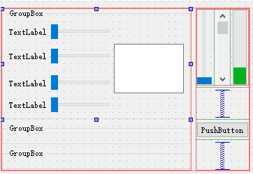

在一个容器内（比如 `QGroupBox` ），添加所有子控件后，可以通过右键选择 `布局` -> `栅格布局`，然后在右键菜单中选择 `布局` -> `打破布局`，打破布局后，就可以任意调整子控件的位置和大小了，调整完成后在右键菜单中选择 `布局` -> `栅格布局`，即可让子控件按照当前的位置将容器调整成刚好容纳子控件的大小。

最后效果如下：

> 提示：可能需要多次操作才能设计成如上效果。