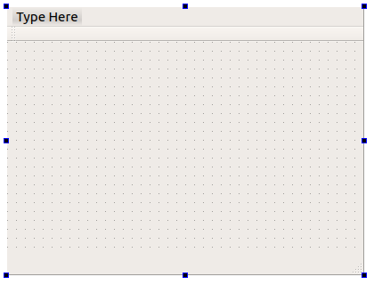
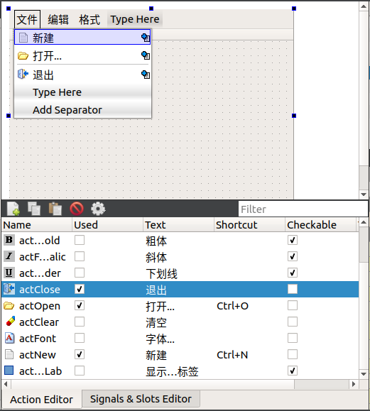

双击项目文件目录树里的 `qwmainwind.ui` ，在 UI 设计器里打开此窗口。在窗口最上方显示 `Type Here` 的地方是菜单栏，菜单栏下方是工具栏，窗口最下方是状态栏。

在菜单栏显示 `Type Here` 的地方双击，出现一个编辑框，在编辑框里输入所要设计菜单的分组名称，如 "文件"，然后回车，这样就创建了一个 "文件" 菜单分组。

创建主菜单的分组后，从 Action 编辑器的列表里将一个 `Action` 拖放到菜单某个分组下，就可以创建一个菜单项，如同在界面上放置一个组件一样。如果需要在菜单里增加一个分隔条，双击 "Add Sperator" 就可以创建一个分隔条，然后拖动到需要的位置。如果需要删除某个菜单项或分隔条，单击右键，选择 "Remove" 菜单项。

> 提示：关于 Action 编辑器请参阅 [设计 Action](./Commons/设计 Action.md)。

