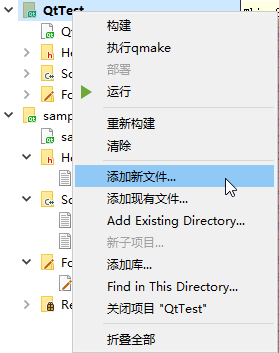
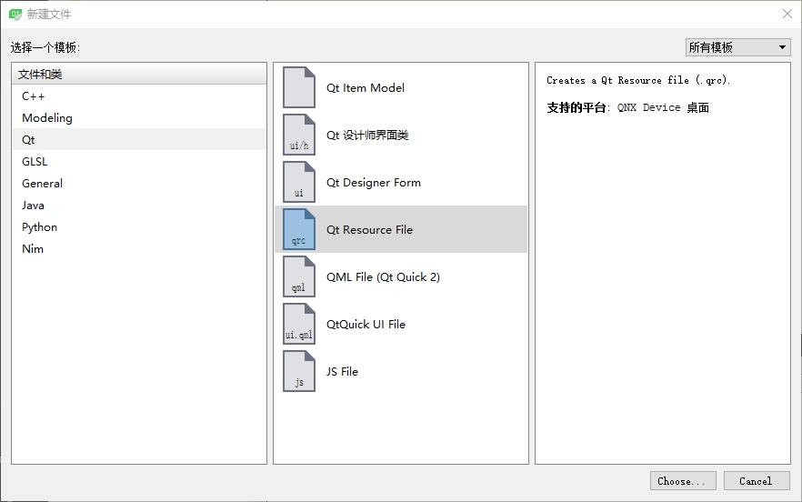
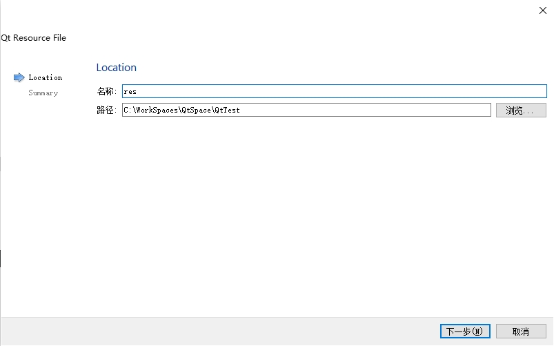
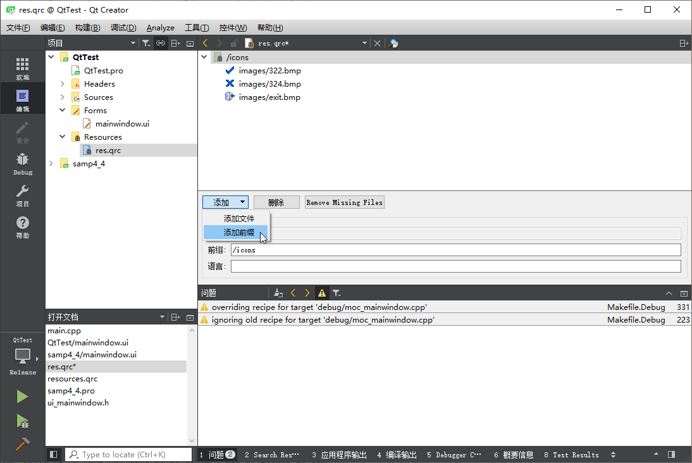
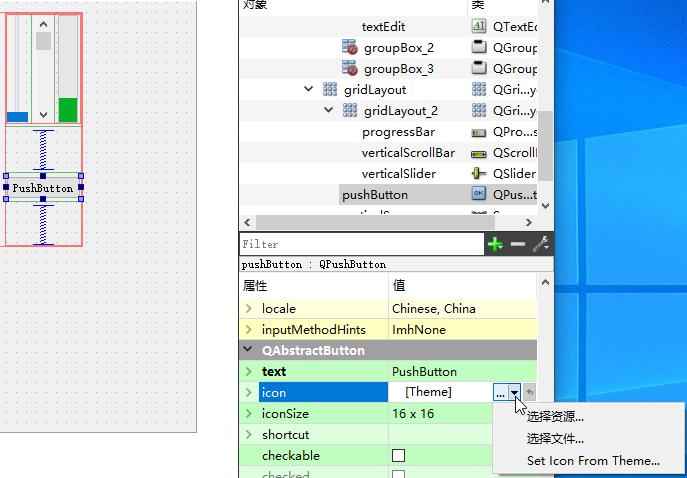
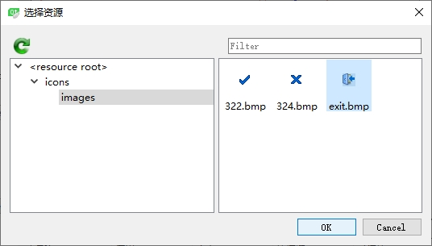
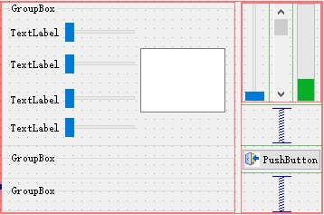

1. 在要添加图片资源的工程名称处右击，在弹出的菜单中选择 `添加新文件...`。

   

2. 在 `新建文件` 对话框中依次选择 `Qt` -> `Qt Resource File` ，然后单击 `Choose...` 按钮。

   

3. 在弹出的 `Qt Resource File` 对话框中输入资源文件的名称 `res`，然后点击 `下一步` 按钮。

   

4. 最后点击 `完成` 按钮，系统会在当前工程根目录下创建一个 `Resources` 节点，里面包含 `res.qrc` 资源文件。

5. 在项目根目录下创建一个 `images` 目录，将要添加到资源的图片复制到该目录中。

6. 右键 `res.qrc` 文件，在弹出的菜单中选择 `Open in Editor`，点击 `添加` 按钮，在下拉列表中选择 `添加前缀`，在下边前缀输入框中输入 `/icons`；再次点击 `添加` 按钮，在下拉列表中点击 `添加文件` 菜单，在弹出 `打开文件` 对话框中，选择 `images` 文件夹中的所有图片，然后点击 `打开` 按钮，就可以将图片添加到项目资源里面了，最后按 <kbd>Ctrl</kbd>+<kbd>S</kbd> 组合键保存修改。

   

7. 假如设计界面中放置了一个 `QPushButton` 控件，可以通过在 `QPushButton` 中 `QAbstractButton` 的 `icon` 属性中设置一个图片给按钮。点击 `icon` 属性右边的箭头，在弹出的菜单中选择 `选择资源...` 菜单。

   

8. 在弹出的 `选择资源` 对话框中选择要使用的图片资源，然后点击 `OK` 按钮即可。

   

9. 最后效果如下。

   

