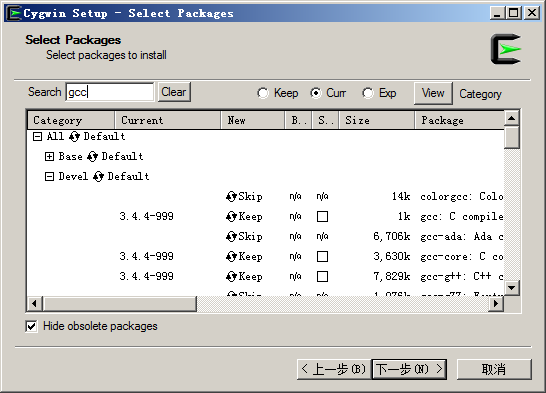

### 2.1.3　在Windows中安装

Redis官方不支持Windows。2011年微软1向Redis提交了一个补丁，以使Redis可以在Windows下编译运行，但被Salvatore Sanfilippo拒绝了，原因是在服务器领域上Linux已经得到了广泛的使用，让Redis能在Windows下运行相比而言显得不那么重要。并且Redis使用了如写时复制等很多操作系统相关的特性，兼容Windows会耗费太大的精力而影响Redis其他功能的开发。尽管如此微软还是发布了一个可以在Windows运行的Redis分支2，而且更新相当频繁，截止到本书交稿时，Windows下的Redis版本为2.8。

1微软开放技术有限公司（Microsoft Open Technologies Inc.），专注于参与开源项目、开放标准工作组以及提出倡议。

2
<a class="my_markdown" href="['https://github.com/MSOpenTech/Redis']">https://github.com/MSOpenTech/Redis</a>

如果想使用Windows学习或测试Redis可以通过Cygwin软件或虚拟机（如VirtualBox）来完成。Cygwin能够在Windows中模拟Linux系统环境。Cygwin实现了一个Linux API接口，使得大部分Linux下的软件可以重新编译后在Windows下运行。Cygwin还提供了自己的软件包管理工具，让用户能够方便地安装和升级几千个软件包。借助Cygwin，我们可以在Windows上通过源代码编译安装最新版的Redis。

#### 1．安装Cygwin

从Cygwin官方网站下载setup.exe程序，setup.exe既是Cygwin的安装包，又是Cygwin的软件包管理器。运行setup.exe后进入安装向导。前几步会要求选择下载源、安装路径、代理和下载镜像等，可以根据具体需求选择，一般来说一路点击“Next”即可。之后会出现软件包管理界面，如图2-1所示。


<center class="my_markdown"><b class="my_markdown">图2-1　Cygwin包管理界面</b></center>

编译安装Redis需要用到的包有gcc和make，二者都可以在“Devel”分类中找到。在“New”字段中标记为“Skip”的包表示不安装，单击“Skip”切换成需要安装的版本号即可令Cygwin在稍后安装该版本的包。图2-1中所示gcc包的状态为“Keep”是因为作者之前已经安装过该包了，同样如果读者在退出安装向导后还想安装其他软件包，只需要重新运行setup.exe程序再次进入此界面即可。

为了方便使用，我们还可以安装wget（用于下载Redis源代码，也可以手动下载并使用Windows资源管理器将其复制到Cygwin对应的目录中，见下文介绍）和vim（用于修改Redis的源代码使之可以在Cygwin下正常编译）。

之后单击“Next”，安装向导就会自动完成下载和安装工作了。

安装成功后打开Cygwin Terminal程序即可进入Cygwin环境，Cygwin会将Windows中的目录映射到Cygwin中。如果安装时没有更改安装目录，Cygwin环境中的根目录对应的Windows中的目录是C:\cygwin。

#### 2．修改Redis源代码

下载和解压Redis的过程和2.1.1节中介绍的一样，不过在 `make` 之前还需要修改Redis的源代码以使其可以在Cygwin下正常编译。

首先编辑src目录下的redis.h文件，在头部加入：

```shell
#ifdef CYGWIN
#ifndef SA ONSTACK
#define SA ONSTACK 0x08000000
#endif
#endif
```

而后编辑src目录下的object.c文件，在头部加入：

```shell
#define strtold(a,b) ((long double)strtod((a),(b)))
```

#### 3．编译Redis

同2.1.1节一样，执行 `make` 命令即可完成编译。

注意

> Cygwin环境无法完全模拟Linux系统，比如Cygwin的fork不支持写时复制；另外，Redis官方也并不提供对Cygwin的支持，Cygwin环境只能用于学习Redis。运行Redis的最佳系统是Linux和OS X，官方推荐的生产系统是Linux。

