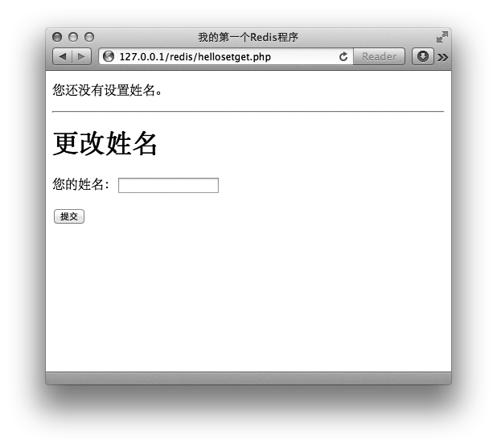

### 3.2.2　命令

#### 1．赋值与取值

```shell
SET key value
GET key
```

`SET` 和 `GET` 是Redis中最简单的两个命令，它们实现的功能和编程语言中的读写变量相似，如 `key = "hello"` 在Redis中是这样表示的：

```shell
redis> SET key hello
OK
```

想要读取键值则更简单：

```shell
redis> GET key
"hello"
```

当键不存在时会返回空结果。

为了节约篇幅，同时避免读者过早地被编程语言的细节困扰，本书大部分章节将只使用redis-cli进行命令演示（必要的时候会配合伪代码），第5章会专门介绍在各种编程语言（PHP、Python、Ruby和Node.js）中使用Redis的方法。

不过，为了能让读者提前对Redis命令在实际开发时的用法有一个直观的体会，这里会先使用PHP实现一个 `SET` / `GET` 命令的示例网页：用户访问示例网页时程序会通过 `GET` 命令判断Redis中是否存储了用户的姓名，如果有则直接将姓名显示出来（如图3-1所示），如果没有则会提示用户填写（如图3-2所示），用户单击“提交”按钮后程序会使用 `SET` 命令将用户的姓名存入到Redis中。


<center class="my_markdown"><b class="my_markdown">图3-1　设置过姓名时的页面</b></center>


<center class="my_markdown"><b class="my_markdown">图3-2　没有设置过姓名时的页面</b></center>

代码如下：

```shell
<?php
// 加载Predis库的自动加载函数
require './predis/autoload.php';
// 连接Redis
$redis= new Predis\Client(array(
　　'host'　　 => '127.0.0.1',
　　'port'　　 => 6379
));
// 如果提交了姓名则使用SET命令将姓名写入到Redis中
if ($_GET['name']) {
　　$redis->set('name', $_GET['name']);
}
// 通过GET命令从Redis中读取姓名
$name = $redis->get('name');
?><!DOCTYPE html>
<html>
　　<head>
　　　　<meta charset="utf-8" />
　　　　<title>我的第一个Redis程序</title>
　　</head>
　　<body>
　　　<?php if ($name): ?>
　　　　<p>您的姓名是：<?php echo $name; ?></p>
　　　<?php else: ?>
　　　　<p>您还没有设置姓名。</p>
　　　<?php endif; ?>
　　　<hr />
　　　<h1>更改姓名</h1>
　　　<form>
　　　　<p>
　　　　　<label for="name">您的姓名：</label>
　　　　　<input type="text" name="name" id="name" />
　　　　</p>
　　　　<p>
　　　　　<button type="submit">提交</button>
　　　　</p>
　　　</form>
　　</body>
</html>
```

在这个例子中我们使用PHP的Redis客户端库Predis与Redis通信。5.1节会专门介绍Predis，有兴趣的读者可以先跳到5.1节查看Predis的安装方法来实际运行这个例子。

Redis的其他命令也可以使用Predis通过同样的方式调用，如马上要介绍的 `INCR` 命令的调用方法是 `$redis->incr` (键名)。

#### 2．递增数字

```shell
INCR key
```

前面说过字符串类型可以存储任何形式的字符串，当存储的字符串是整数形式时，Redis提供了一个实用的命令 `INCR` ，其作用是让当前键值递增，并返回递增后的值，用法为：

```shell
redis>INCR num
(integer) 1
redis>INCR num
(integer) 2
```

当要操作的键不存在时会默认键值为0，所以第一次递增后的结果是1。当键值不是整数时Redis会提示错误：

```shell
redis>SET foo lorem
OK
redis>INCR foo
(error) ERR value is not an integer or out of range
```

有些读者会想到可以借助 `GET` 和 `SET` 两个命令自己实现 `incr` 函数，伪代码如下：

```shell
def incr($key)
　　$value =GET $key
　　if not $value
　　　　　 $value = 0
　　$value = $value + 1
　　SET $key, $value
　　return $value
```

如果Redis同时只连接了一个客户端，那么上面的代码没有任何问题（其实还没有加入错误处理，不过这并不是此处讨论的重点）。可当同一时间有多个客户端连接到Redis时则有可能出现竞态条件（race condition）3。例如有两个客户端A和B都要执行我们自己实现的 `incr` 函数并准备将同一个键的键值递增，当它们恰好同时执行到代码第二行时二者读取到的键值是一样的，如“5”，而后它们各自将该值递增到“6”并使用 `SET` 命令将其赋给原键，结果虽然对键执行了两次递增操作，最终的键值却是“6”而不是预想中的“7”。包括 `INCR` 在内的所有Redis命令都是原子操作（atomic operation）4，无论多少个客户端同时连接，都不会出现上述情况。之后我们还会介绍利用事务（4.1节）和脚本（第6章）实现自定义的原子操作的方法。

3竞态条件是指一个系统或者进程的输出，依赖于不受控制的事件的出现顺序或者出现时机。

4原子操作取“原子”的“不可拆分”的意思，原子操作是最小的执行单位，不会在执行的过程中被其他命令插入打断。

